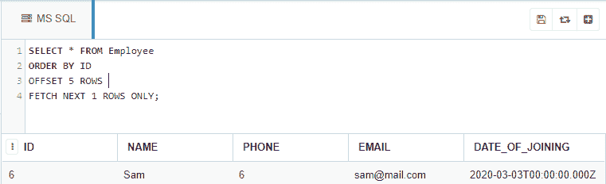

# 显示员工表第 n 条记录的 SQL 查询

> 原文:[https://www . geesforgeks . org/SQL-查询到显示-第 n 条记录-来自员工-表/](https://www.geeksforgeeks.org/sql-query-to-display-nth-record-from-employee-table/)

给你。我们将看到如何使用 SQL 查询从 Microsoft SQL Server 的数据库表中检索和显示第 n 条记录。我们将首先创建一个名为“极客”的数据库，然后在该数据库中创建“雇员”表，并在该表上执行我们的查询。

### **创建数据库:**

使用下面的 SQL 语句创建一个名为 geeks 的数据库:

```
CREATE DATABASE geeks;
```

### **使用数据库:**

```
USE geeks;
```

### 表格定义:

我们的*极客*数据库中有以下员工表:

```
CREATE TABLE Employee(
ID INT PRIMARY KEY AUTO_INCREMENT,
NAME VARCHAR(30) NOT NULL,
PHONE INT(10) NOT NULL UNIQUE,
EMAIL VARCHAR(30) NOT NULL UNIQUE,
DATE_OF_JOINING DATE);
```

您可以使用下面的语句来查询创建的表的描述:

```
EXEC SP_COLUMNS Employee;
```


### 向表中添加数据:

使用以下语句向*员工*表添加数据:

```
INSERT INTO Employee (NAME, PHONE, EMAIL, DATE_OF_JOINING)
VALUES
('Yogesh Vaishnav', 0000000001, 'yogesh@mail.com', '2019-10-03'),
('Vishal Vishwakarma', 0000000002, 'chicha@mail.com', '2019-11-07'),
('Ajit Yadav', 0000000003, 'ppa@mail.com', '2019-12-12'),
('Ashish Yadav', 0000000004, 'baba@mail.com', '2019-12-25'),
('Tanvi Thakur', 0000000005, 'tanvi@mail.com', '2020-01-20'),
('Sam', 0000000006, 'sam@mail.com', '2020-03-03'),
('Ron', 0000000007, 'ron@mail.com', '2020-05-16'),
('Sara', 0000000008, 'sara@mail.com', '2020-07-01'),
('Zara', 0000000009, 'zara@mail.com', '2020-08-20'),
('Yoji', 0000000010, 'yoji@mail.com', '2020-03-10');
```

要验证表格的内容，请使用以下语句:

```
SELECT * FROM Employee;
```


现在让我们显示表格的第 n 条记录。

```
Syntax : SELECT * FROM <table_name> LIMIT  N-1,1;

Here N refers to the row which is to be retrieved.
```

**示例:**

让我们从已经创建的 Employee 表开始检索第 6 行。

```
SELECT * FROM Employee 
ORDER BY <column_name>     --column name is the name according to which the rows are to be ordered.Here it's ID.
OFFSET 5 ROWS              --since N - 1 = 6 - 1 = 5 
FETCH NEXT 1 ROWS ONLY;
```

**输出:**

