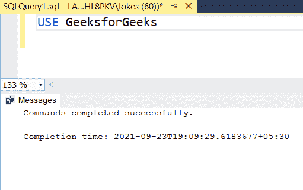

# 显示 Emp 表中埃纳姆列长度和前 3 个字符的 SQL 查询

> 原文:[https://www . geesforgeks . org/SQL-query-to-display-EMP-table 中的列的长度和前 3 个字符/](https://www.geeksforgeeks.org/sql-query-to-display-the-length-and-first-3-characters-of-ename-column-in-emp-table/)

为了显示字符串的长度和前三个字符，字符串函数在 SQL 中非常有用。在本文中，让我们看看如何使用 MSSQL 作为服务器来显示 Emp 表中埃纳姆列的长度和前 3 个字符。

为了找到字符串的长度，我们使用 [LEN()函数](https://www.geeksforgeeks.org/len-function-in-sql-server/)。

**语法:**

```
LEN(Ename)
```

要找到字符串的前 n 个字符，我们使用 [LEFT()函数](https://www.geeksforgeeks.org/left-function-in-mysql/):

**语法:**

```
LEFT(Ename , N)
```

**步骤 1:** 创建数据库

我们使用下面的命令创建一个名为 GeeksforGeeks 的数据库。

**查询:**

```
CREATE DATABASE GeeksforGeeks
```


**步骤 2:** 使用数据库

要使用 GeeksforGeeks 数据库，请使用以下命令:

**查询:**

```
USE GeeksforGeeks;
```



**步骤 3:** 创建表格

使用如下 SQL 查询创建一个包含 5 列的 Emp 表。

```
CREATE TABLE Emp
(
E_id varchar(20),
Ename varchar(20),
Edept varchar(20),
E_age INT,
E_sex varchar(8)
);
```

**输出:**


**步骤 4:** 验证数据库

使用如下 SQL 查询查看数据库的描述。

**查询:**

```
EXEC sp_columns Emp
```

**输出:**


**步骤 5:** 将数据插入表中

使用如下 SQL 查询将行插入 Emp 表。

**查询:**

```
 INSERT INTO Emp VALUES('E00001','JHONNY','BACKEND DEVELOPER',26,'male'),
 ('E00002','DARSHI','MARKETING',27,'male'),
('E00003','JASMINE','FRONTEND DEVELOPER',37,'female'),
('E00004','LILLY','FULL STACK DEVELOPER',47,'female'),
('E00005','RONALD','UI DEVELOPER',26,'male')
```

**输出:**


**步骤 6:** 验证插入的数据

使用如下选择查询检查表中插入的数据。

**查询:**

```
SELECT* FROM Emp
```

**输出:**


*   查询显示埃纳姆列的长度和前 3 个字符。

**查询:**

```
SELECT LEN(Ename) AS LengthofEname,
LEFT(Ename,3) AS FirstThree FROM Emp
```

**输出:**


*   查询显示埃纳姆列的长度和最后 3 个字符。

**查询:**

```
SELECT LEN(Ename) AS LengthofEname,
RIGHT(Ename,3) AS LastThree FROM Emp
```

**输出:**

