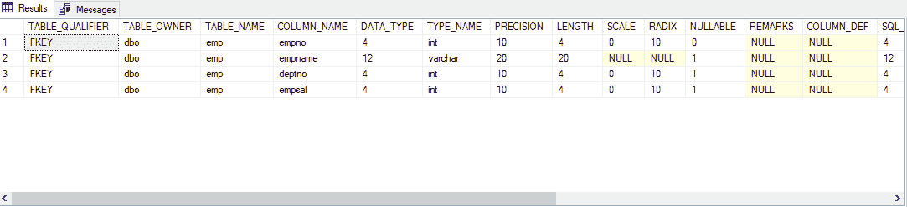
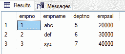
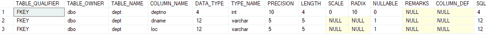
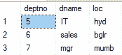
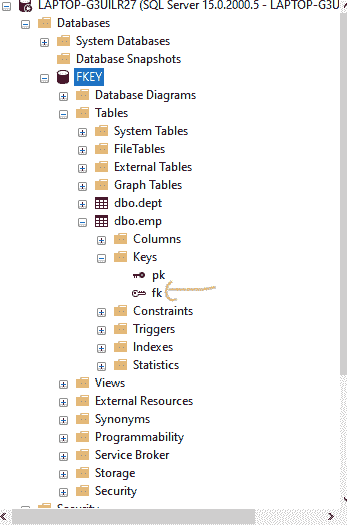
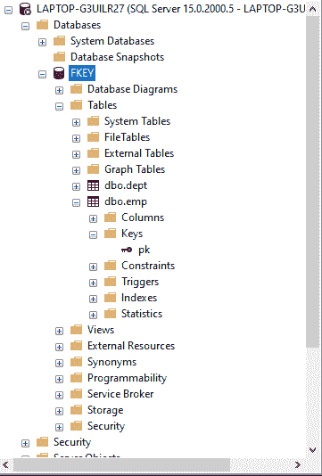

# 使用 ALTER 命令删除外键约束的 SQL 查询

> 原文:[https://www . geesforgeks . org/SQL-query-to-drop-外键-约束-使用-alter-command/](https://www.geeksforgeeks.org/sql-query-to-drop-foreign-key-constraint-using-alter-command/)

在这里，我们将看到如何使用**微软 SQL Server 使用 ALTER 命令(SQL 查询)删除外键约束。**

**外键**是一个表中的属性，它从另一个表中获取引用，在该表中它充当主键。此外，充当外键的列应该出现在两个表中。

### **创建新数据库:**

```
CREATE DATABASE geeks;
```

### 使用数据库:

```
USE geeks;
```

### 表格定义:

我们的数据库中有以下 emp 表:

```
CREATE TABLE emp(
empno number(2) constraint pk primary key ,
empname varchar2(20),
deptno number(2),
empsal number(20));
```

要验证表架构，请使用以下查询:

```
EXEC SP_COLUMNS emp;
```

**输出:**



电磁脉冲表模式

### 向表中添加数据:

使用以下语句将数据添加到 *emp* 表中:

```
INSERT INTO emp values(1,'abc',5,20000);
INSERT INTO emp values(2,'def',6,30000);
INSERT INTO emp values(3,'xyz',7,40000);
```

**输出:**



电磁脉冲表中的值

现在让我们使用 ALTER 命令编写 SQL 查询来删除外键约束。为此，我们必须创建另一个名为“DEPT”的表。

### **创建部门表**

```
CREATE TABLE dept(
deptno number(2) constraint pk2 primary key ,
dname varchar2(5),
loc varchar2(5));
```

要签出当前表，请使用以下语句:

```
SELECT * FROM dept;
```

**输出:**



部门表模式

### 将数据添加到部门表:

使用以下语句将数据添加到部门表:

```
INSERT INTO dept values(5,'IT','hyd');
INSERT INTO dept values(6,'sales','bglr');
INSERT INTO dept values(7,'mgr','mumb');
```

要签出当前表，请使用以下语句:

```
SELECT * FROM dept;
```

### **输出**



部门表值

这里我们保留了 **EMP** 和 **DEPT** 表格中常见的 **DEPTNO** 列

### 添加外键约束

```
ALTER TABLE emp add constraint fk foreign key(deptno) references dept(deptno);
 //ADDS FOREIGN KEY CONSTRAINT ON EMP TABLE
```



外键“FK”被创造出来了

### 删除外部约束:

```
ALTER TABLE TABLE NAME drop constraint CONSTRAINT_NAME
```

### 使用 ALTER 从表中删除外键约束:

```
ALTER TABLE emp drop constraint fk;
```

**输出:**



因此，通过这种方式，我们可以使用 ALTER 命令删除外键约束