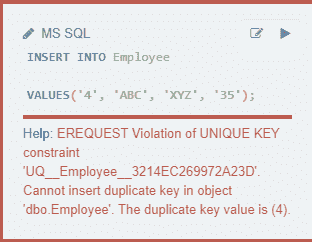

# 使用 ALTER 命令删除唯一键约束的 SQL 查询

> 原文:[https://www . geesforgeks . org/SQL-query-to-drop-unique-key-constraints-use-alter-command/](https://www.geeksforgeeks.org/sql-query-to-drop-unique-key-constraints-using-alter-command/)

在这里，我们看到如何使用 alter 命令删除唯一约束。ALTER 用于添加、删除/删除或修改现有表中的列。它还用于在现有表上添加和删除各种约束。

> **语法:**
> 
> ALTER TABLE 表名
> 
> DROP CONSTRAINT unique _ CONSTRAINT；

例如，考虑下表“员工”。

**创建表格:**

```sql
CREATE TABLE Employee
('ID INT, F_Name CHAR(10), L_Name CHAR(10), Age INT);
```

**在表格中插入数值:**

```sql
INSERT INTO Employee
VALUES('1','Rahul','Pal','20');
INSERT INTO Employee
VALUES('2','Ajay','Soni','32');
INSERT INTO Employee
VALUES('3','Jay','Harjai','24');
INSERT INTO Employee
VALUES('4','Ram','Meena','30');
```

此时，我们的表如下所示:

### **员工**


### **使用 ALTER 添加唯一约束:**

要向表中添加唯一约束，请使用下面的语句:

```sql
ALTER TABLE Employee
ADD CONSTRAINT/INDEX unique_id UNIQUE (ID);
```

现在，如果我们添加副本。它会抛出如下错误。为了添加重复项，我们需要删除唯一约束。



### **删除唯一约束查询:**

现在，下面的查询可以用来删除我们在上面创建的唯一约束:

```sql
ALTER TABLE Employee
DROP CONSTRAINT unique_id;
```

现在让我们尝试在表中添加重复项:

```sql
INSERT INTO Employee
VALUES('4', 'ABC', 'XYZ', '35');
```

由于我们没有得到错误，我们已经成功地删除了唯一的约束。让我们检查一下表格，使用下面的语句来验证这一点:

```sql
SELECT * FROM Employee;
```

**输出:**

### 雇员

