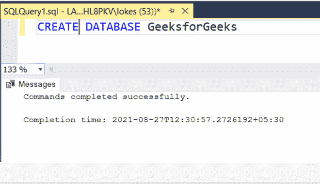
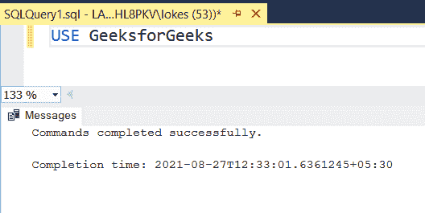
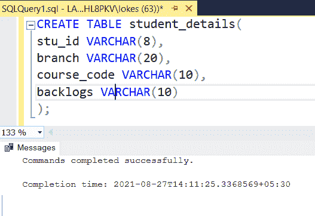
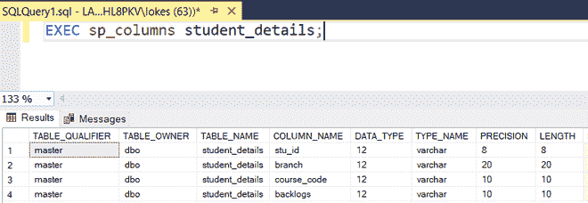
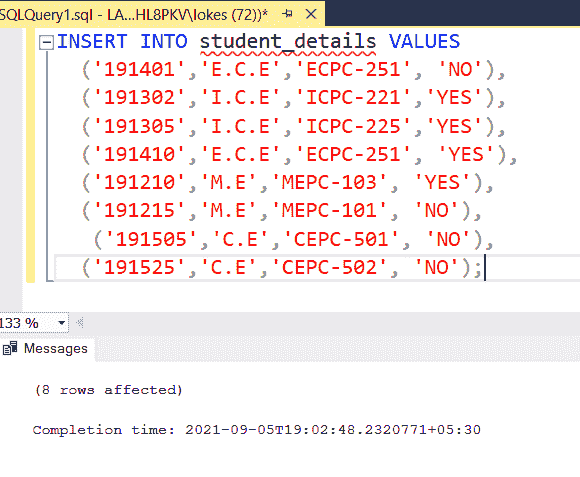
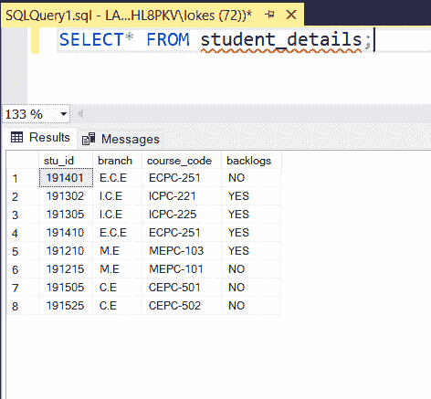
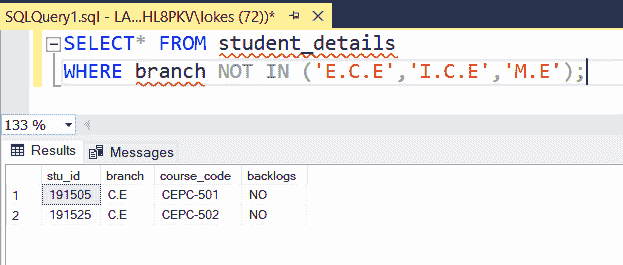
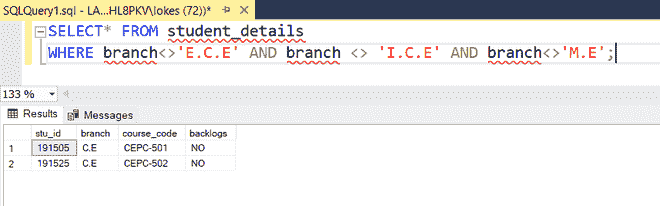
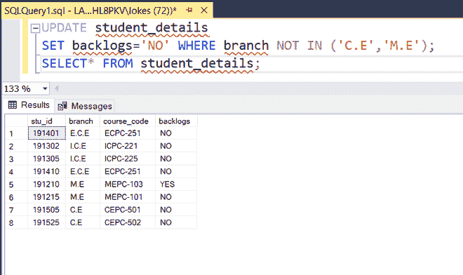

# 排除多个值的 SQL 查询

> 原文:[https://www . geesforgeks . org/SQL-查询-排除-多值/](https://www.geeksforgeeks.org/sql-query-to-exclude-multiple-values/)

为了排除要从表中提取的多个值，我们可以使用多个 OR 语句，但是当我们想要排除大量值时，编写多个 AND 语句会变得冗长，为了避免这种情况，我们可以将 NOT IN 子句用于需要用 [WHERE 语句](https://www.geeksforgeeks.org/sql-where-clause/)排除的值数组。

在本文中，让我们看看使用 AND 和 NOT IN 子句排除多个值的 SQL 查询。

### **创建数据库**

使用以下命令创建一个名为 GeeksforGeeks 的数据库:

```sql
CREATE DATABASE GeeksforGeeks
```



### **使用数据库**

要使用 GeeksforGeeks 数据库，请使用以下命令:

```sql
USE GeeksforGeeks
```



### **创建表格**

使用以下 SQL 查询创建一个包含 4 列的 student_details 表:

```sql
CREATE TABLE student_details(
stu_id VARCHAR(8),
branch VARCHAR(20),
course_code VARCHAR(10),
backlogs VARCHAR(10)
);
```



### **验证表格:**

使用以下 SQL 查询查看数据库中表的描述:

```sql
EXEC sp_columns student_details;
```



### **将数据插入表中:**

使用以下 SQL 查询将行插入学生详细信息表:

```sql
INSERT INTO student_details VALUES
  ('191401','E.C.E','ECPC-251', 'NO'),
  ('191302','I.C.E','ICPC-221','YES'),
  ('191305','I.C.E','ICPC-225','YES'),
  ('191410','E.C.E','ECPC-251', 'YES'),
  ('191210','M.E','MEPC-103', 'YES'),
  ('191215','M.E','MEPC-101', 'NO'),
   ('191505','C.E','CEPC-501', 'NO'),
  ('191525','C.E','CEPC-502', 'NO');
```



### **验证插入的数据**

使用以下 SQL 查询在插入行后查看表 student_details:

```sql
SELECT* FROM employee_details;
```



### **对 S **的示例查询:****

**1。**查询除“ECE”、“ICE”、“ME”以外的学生

**使用非输入:**

**语法:**

```sql
SELECT * FROM table_name
WHERE req_column NOT IN(data1,data2,data3,....)
```

**查询:**

```sql
SELECT* FROM student_details
WHERE branch NOT IN ('E.C.E','I.C.E','M.E');
```



**使用 AND:**

**语法:**

```sql
SELECT * FROM table_name
WHERE condition1 AND condition2 AND condition3;
```

**查询:**

```sql
SELECT* FROM student_details
WHERE branch<>'E.C.E' AND branch <> 'I.C.E' AND branch<>'M.E';
```



**2。**查询更新除了中文系和中文系的学生以外没有其他人的积压

```sql
UPDATE student_details
SET backlogs='NO' WHERE branch NOT IN ('C.E','M.E');
SELECT* FROM student_details;
```

