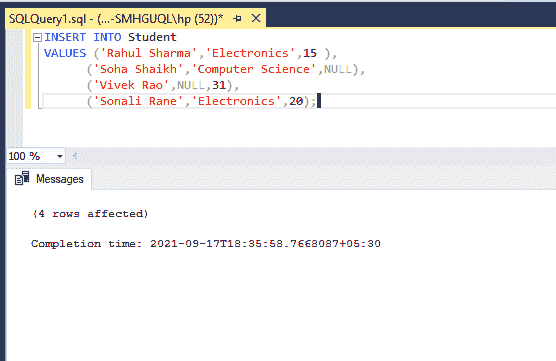
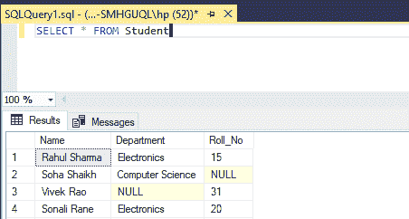
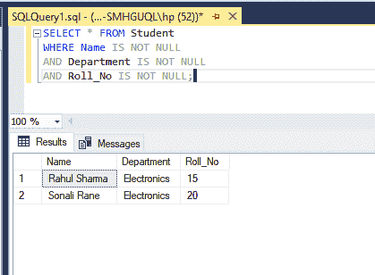

# 排除空值的 SQL 查询

> 原文:[https://www . geesforgeks . org/SQL-查询-排除-空值/](https://www.geeksforgeeks.org/sql-query-to-exclude-null-values/)

在本文中，我们将研究如何使用 SQL 查询从表中排除空值。

### **空值:**

空值表示没有值。这意味着一行中没有列值。空值不同于空格或零值。零值是一个整数，空格是一个字符，而空值是被留空的值。

为了从表中排除空值，我们必须创建一个具有空值的表。让我们创建一个表格。

**步骤 1:** 创建表格

**语法:**

```sql
CREATE TABLE table_name (
   column1 datatype,
   column2 datatype,
   column3 datatype,
  ....);
```

**查询**:

```sql
CREATE TABLE Student(Name varchar(40),
Department varchar(30),Roll_No int, );
```

使用上面的查询在我们的数据库中创建学生表。学生表有三个字段“姓名”、“部门”和“学生人数”。要在表中插入值，我们必须使用 insert 查询。

**输出:**


**步骤 2:** 将数据插入表格

**语法:**

```sql
INSERT INTO table_name
VALUES (value1, value2, value3, ...);
```

**查询:**

```sql
INSERT INTO Student
VALUES ('Rahul Sharma','Electronics',15),
      ('Soha Shaikh','Computer Science',NULL),
      ('Vivek Rao',NULL,31),
      ('Sonali Rane','Electronics',20);
```

使用上面的查询，我们已经将数据添加到了表中。我们使用空关键字插入空值。

**输出:**



**第三步:查看表格数据**

我们可以使用下面的 SELECT 查询打印表中的数据。

**语法:**

```sql
SELECT * FROM table_name
```

**查询:**

```sql
SELECT * FROM Student
```

输出将显示包含所有字段的表，因为我们在查询中使用了' * '。这意味着选择表中的所有字段。

**输出:**



**步骤 4:排除空值**

为了从表中排除空值，我们需要在 WHERE 子句中使用 IS NOT NULL 运算符。

*   **WHERE 子句:**
    *   WHERE 子句用于筛选记录。
    *   它将提取那些满足条件的记录。
    *   它可以用于选择、更新、删除查询。
*   **不是空运算符:**
    *   该运算符用于测试非空值。

**语法:**

```sql
SELECT column_names
 FROM table_name
WHERE column_name IS NOT NULL;
```

**查询:**

```sql
SELECT * FROM Student
WHERE Name IS NOT NULL
AND Department IS NOT NULL
AND Roll_No IS NOT NULL;
```

为了从所有列中排除空值，我们使用了 AND 运算符。如果所有条件都为真，则“与”运算符显示记录。

**输出:**

