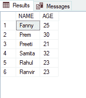

# 如果匹配另一个表中的条目，则排除记录的 SQL 查询

> 原文:[https://www . geesforgeks . org/SQL-查询到排除记录-如果它匹配另一个表中的条目/](https://www.geeksforgeeks.org/sql-query-to-exclude-records-if-it-matches-an-entry-in-another-table/)

在本文中，我们将看到如何编写 SQL Query 来排除与另一个表中的条目相匹配的记录。我们可以使用 SQL 中的非输入运算符来执行上述功能。为了获得值列表，我们可以编写子查询。

NOT IN 运算符充当 IN 运算符的否定，并返回指定列表中存在的项目之外的结果。

**不在语法中:**

```sql
SELECT * FROM table_name WHERE column_name NOT IN (list);
```

现在，按照以下步骤进行演示:

**步骤 1:** 创建数据库

我们可以使用以下命令创建一个名为 geeks 的数据库。

**查询:**

```sql
CREATE DATABASE geeks;
```

**步骤 2:** 使用数据库

使用下面的 SQL 语句将数据库上下文切换到极客:

**查询:**

```sql
USE geeks;
```

**步骤 3:** 表格定义

在极客的数据库中，我们有两个名为“demo_table1”和“demo_table2”的表。

**查询(demo_table1):**

```sql
CREATE TABLE demo_table1(
NAME VARCHAR(20),
AGE INT,
CITY VARCHAR(20) );
```

**查询(demo_table2):**

```sql
CREATE TABLE demo_table2(
NAME VARCHAR(20),
AGE int);
```

**步骤 4:** 将数据插入表格

**查询(demo_table1):**

```sql
INSERT INTO demo_table1 VALUES
('Romy',23,'Delhi'),
('Rahul',23,'Delhi'),
('Nikhil',24,'Punjab'),
('Ranvir',23,'Punjab'),
('Samiksha',23,'Banglore'),
('Ashtha',24,'Banglore'),
('Tannu',30,'Patna'),
('Girish',30,'Patna'),
('Ram', 20 , 'Patna'),
('Raj', 12, 'Delhi');
```

**查询(demo_table2):**

```sql
INSERT INTO demo_table2 VALUES
('Fanny',25 ),
('Prem', 30), 
('Preeti',21),
('Samita',32),
('Rahul',23),
('Ranvir',23);
```

**第五步:**查看内容

执行以下查询查看表格的内容

**查询:**

```sql
SELECT * FROM demo_table1;
```

**输出:**


**查询:**

```sql
SELECT * FROM demo_table2;
```

**输出:**



**步骤 6:** 根据 demo_table2 中找到的匹配项从 demo_table1 中排除数据

对于演示，从 demo_table1 中排除名称列中的值与 demo_table2 的名称列中的条目相匹配的数据。

**查询:**

```sql
SELECT * FROM demo_table1 WHERE NAME NOT IN (SELECT NAME FROM demo_table2);
```

**输出:**


我们可以在图像中看到，由于值与 demo_table2 中的条目相匹配，两个条目被排除在外。