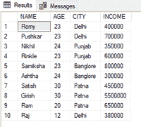
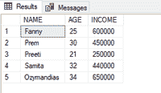
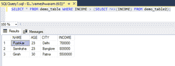

# 使用另一个表过滤一个表的 SQL 查询

> 原文:[https://www . geesforgeks . org/SQL-查询到筛选器-一个表-使用另一个表/](https://www.geeksforgeeks.org/sql-query-to-filter-a-table-using-another-table/)

在本文中，我们将看到，如何使用另一个表来过滤一个表。我们可以使用子查询代替 [WHERE 子句中的条件来执行该函数。](https://www.geeksforgeeks.org/sql-where-clause/)另一个查询内部的查询称为子查询。它也可以称为嵌套查询。一个 SQL 代码可以有一个或多个嵌套查询。

**语法:**

```
SELECT * FROM table_name WHERE
column_name=( SELECT column_name FROM table_name);
```

在 WHERE 子句后编写的查询是上述语法中的子查询。

现在，按照以下步骤进行演示:

**步骤 1:** 创建数据库

我们可以使用以下命令创建一个名为 geeks 的数据库。

**查询:**

```
CREATE DATABASE geeks;
```

**第二步**:使用数据库

使用下面的 SQL 语句将数据库上下文切换到极客:

**查询:**

```
USE geeks;
```

**步骤 3:** 表格定义

在极客的数据库中，我们有两个名为“demo_table1”和“demo_table2”的表。

**查询(demo_table1):**

```
CREATE TABLE demo_table1(
NAME VARCHAR(20),
AGE int,
CITY VARCHAR(10),
INCOME int);
```

**查询(demo_table2):**

```
CREATE TABLE demo_table2(
NAME VARCHAR(20),
AGE int,
INCOME int);
```

**步骤 4:** 将数据插入表格

**查询(demo_table1):**

```
INSERT INTO demo_table1 VALUES
('Romy',23,'Delhi',400000),
('Pushkar',23,'Delhi',700000),
('Nikhil',24,'Punjab',350000),
('Rinkle',23,'Punjab',600000),
('Samiksha',23,'Banglore',800000),
('Ashtha',24,'Banglore',300000),
('Satish',30,'Patna',450000),
('Girish',30,'Patna',5500000),
('Ram', 20 , 'Patna',650000),
('Raj', 12, 'Delhi',380000);
```

**查询(demo_table2):**

```
INSERT INTO demo_table2 VALUES
('Fanny',25,600000 ),
('Prem', 30,450000),
('Preeti',21,250000 ),
('Samita',32,440000),
('Ozymandias',34,650000);
```

**第五步:**查看表格内容。

执行下面的查询查看表格的内容。

**查询:**

```
SELECT * FROM demo_table1;
```

**输出:**



**查询:**

```
SELECT * FROM demo_table2;
```

**输出:**



**步骤 6:** 使用另一个表格过滤表格

为了演示，我们将过滤 demo_table1 中收入大于 semo_table2 中最大收入的数据。

要从 demo_table2 中获取最高工资:

**查询:**

```
SELECT MAX(INCOME) FROM demo_table2;
```

上面使用的查询将用作子查询来过滤 demo_table1。

**最终查询:**

```
SELECT * FROM demo_table WHERE INCOME > (SELECT MAX(INCOME) FROM demo_table2);
```

**输出:**



从图中可以看到，demo_table1 中的数据被过滤掉，收入超过了 650000(demo _ table 2 中的最大收入值)。