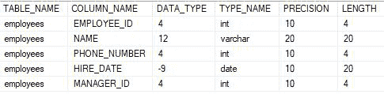
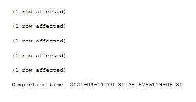
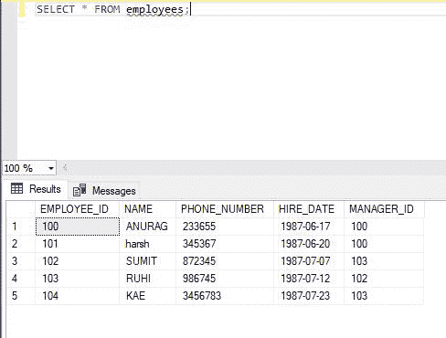
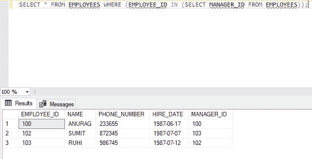

# 查询所有兼任经理的员工的 SQL 查询

> 原文:[https://www . geesforgeks . org/SQL-查询查找所有员工-谁也是经理/](https://www.geeksforgeeks.org/sql-query-to-find-all-employees-who-are-also-managers/)

结构化查询语言是一种标准的数据库语言，用于创建、维护和检索关系数据库中的数据，如 MySQL、Oracle 等。

在这里，我们将看到如何在 SQL 中找到同时也是经理的所有员工的详细信息。我们将首先创建一个名为“极客”的数据库，然后在该数据库中创建一个“员工”表。之后，我们将对该表执行查询。

### **创建数据库:**

使用下面的 SQL 语句创建一个名为 geeks 的数据库:

```sql
CREATE DATABASE geeks;
```

### **使用数据库:**

```sql
USE geeks;
```

### 表格定义:

我们的*极客*数据库中有以下员工表:

```sql
CREATE TABLE employees(
    EMPLOYEE_ID int,
    NAME Varchar(20),
    PHONE_NUMBER int,
    HIRE_DATE date,
    MANAGER_ID int);
```

可以用下面的语句查询创建的表的描述:

```sql
EXEC SP_COLUMNS employees;
```



### 向表中添加数据:

使用以下语句向*员工*表添加数据:

```sql
INSERT INTO EMPLOYEES VALUES (100, "ANURAG", 9889269997, "1987-06-17", 100);
INSERT INTO EMPLOYEES VALUES (101, "harsh", 8789269986, "1987-06-20", 100);
INSERT INTO EMPLOYEES VALUES (102, "SUMIT", 7689269975, "1987-07-07", 103);
INSERT INTO EMPLOYEES VALUES (103, "RUHI", 9589269964, "1987-07-12", 102);
INSERT INTO EMPLOYEES VALUES (104, "KAE", 8489269953, "1987-07-23", 103);
```



使用以下语句验证表格的内容:

```sql
SELECT * FROM EMPLOYEES;
```



现在，为了获得同时也是经理的所有员工的详细信息，我们使用了 *EMPLOYEE_ID* 字段和 *MANAGER_ID* ，我们将找出同时也是经理的员工的详细信息。该查询将具有以下语法:

```sql
Syntax:
SELECT *
FROM table_name  
WHERE (column_name IN (SELECT column_name FROM table_name));
```

现在对我们创建的表运行相同的查询，如下所示:

```sql
SELECT * FROM EMPLOYEES WHERE (EMPLOYEE_ID IN (SELECT MANAGER_ID FROM EMPLOYEES));
```

**输出:**

