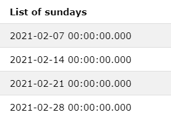

# 查找两个日期之间所有星期日的 SQL 查询

> 原文:[https://www . geesforgeks . org/SQL-查询查找两个日期之间的所有星期日/](https://www.geeksforgeeks.org/sql-query-to-find-all-sundays-between-two-dates/)

为了使用 SQL 语言查找两天之间的所有星期日，我们将使用 SQL 中定义的“日期函数”。除此之外，我们还将使用 [CTE](https://www.geeksforgeeks.org/cte-in-sql/) (视图)的想法。

**基本思路:**

所以基本上我们有两天时间，我们需要列出这两天之间的所有周日。

稍微思考一下，我们有了这样的想法:我们可以检查给定的两个边界日期(星期日)之间的所有日期。此外，SQL 日期函数确实提供了一种这样的方法来实现这个想法:

```sql
DATENAME(interval_part, Date)
```

此函数返回参数中指定的日期部分的名称。

例如:

```sql
DATENAME(month, '18/11/2001' ) 
```

对该函数的调用将在 11 月返回。

因此，我们可以将任何日期所代表的日期与星期日相匹配。如果是星期天，我们选择它，否则拒绝它。

现在剩下的部分是创建一个包含两个给定日期之间的所有日期的表，这样我们就可以对它们进行检查。

这可以通过这样一个想法来实现，即我们可以将日期的日部分在前一个日期的基础上增加 1，以获得下一个日期，并检查下一个日期是否小于给定的日期上限。

日期添加(零件、编号、日期) :该方法用于将指定的**编号**添加到给定的**日期的**零件**中。**

例如，DATEADD(年份，2，' 18/11/2001 ')这导致日期:18/11/2003。

这是我们针对这个主题的 SQL 查询:

```sql
declare  @StartDate DateTime = '2021-02-01',
              @EndDate DateTime = '2021-02-28';
/*Creating a temporary view in sql(CTE) which recursively 
calls itself to find next date by incrementing the 
previous date and stores the result in it till the end date is reached*/
WITH CTE(date_list) AS (
      SELECT @StartDate
      UNION ALL
      SELECT DATEADD(day,1,date_list) FROM CTE
      WHERE date_list<=@EndDate
)
SELECT date_list as 'List of sundays'
FROM CTE
WHERE DATENAME(weekday ,date_list) IN ('Sunday');
/*In the where clause at last we are checking 
each day from the list whether it is in Sunday list or not*/
```

