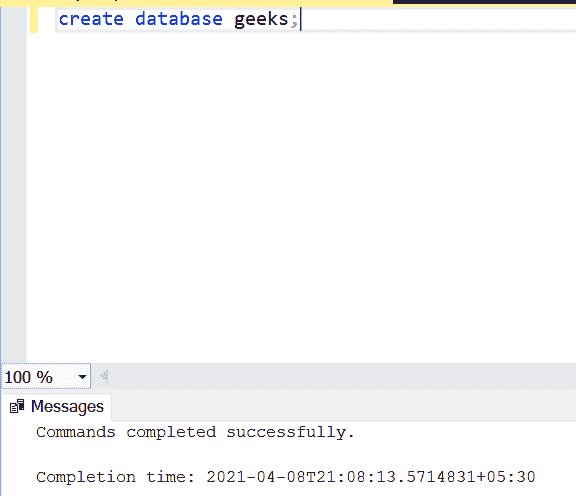

# 查找所有成绩大于平均成绩的学生的 SQL 查询

> 原文:[https://www . geesforgeks . org/SQL-查询查找所有分数高于平均分数的学生/](https://www.geeksforgeeks.org/sql-query-to-find-all-the-students-with-marks-greater-than-average-marks/)

SQL 中的查询就像执行任务的语句。在这里，我们需要写一个查询，找到所有成绩大于学生平均成绩的学生。

我们将首先创建一个名为“**极客**”的数据库，然后在该数据库中创建一个表“**学生**”。

### 创建数据库:

我们可以使用以下命令创建数据库:

```sql
Syntax: CREATE DATABASE DATABASE_NAME;
```

让我们创建一个如下所示的*极客*数据库:

```sql
CREATE DATABASE geeks;
```



### 使用数据库:

使用以下命令使用*极客*数据库:

```sql
USE geeks;
```


### 将表添加到数据库:

要将表添加到数据库中，我们使用以下命令:

```sql
Syntax: CREATE TABLE table_name (Attribute_name datatype...);
```

因此，让我们在*极客*数据库中创建一个学生表，如下所示:

```sql
CREATE TABLE Students(
Id int,
Name varchar(20),
TotalMarks int);
```

此表添加成功。

**查看表格说明:**

```sql
EXEC sp_columns Students;
```


### 向表中插入值:

要将记录插入表中，我们可以使用下面的命令:

```sql
Syntax: INSERT INTO table_name(column1,
                column2,
                column 3,.....)
                 VALUES( value1,
                value2,
                value3,.....);
```

所以让我们给*学生*表添加一些记录:

```sql
INSERT INTO Students VALUES (1,'Neha',90);
INSERT INTO Students VALUES (2,'Sahil',50);
INSERT INTO Students VALUES (3,'Rohan',70);
INSERT INTO Students VALUES (4,'Ankita',80);
INSERT INTO Students VALUES (5,'Rahul',65);
INSERT INTO Students VALUES (6,'Swati',55);
INSERT INTO Students VALUES (7,'Alka',75);
```


现在，让我们使用如下所示的 SELECT 语句打印表格中的可用数据:

```sql
SELECT * FROM department;
```

**注:**此处*代表全部。如果我们执行这个查询，将显示整个表。

**输出:**


### 查询为**数据:**

使用以下语法查询所有分数高于班级平均水平的学生:

```sql
Syntax:
SELECT column1 FROM table_name
WHERE column2 > (SELECT AVG(
                            column2) 
FROM table_name);
```

现在使用上面的语法对我们的*学生*表进行如下查询:

```sql
SELECT Name FROM Students WHERE TotalMarks > (SELECT AVG(TotalMarks) FROM Students);
```

**输出:**

