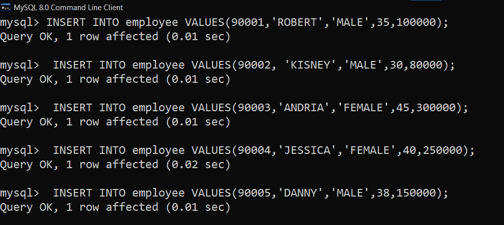

# SQL 查询查找薪资等于或大于特定数字的员工

> 原文:[https://www . geesforgeks . org/SQL-query-查找工资等于或大于特定数字的员工/](https://www.geeksforgeeks.org/sql-query-to-find-an-employee-whose-salary-is-equal-to-or-greater-than-a-specific-number/)

在本文中，我们将讨论 SQL 查询的概述，我们的主要焦点将是如何借助示例在 SQL 中找到工资等于或大于特定数字的员工。我们一个一个来讨论。

**简介:**
[SQL(结构化查询语言)](https://www.geeksforgeeks.org/structured-query-language/)用于维护关系数据库中的结构化数据，这是一个用于操作数据库中数据的标准。根据我们在数据库中使用的相关命令的目的，SQL 进一步分为 DDL(数据定义语言)、DML(数据操作语言)和 DCL(数据控制语言)。SQL 中的查询允许我们与数据库交互。[数据库管理系统](https://www.geeksforgeeks.org/introduction-of-dbms-database-management-system-set-1/)中的查询有助于从数据库中创建、删除、更新和检索数据。

**步骤-1:创建示例表–**
在 MySQL 中逐步创建此表 employee step _ by _ step。

<figure class="table">T31

35

T35

| EMP _ id | 电磁脉冲名称 | EMP _ sex | 电磁脉冲年龄 | 电磁脉冲 _ 薪 |
| --- | --- | --- | --- | --- |
| 90001
 | Robert | man | 45 | 300000

 |
| 90004 | 杰西卡 | Nvzhu | Forty | 250000 |

</figure>

**步骤-2:创建数据库–**
使用如下查询创建数据库。
**语法:**

```
CREATE DATABASE database_name;
```

按如下方式创建数据库公司。

```
CREATE DATABASE company;
```

**输出:**


**步骤 3:使用数据库–**

使用数据库公司使用如下 SQL 查询。

```
syntax: USE database_name;
```

**输出:**


**步骤-4:添加表–**
使用如下 SQL 查询将表员工添加到数据库公司。

**语法:**

```
CREATE TABLE table_name
( column_name1 data_type1 ,
column_name2 data_type2 ,
column_name3 data_type3 ,
.
.
column_nameN data_typeN , );      
```

创建表的 SQL 查询，如下所示。

```
Creating a table employee 
with 
columns (emp_id,emp_name,emp_sex,emp_age,emp_salary) 
into a database company:
```

**输出:**


**步骤-5:通过 description 查询验证列和数据类型–**
列及其数据类型，如下所示。

**语法:**

```
DESCRIBE table_name;
```

用于验证列及其数据类型的 SQL 查询，如下所示。

```
DESCRIBE employee;
```

**输出:**


**第 6 步:向表中插入行员工–**
这里，向表中插入行员工如下。

**语法:**

```
INSERT INTO table_name  
VALUES(column1_data,column2_data,......columnN_data);
```

在表中插入了 5 名员工的数据，并创建了如下表员工。

**输出:**



**步骤-7:验证插入的数据–**
使用如下选择查询检查数据库中的插入数据。

```
SELECT * FROM employee;
```

**输出:**


**示例:**
在这里，我们将看到如下理解查询的示例。

**示例-1 :**
查询查找薪资大于等于 1，000，000 的员工姓名。
**SQL 查询–**

```
SELECT emp_name
FROM employee
WHERE emp_salary>=100000;
```

**输出:**


**示例-2 :**
查询查找薪资大于等于 2，000，000 的员工的所有详细信息。
**SQL 查询–**

```
SELECT emp_name
FROM employee
WHERE emp_salary>=200000;
```

**输出:**


**示例-3 :**
查询查找工资 300 万的员工。
**SQL 查询–**

```
SELECT emp_name
FROM employee
WHERE emp_salary=300000;
```

**输出:**

