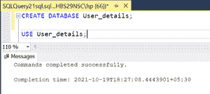
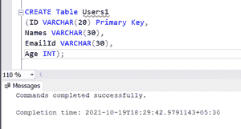
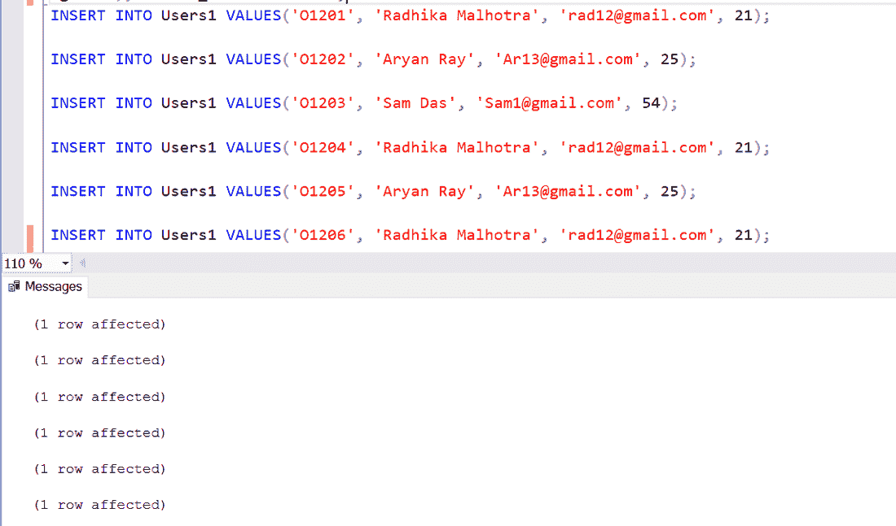
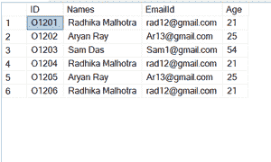
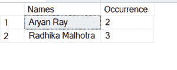

# 在表中查找重名的 SQL 查询

> 原文:[https://www . geesforgeks . org/SQL-查询查找表中重名/](https://www.geeksforgeeks.org/sql-query-to-find-duplicate-names-in-a-table/)

数据库中的重复记录有时会有问题，因为它们会造成混乱，或者还会产生错误的输出。因此，最好从数据库中删除所有重复的记录，因为这将节省我们的时间和空间。但是，最好的做法是将唯一约束( [**【主键】**](https://www.geeksforgeeks.org/primary-key-constraint-in-sql/) 约束)放在一个表上来防止这种情况。

该错误可能是由于各种原因造成的，例如–

*   应用程序缺陷，
*   用户错误
*   糟糕的数据库设计
*   还是因为一些未知的外部来源。

因此，在本文中，我们将在表中查找重复的名称。要进行该查询，我们需要了解 [GROUP BY](https://www.geeksforgeeks.org/sql-group-by/) 语句和[聚合函数](https://www.geeksforgeeks.org/aggregate-functions-in-sql/)(特别是 **COUNT()** )。

我们建议您先浏览[这篇](https://www.geeksforgeeks.org/how-to-group-and-aggregate-data-using-sql/)文章，以便更好地理解。

要在表中找到重复的名称，我们必须遵循以下步骤:

*   **定义条件:**首先需要定义查找重名的条件。您可能希望在一个或多个列中进行搜索。
*   **写查询:**然后简单的写查询找到重名。

我们开始吧-

假设您正在使用一个电子商务网站的数据库。现在，一些用户名被保存了不止一次，他们的电子邮件 id 也是如此。这将导致电子商务网站的错误分析结果，因为不需要多次保存这些数据。

现在让我们首先创建我们的演示数据库，

**步骤 1:** 创建数据库

创建一个名为 User_details 的新数据库，然后使用它。

**查询:**

```sql
CREATE DATABASE User_details; USE User_details;   
```

**输出:**



**步骤 2:** 定义表格

创建一个名为 Users1 的表，并添加这四列 Id、名称、电子邮件 ID 和年龄。

**查询:**

```sql
CREATE Table Users1 (ID VARCHAR(20) Primary Key,
 Names VARCHAR(30), EmailId VARCHAR(30), Age INT);   
```

**输出:**



**第三步:**在表格中插入行，在表格中插入这六行。

**查询:**

```sql
INSERT INTO Users1 VALUES('O1201', 'Radhika Malhotra', 'rad12@gmail.com', 21); 
INSERT INTO Users1 VALUES('O1202', 'Aryan Ray', 'Ar13@gmail.com', 25); 
INSERT INTO Users1 VALUES('O1203', 'Sam Das', 'Sam1@gmail.com', 54); 
INSERT INTO Users1 VALUES('O1204', 'Radhika Malhotra', 'rad12@gmail.com', 21);
 INSERT INTO Users1 VALUES('O1205', 'Aryan Ray', 'Ar13@gmail.com', 25);
  INSERT INTO Users1 VALUES('O1206', 'Radhika Malhotra', 'rad12@gmail.com', 21);   
```

**输出:**



**步骤 4:** 查看插入的数据

运行此命令查看我们的表。

**查询:**

```sql
SELECT * FROM Users1;    
```

**输出:**



用户 1 表

**第 5 步:**现在，让我们进行查询，在该表中查找重复的名称。

*   **定义标准:**这里我们只为从用户 1 表中选择的名称列定义标准。

**查询:**

```sql
SELECT Names,COUNT(*) AS Occurrence FROM
 Users1 GROUP BY Names HAVING COUNT(*)>1;   
```

这个查询很简单。这里，我们使用 GROUP BY 子句对“名称”列中的相同行进行分组。然后，我们使用 COUNT()函数查找该列中的重复数，并将该数据显示在名为“发生”的新列中。[有](https://www.geeksforgeeks.org/having-clause-in-ms-sql-server/)一个子句只保留出现一次以上的组。

**输出:**



我们在表中发现了重复的名称及其出现。这些信息可以帮助我们将来从表中删除重复的行。