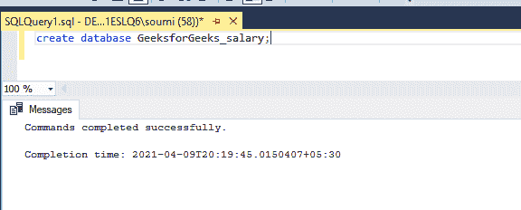
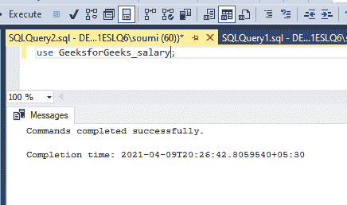
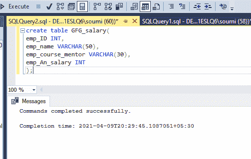
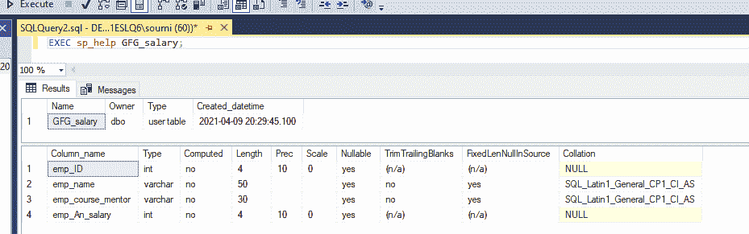
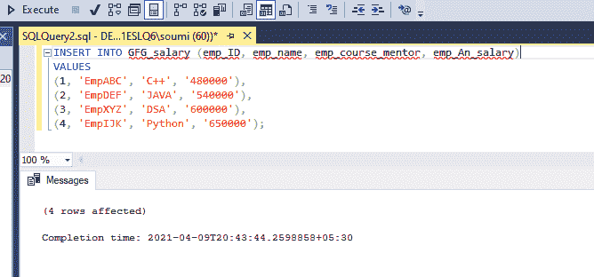
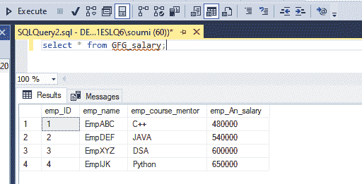
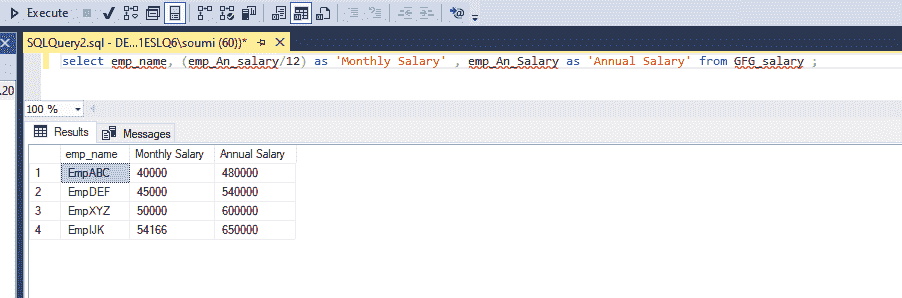
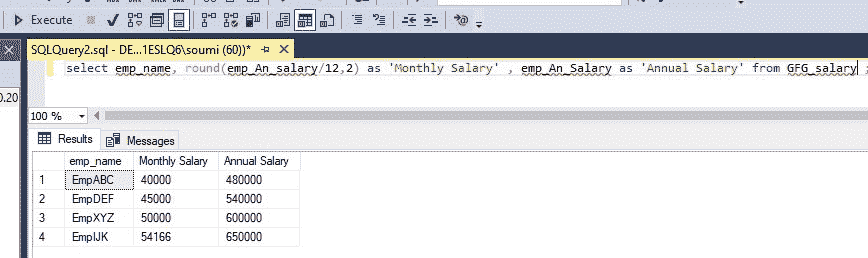
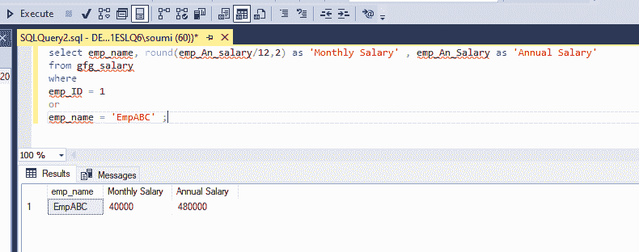

# 给定年薪时查询员工月薪的 SQL 查询

> 原文:[https://www . geeksforgeeks . org/SQL-查询查找-员工月薪-如果给年薪/](https://www.geeksforgeeks.org/sql-query-to-find-monthly-salary-of-employee-if-annual-salary-is-given/)

SQL 代表**结构化查询语言**，用于数据库中检索数据，更新和修改关系数据库中的数据，如 MySql、Oracle 等。查询是对数据库数据的一个问题或请求，也就是说，如果我们问某人任何问题，那么这个问题就是查询。类似地，当我们需要数据库中的任何数据时，我们用 SQL 编写查询来获取这些数据。在这篇文章中，我们谈论的是如果给定年薪，我们如何找到员工的月薪。

### 正在创建数据库

要创建数据库，我们需要在 SQL 平台中使用一个查询，比如 MySql、Oracle 等。问题是，

```
CREATE DATABASE database_name;
```

例如，

```
CREATE DATABASE GeeksforGeeks_salary;
```



### 使用数据库

要使用数据库，我们需要在 SQL 平台上使用一个查询，比如 MySql、Oracle 等。问题是，

```
USE database_name;
```

例如:

```
USE GeeksforGeeks_salary;
```



### 在数据库中添加表

要在数据库中创建表，我们需要在 SQL 平台中使用一个查询，比如 MySql、Oracle 等。问题是，

```
CREATE TABLE table_name(
column1 type(size),
column2 type(size),
.
.
.
columnN type(size)
);
```

例如，

```
CREATE TABLE GFG_salary(
emp_ID INT,
emp_name VARCHAR(50),
emp_course_mentor VARCHAR(30),
emp_An_salary INT
);
```



要查看表格，请使用以下内容:

```
DESC GFG_salary;
```

如果我们使用微软的 SQL server，那么我们需要使用 **EXEC sp_help** 来代替 **DESC。**在微软 SQL server 中，DESC 命令不是 SQL 命令，它是在 Oracle 中使用的。



### 向表中添加值

为了给表增加价值，我们需要在 SQL 平台中使用一个查询，比如 MySql、Oracle 等。命令是，

```
INSERT INTO table_name(
value1,
value2,
value3
.
.
.

valueN);
```

例如，这里的查询将是，

```
INSERT INTO `GFG_salary` (`emp_ID`, `emp_name`, `emp_course_mentor`, `emp_An_salary`)
VALUES
(1, 'EmpABC', 'C++', '480000'),
(2, 'EmpDEF', 'JAVA', '540000'),
(3, 'EmpXYZ', 'DSA', '600000'),
(4, 'EmpIJK', 'Python', '650000');
```



### 插入后表格中的数据

```
SELECT * FROM GFG_salary;
```



**现在我们要从给出年薪的表中找到员工的月薪，**

要找到这一点，我们必须将年薪除以 12，并制作一个别名列作为月薪，以查看每个员工的月薪。要查看表中的其他详细信息，请选择 select 语句中的那些列。

```
SELECT emp_name, (emp_An_salary/12) AS 'Monthly Salary' ,
emp_An_Salary AS 'Annual Salary' FROM GFG_salary ;
```



现在把工资四舍五入到小数点后 2 位，为此我们已经使用了**四舍五入**功能，见下图

```
SELECT emp_name, round(emp_An_salary/12,2) AS 'Monthly Salary' ,
emp_An_Salary AS 'Annual Salary' FROM GFG_salary
```



要找到特定员工的月薪，请使用带有条件的 **where** 子句，如下所示:

```
SELECT  emp_name, round(emp_An_salary/12,2) AS 'Monthly Salary' , emp_An_Salary AS 'Annual Salary'
FROM gfg_salary
WHERE
emp_ID = 1 
OR
emp_name = 'EmpABC' ;
```

