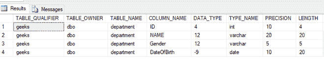
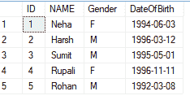
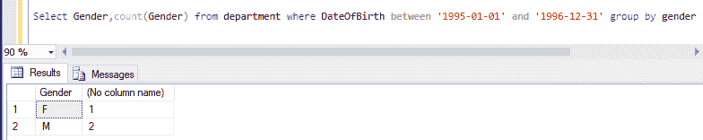

# 根据性别查找其 DOB 在给定范围内的员工数量的 SQL 查询

> 原文:[https://www . geesforgeks . org/SQL-查询查找员工人数-按性别-谁的 dob 在给定范围内/](https://www.geeksforgeeks.org/sql-query-to-find-number-of-employees-according-to-gender-whose-dob-is-between-a-given-range/)

SQL 中的查询就像执行任务的语句。在这里，我们需要编写一个查询，根据性别查找 DOB 在给定范围内的员工数量。

我们将首先创建一个名为“**极客**”的数据库，然后我们将在该数据库中创建一个表“**部门**”。

### 创建数据库:

使用下面的 SQL 语句创建一个名为 geeks 的数据库:

```
CREATE DATABASE geeks;
```

### 使用数据库:

```
USE geeks;
```

### 表格定义:

极客数据库中有以下部门表:

```
CREATE TABLE department(
    ID int,
    NAME Varchar(20),
    Gender Varchar(5),
    DateOfBirth Date);
```

您可以使用下面的语句来查询创建的表的描述:

```
EXEC sp_columns department;
```



### 向表中添加数据:

日期数据类型使用格式“ **YYYY-MM-DD** ”。使用以下语句向部门表添加数据:

```
INSERT INTO department VALUES (1,'Neha','F','1994-06-03');
INSERT INTO department VALUES (2,'Harsh','M','1996-03-12');
INSERT INTO department VALUES (3,'Harsh','M','1995-05-01');
INSERT INTO department VALUES (4,'Rupali','F',1996-11-11');
INSERT INTO department VALUES (5,'Rohan','M','1992-03-08');
```

要验证表格的内容，请使用以下语句:

```
SELECT * FROM department
```



根据员工的性别获取其 DOB 在给定范围内的员工数量。这里，我们将假设 DOB 范围为从 **1995-01-01** 到 **1996-12-31** 。

### 查询:

现在，我们将使用下面的语法根据性别查询其 DOB 在给定范围内的员工数量:

```
Syntax:
SELECT column_name1, count(column_name1) FROM table_name 
WHERE column_name2 between value1 and value2 GROUP BY column_name1;
```

因此，我们的表的查询如下所示:

```
SELECT Gender,count(Gender) FROM department 
WHERE DateOfBirth between '1995-01-01' and '1996-12-31'
GROUP BY gender;
```

**输出:**

