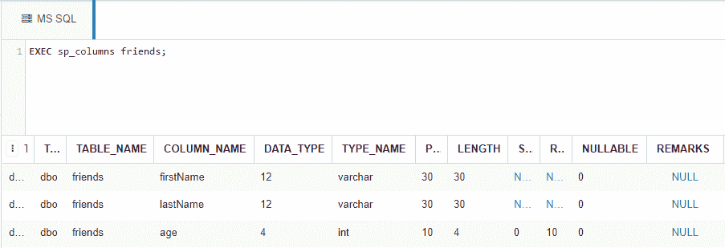
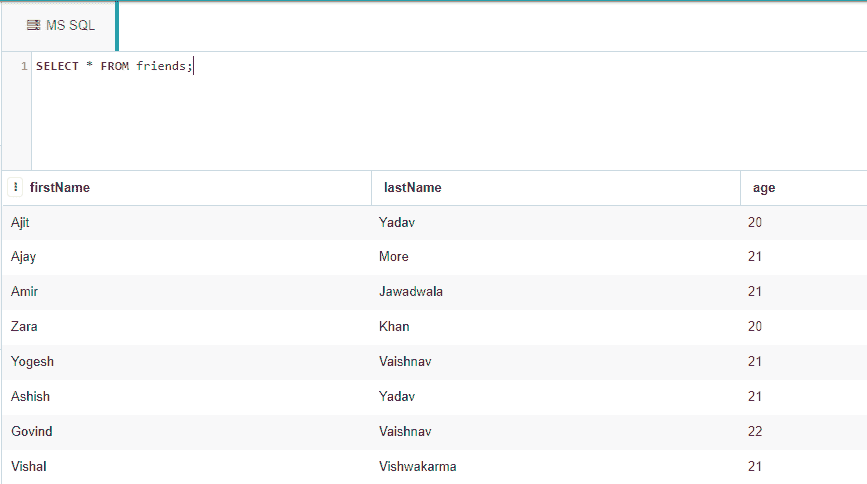
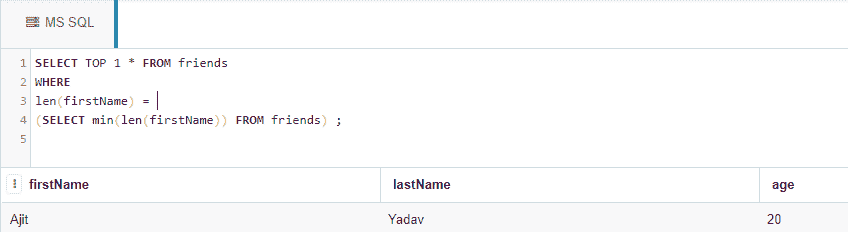
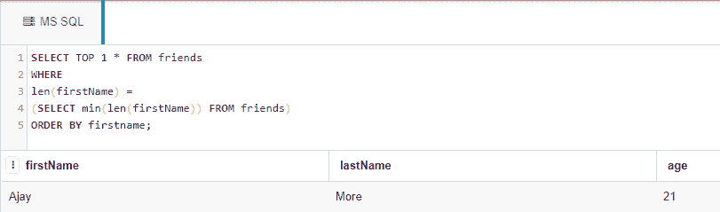
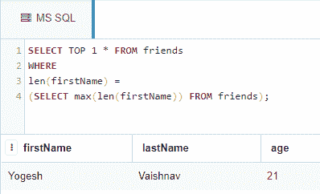
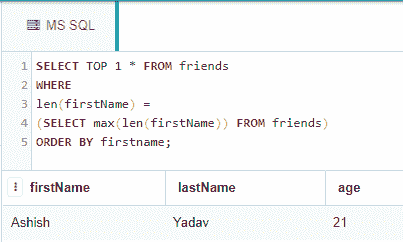

# 从表的一列中找到最短的&最长的字符串的 SQL 查询

> 原文:[https://www . geesforgeks . org/SQL-从表的列中查询到查找最短最长字符串/](https://www.geeksforgeeks.org/sql-query-to-find-shortest-longest-string-from-a-column-of-a-table/)

在这里，我们将看到如何在 SQL 查询的帮助下从数据库中的一个表的一列中找到最短和最长的字符串。我们将首先创建一个数据库“*极客*”，然后我们创建一个表“*朋友*”与“*名字*”、“*姓氏*”、“*年龄*”列。然后将对该表执行我们的 SQL 查询，以检索列中最短和最长的字符串。

在本文中，我们将使用微软的 SQL Server 作为我们的数据库。

### **创建数据库:**

使用下面的 SQL 语句创建一个名为 geeks 的数据库:

```sql
CREATE DATABASE geeks;
```

### **使用数据库:**

```sql
USE geeks;
```

### 表格定义:

我们的*极客*数据库中有以下员工表:

```sql
CREATE TABLE friends(
firstName VARCHAR(30) not NULL,
lastName VARCHAR(30) not NULL,
age INT NOT NULL);
```

您可以使用下面的语句来查询创建的表的描述:

```sql
EXEC SP_COLUMNS friends;
```



### 向表中添加数据:

使用以下语句向*好友*表添加数据:

```sql
INSERT INTO friends
values
('Ajit','Yadav', 20),
('Ajay', 'More', 21),
('Amir', 'Jawadwala', 21),
('Zara', 'Khan', 20),
('Yogesh', 'Vaishnav', 21),
('Ashish', 'Yadav', 21),
('Govind', 'Vaishnav', 22),
('Vishal', 'Vishwakarma', 21);
```

要验证表格的内容，请使用以下语句:

```sql
SELECT * FROM friends;
```



现在让我们使用 *char_length* ()、 *min* ()和 *max* ()函数和 LIMIT 子句，从刚刚创建的表中找到最短和最长的*名字*。

### **最短的** ***名*** **:**

使用 ow 语法在朋友表中找到最短的*名字*:

> **语法:**
> 
> 从<table_name>中选择 TOP 1 *–这里我们只想要一行，这就是为什么 TOP 1 *</table_name>
> 
> 在哪里
> 
> len( <string_column>) =</string_column>
> 
> (选择最小(镜头(<string_column>))从<table_name>)；</table_name></string_column>

**示例:**

```sql
SELECT TOP 1 * FROM friends
WHERE
len(firstName) = 
(SELECT min(len(firstName)) FROM friends);
```

**输出:**



### **排在词典上最短的** ***名*** **:**

如果有多个具有相同最小长度的字符串，并且我们想要按照字典顺序检索最短的字符串，则可以执行以下操作:

> **语法:**
> 
> 从<table_name>中选择 TOP 1 *–这里我们只需要一行，这就是为什么 TOP 1 *。</table_name>
> 
> 在哪里
> 
> len( <string_column>) =</string_column>
> 
> (从<table_name>选择最小值(透镜(<string_column>))</string_column></table_name>
> 
> 通过<column_name>订购；–在这种情况下，列名将是名字。</column_name>

**示例:**

```sql
SELECT TOP 1 *  FROM friends
WHERE
len(firstName) = 
(SELECT min(len(firstName)) FROM friends)
ORDER BY firstname;
```

**输出:**



### **最长的一排** ***名*** **:**

> **语法:**
> 
> 从<table_name>中选择前 1*</table_name>
> 
> 在哪里
> 
> len( <string_column>) =</string_column>
> 
> (从<table_name>选择最大值(透镜(<string_column>)))；</string_column></table_name>

**示例:**

```sql
SELECT TOP 1 * FROMfriends
WHERE
len(firstName) = 
(SELECT max(len(firstName)) FROMfriends);
```

**输出:**



### **排在词典上最长的** ***名*** **:**

> **语法:**
> 
> 从<table_name>中选择前 1*</table_name>
> 
> 在哪里
> 
> len( <string_column>) =</string_column>
> 
> (从<table_name>选择最大值(镜头(<string_column>))</string_column></table_name>
> 
> 通过<string_column>订购；–在这里，我们将按名字排序数据。</string_column>

**示例:**

```sql
SELECT TOP 1* FROM friends
WHERE
len(firstName) = 
(SELECT max(len(firstName)) FROM friends) 
ORDER BY firstName;
```

**输出:**

