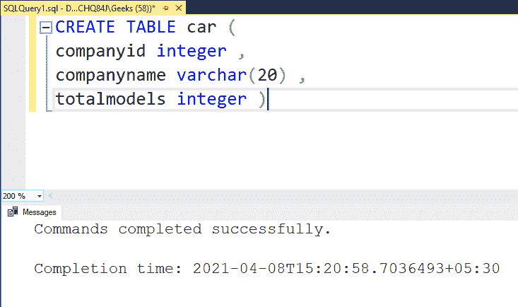
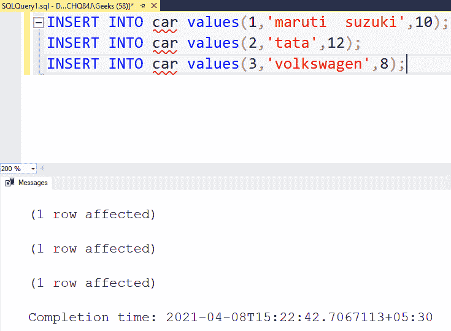
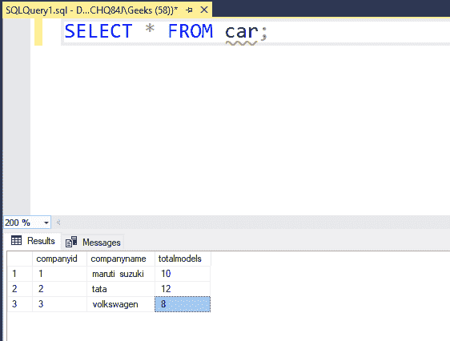
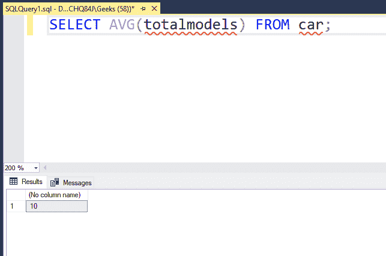

# 查询一列平均值的 SQL 查询

> 原文:[https://www . geesforgeks . org/SQL-查询查找列平均值/](https://www.geeksforgeeks.org/sql-query-to-find-the-average-value-in-a-column/)

在本文中，我们将看到如何在 SQL 中找到列的平均值。SQL 表中的一列是垂直目录结构。在本文中，我们将使用**微软 SQL Server** 作为我们的数据库。

出于示例的目的，我们将创建一个示例表，并对其执行相同的操作。

### 表格定义:

我们的数据库中有以下*车*表:

```sql
CREATE TABLE car (
companyid integer ,
companyname varchar(20) ,
totalmodels integer )
```



上面的查询为我们创建了一个*车*表。

### 向表中添加数据:

要在表中插入值，我们需要使用 *insert* 语句。使用以下语句将数据添加到*汽车*表中:

```sql
INSERT INTO car values(1,'maruti  suzuki',10);
INSERT INTO car values(2,'tata',12);
INSERT INTO car values(3,'volkswagen',8);
```



以上查询将数据添加到*车*表中。

**注意:**我们必须根据创建的表插入值。例如，我们创建了一个*汽车*表，其中 *companyid* 为整数， *companyname* 为 *varchar* 、*T11】和 *totalmodels* 为整数。因此，我们需要插入一个整数、一个字符和一个整数，否则我们可能会得到一个错误。*

要验证表格的内容，请使用以下语句:

```sql
SELECT * FROM car;
```

这将显示我们创建的表格，如下所示:



### **一列中所有值的平均值**

为此，我们需要使用 **avg()函数。**我们必须将列名作为参数传递。avg()函数具有以下语法:

```sql
SELECT AVG( column_name ) FROM table_name;
```

*   avg()函数可以与 SELECT 查询一起使用，用于从表中检索数据。

下面的查询可以找到我们的*车*表*车型*栏的平均值:

```sql
SELECT AVG(totalmodels) FROM car;
```

**输出:**



让我们验证输出。10、12 和 18 的平均数是 10。因此，我们成功地找出了一个表的一列中所有值的平均值。