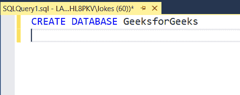
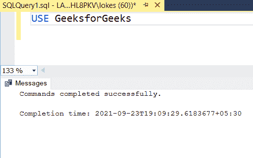
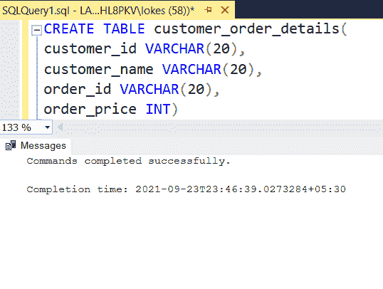
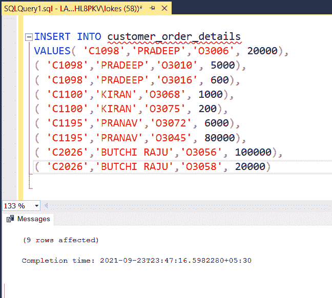
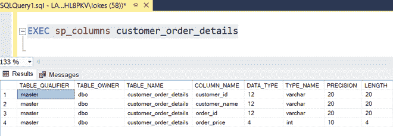
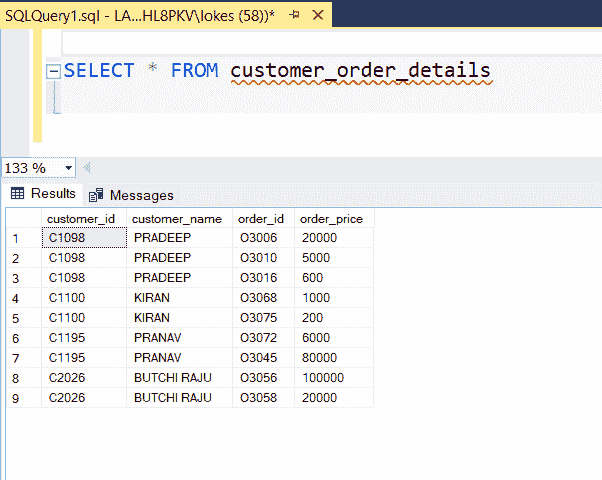
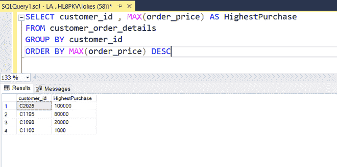
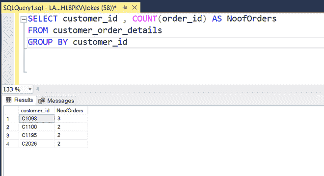

# 查询每个客户订购的最高采购金额的 SQL 查询

> 原文:[https://www . geesforgeks . org/SQL-查询查找最高购买金额-按每个客户订购/](https://www.geeksforgeeks.org/sql-query-to-find-the-highest-purchase-amount-ordered-by-the-each-customer/)

为了找到每个客户的最高购买金额，我们可以使用 GROUP BY 子句，该子句对于聚合函数非常有用。我们使用 MAX()函数和 GROUP BY 来查找每个客户的最高购买量。

在本文中，让我们看看使用 MSSQL 作为服务器来查找每个客户订购的最高购买金额的 SQL 查询。

**步骤 1:** 我们正在创建一个数据库。为此，使用下面的命令创建一个名为 GeeksforGeeks 的数据库。

**查询:**

```
CREATE DATABASE GeeksforGeeks;
```



**步骤 2:** 要使用 GeeksforGeeks 数据库，请使用以下命令。

**查询:**

```
USE GeeksforGeeks
```

**输出:**



**步骤 3:** 现在我们创建一个表。使用以下 SQL 查询创建一个包含 4 列的 customer_order_details 表。

**查询:**

```
CREATE TABLE customer_order_details(
customer_id VARCHAR(20),
customer_name VARCHAR(20),
order_id VARCHAR(20),
order_price INT)
```

**输出:**



**第 4 步:**向表中插入行的查询。使用以下 SQL 查询将行插入 customer_order_details 表。

**查询:**

```
INSERT INTO customer_order_details
VALUES( 'C1098','PRADEEP','O3006', 20000),
( 'C1098','PRADEEP','O3010', 5000),
( 'C1098','PRADEEP','O3016', 600),
( 'C1100','KIRAN','O3068', 1000),
( 'C1100','KIRAN','O3075', 200),
( 'C1195','PRANAV','O3072', 6000),
( 'C1195','PRANAV','O3045', 80000),
( 'C2026','BUTCHI RAJU','O3056', 100000),
( 'C2026','BUTCHI RAJU','O3058', 20000)
```

**输出:**



**步骤 5:** 查看表格的描述。

**查询:**

```
EXEC sp_columns customer_order_details
```

**输出:**



**步骤 6:** 查看插入的数据

**查询:**

```
SELECT * FROM customer_order_details
```

**输出:**



*   查询每个客户订购的最高购买金额

**查询:**

```
SELECT customer_id , MAX(order_price) AS HighestPurchase
FROM customer_order_details
GROUP BY customer_id 
ORDER BY MAX(order_price) DESC
```

**输出:**



*   查询每个客户订购的订单数量。

**查询:**

```
SELECT customer_id , COUNT(order_id) AS NoofOrders
FROM customer_order_details
GROUP BY customer_id
```

**输出:**

