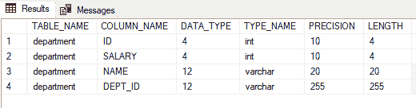
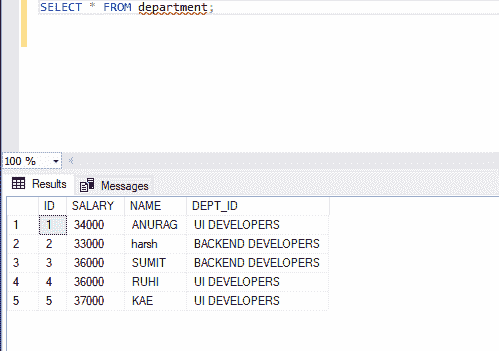
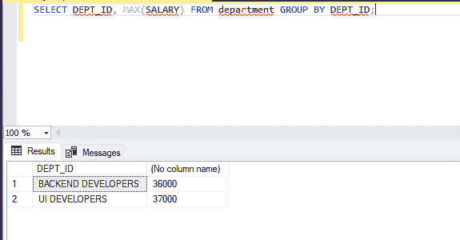

# 查询各部门最高工资的 SQL 查询

> 原文:[https://www . geesforgeks . org/SQL-查询找到每个部门工资最高的人/](https://www.geeksforgeeks.org/sql-query-to-find-the-highest-salary-of-each-department/)

结构化查询语言是一种标准的数据库语言，用于创建、维护和检索关系数据库中的数据，如 MySQL、Oracle 等。在本文中，我们将使用**微软 SQL Server** 。

下面我们就来看看如何拿到各个部门的最高工资。在这里，我们将首先创建一个名为“极客”的数据库，然后在该数据库中创建一个表“部门”。之后，我们将对该表执行查询。

**创建数据库:**

```
CREATE geeks;
```

**使用该数据库:**

```
USE geeks;
```

**这是我们在** **极客数据库中的表:**

```
CREATE TABLE department(
    ID int,
    SALARY int,
    NAME Varchar(20),
    DEPT_ID Varchar(255));
```

**查看表格说明:**

```
EXEC sp_columns department;
```



**在表格中添加数值:**

```
INSERT INTO department VALUES (1, 34000, 'ANURAG', 'UI DEVELOPERS');
INSERT INTO department VALUES (2, 33000, 'harsh', 'BACKEND DEVELOPERS');
INSERT INTO department VALUES (3, 36000, 'SUMIT', 'BACKEND DEVELOPERS');
INSERT INTO department VALUES (4, 36000, 'RUHI', 'UI DEVELOPERS');
INSERT INTO department VALUES (5, 37000, 'KAE', 'UI DEVELOPERS');
```


**这是我们表里面的数据:**

```
SELECT * FROM department;
```



拿到桌子上每个部门的最高工资。这里我们的表包含一个 DEPT_ID，它有两个不同的类别 UI DEVELOPERS 和后端 DEVELOPERS，我们将找出该列的最高工资。

> 从表名按列名分组中选择列名；

**示例:**

```
SELECT DEPT_ID, MAX(SALARY) FROM department GROUP BY DEPT_ID;
```

**输出:**

