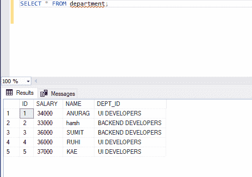

# 查找姓名以特定字母开头的人的姓名的 SQL 查询

> 原文:[https://www . geesforgeks . org/SQL-query-to-find-姓名以特定字母开头的人名/](https://www.geeksforgeeks.org/sql-query-to-find-the-name-of-a-person-whose-name-starts-with-specific-letter/)

在这里，我们将看到如何在 SQL 中找到一个名字以指定字母开头的人的名字。在本文中，我们将使用**微软 SQL Server** 作为我们的数据库。

例如，找到名字以字母“H”开头的人的名字。我们将在 SQL 查询中的指定字母后使用%符号。在这里，我们将首先创建一个名为“极客”的数据库，然后在该数据库中创建一个表“部门”。之后，我们将对该表执行查询。

**创建数据库:**

```
CREATE DATABASE geeks;
```

**使用该数据库:**

```
USE geeks;
```

**这是我们表中的** ***极客*** **数据库**

```
CREATE TABLE department(
    ID int,
    SALARY int,
    NAME Varchar(20),
    DEPT_ID Varchar(255));
```

**查看表格:**

```
EXEC sp_column department;
```


**在表格中添加数值:**

```
INSERT INTO department VALUES (1, 34000, 'ANURAG', 'UI DEVELOPERS');
INSERT INTO department VALUES (2, 33000, 'harsh', 'BACKEND DEVELOPERS');
INSERT INTO department VALUES (3, 36000, 'SUMIT', 'BACKEND DEVELOPERS');
INSERT INTO department VALUES (4, 36000, 'RUHI', 'UI DEVELOPERS');
INSERT INTO department VALUES (5, 37000, 'KAE', 'UI DEVELOPERS');
```


**这是我们表里面的数据:**

```
SELECT * FROM department;
```



**现在让我们找到一个名字以** **指定字母**开头的人的名字

> **语法:**
> 
> 选择“列名”
> 
> 来自“表名”
> 
> 其中“列名”像{ PATTERN }；

**例 1:** 在这个例子中，我们会找到以 h 开头的名字。

```
 SELECT * FROM department WHERE NAME LIKE 'H%';
```

**输出:**


**例 2:** 在这个例子中，我们会找到以 r 开头的名字。

```
 SELECT * FROM department WHERE NAME LIKE 'R%';
```

**输出:**

