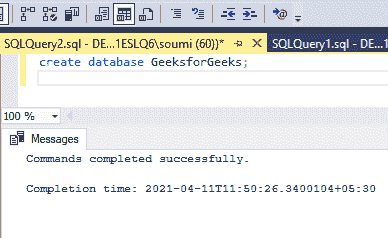
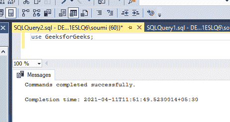
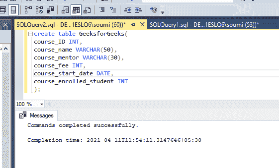
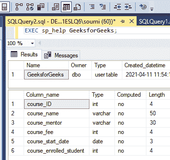
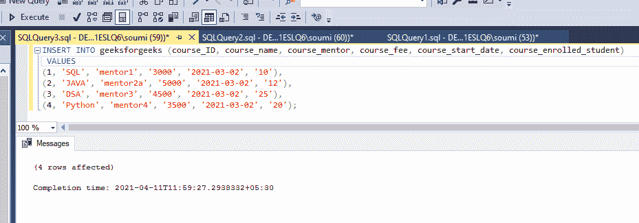
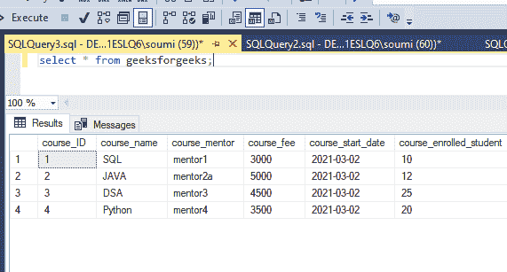
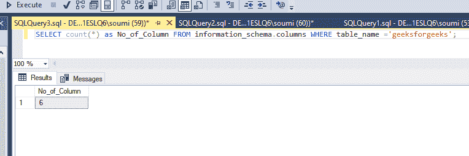

# 查找表中列数的 SQL 查询

> 原文:[https://www . geesforgeks . org/SQL-query-查找表中的列数/](https://www.geeksforgeeks.org/sql-query-to-find-the-number-of-columns-in-a-table/)

SQL 代表一种**结构查询语言**，在数据库中用来检索数据，更新和修改 MySql、Oracle 等关系数据库中的数据。查询是对数据库数据的一个问题或请求，也就是说，如果我们问某人任何问题，那么这个问题就是查询。类似地，当我们需要数据库中的任何数据时，我们用 SQL 编写查询来获取这些数据。在本文中，我们将讨论如何找到表中的列数。

**创建数据库:**

要创建数据库，我们需要在 SQL 平台中使用一个查询，比如 MySql、Oracle 等。问题是，

```sql
create database database_name;
```

例如，

```sql
create database GeeksforGeeks;
```



**输出:**

```sql
Commands completed successfully
```

**使用数据库:**

为了使用数据库，我们需要在 SQL 门户中使用一个查询，比如 MySql、Oracle 等。问题是，

```sql
use database_name;
```

**这里查询的是**，

```sql
use GeeksforGeeks;
```



**输出:**

```sql
Commands completed successfully
```

**在数据库中添加表格:**

要在数据库中创建表，我们需要在 SQL 平台中使用一个查询，比如 MySql、Oracle 等。问题是，

```sql
create table table_name(
column1 type(size),
column2 type(size),
.
.
.
columnN type(size)
);
```

例如，

```sql
create table GeeksforGeeks(
course_ID INT,
course_name VARCHAR(50),
course_mentor VARCHAR(30),
course_fee INT,
course_start_date DATE
course_enrolled_student INT
);
```

这里，表中有 6 列。



**见表:**

要查看该表，请使用“ **DESC 表名**查询。

这里的查询是，

```sql
desc geeksforgeeks;
```

如果我们使用微软的 SQL 服务器，那么我们需要使用**‘EXEC sp _ help’**来代替 DESC。在微软的 SQL 服务器中， **DESC** 命令不是 SQL 命令，而是在 Oracle 中使用。

```sql
EXEC sp_help GFG_salary;
```



**输出:**

```sql
SL No   |    Column_name                   |    Type    |   Computed   |   Length
----------------------------------------------------------------------------------
1\.        |    course_ID                       |    int     |      no      |     4
2\.        |    course_name                   |   varchar  |      no      |     50 
3\.        |    course_mentor                 |   varchar  |      no      |     30
4\.        |    course_fee                       |     int    |      no      |     4
5\.        |    course_start_date             |    date    |      no      |     3
6\.        |    course_enrolled_student       |     int    |      no      |     4
----------------------------------------------------------------------------------
```

**在表格中添加数值:**

为了给表增加价值，我们需要在 SQL 平台中使用一个查询，比如 MySql、Oracle 等。问题是，

```sql
insert into table_name(
value1,
value2,
value3
.
.
.

valueN);
```

例如，这里的查询将是，

```sql
INSERT INTO `geeksforgeeks` (`course_ID`, `course_name`, `course_mentor`, `course_fee`, `course_start_date`, `course_enrolled_student`) VALUES
(1, 'SQL', 'mentor1', '3000', '2021-03-02', '10'),
(2, 'JAVA', 'mentor2a', '5000', '2021-03-02', '12'),
(3, 'DSA', 'mentor3', '4500', '2021-03-02', '25'),
(4, 'Python', 'mentor4', '3500', '2021-03-02', '20');
```



**输出:**

```sql
4 rows affected
```

**插入后表格中的数据:**

```sql
select * from geeksforgeeks;
```



**输出:**

```sql
   | course_ID    | course_name | course_mentor | course_fee | course_start_date |  course_enrolled_student  
----------------------------------------------------------------------------------------------------------
1\. |  1         |    SQL      |     mentor1   |  3000      | 2021-03-02        |  10
2\. |  2         |    JAVA     |     mentor2a  |  5000      | 2021-03-02        |  12   
3\. |  3         |    DSA      |     mentor3   |  4500      | 2021-03-02        |  25
4\. |  4         |    Python   |     mentor4   |  3500      | 2021-03-02        |  20
----------------------------------------------------------------------------------------------------------
```

**现在我们必须找到表中存在的列数，**

为了找到答案，我们可以在关系数据库中使用一个简单的函数 **COUNT()** 和 **INFORMATION_SCHEMA** 视图。这个 **INFORMATION_SCHEMA** 是一组 **ANSI 标准**视图，提供对数据库及其对象(如表、约束、过程等)细节的只读访问。请参见下面的查询

```sql
SELECT count(*) as No_of_Column FROM information_schema.columns WHERE table_name ='geeksforgeeks';
```

这里， **COUNT(*)** 计算 **INFORMATION_SCHEMA 返回的列数。列**一个接一个，并提供列的最终计数。这里**表名**选择我们希望工作的表。



**输出:**

```sql
   |  No_of_Column  
-------------------
1\. |  6
-------------------
```

所以在这里，最终输出将是 6，因为在表“geeksforgeeks”中有 6 列。