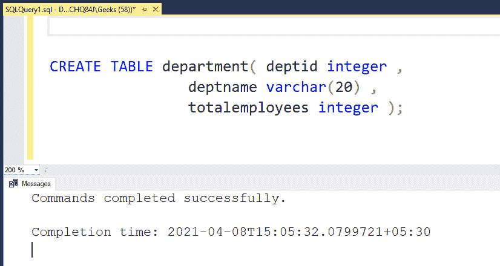
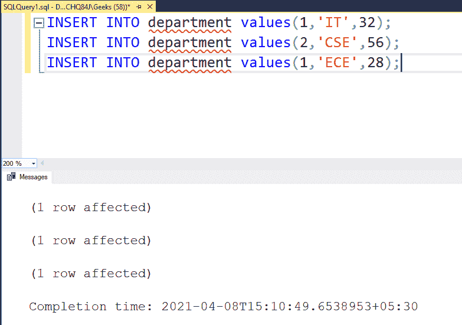
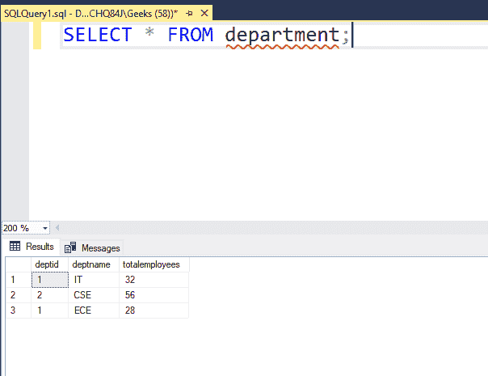

# 查找一列中所有值之和的 SQL 查询

> 原文:[https://www . geesforgeks . org/SQL-查询查找列中所有值的总和/](https://www.geeksforgeeks.org/sql-query-to-find-the-sum-of-all-values-in-a-column/)

在本文中，我们将研究查询数据库表的一列中所有值的总和的过程。但是在找到一列中所有值的总和之前，让我们创建一个包含一些列和数据的表。在本文中，我们将使用**微软 SQL Server** 作为我们的数据库。

### **创建表格:**

使用以下语法在数据库中创建一个表

**语法:**

```
create table table_name( column_name 1 data type ( size ) ,
        column_name 2 data type ( size) ,
          . . . . column_name n data type ( size ) )
```

为了便于说明，我们将创建一个部门表，并对其进行操作。部门表将有 3 个字段，即 *deptid、deptname、totalemployees。*为此，请使用以下语句:

```
CREATE TABLE department( deptid integer ,
                 deptname varchar(20) ,
                  totalemployees integer );
```



这将创建表格。要向表中插入值，我们需要使用 insert 语句。让我们看看向我们创建的部门表中添加一些数据:

**注意:**我们必须根据创建的表插入值。例如，我们创建了一个部门表，其中 *deptid* 为整数， *deptname* 为 varchar， *totalemployees* 为整数。因此，我们需要分别插入一个整数、一个字符和一个整数。

现在，让我们使用下面的查询向部门表中插入一些行:

```
INSERT INTO department values(1,'IT',32);
INSERT INTO department values(2,'CSE',56);
INSERT INTO department values(1,'ECE',28);
```

**输出:**



按照相同的模式，我们在表中插入了一些行，现在让我们使用 SELECT 语句打印表中可用的数据，如下所示:

```
SELECT * FROM department;
```

**注:**此处*代表全部。如果我们执行这个查询，将显示整个表。

**输出:**



### **一列中所有值的总和:**

*   为此，我们需要使用 **sum()函数**。我们必须将列名作为参数传递。
*   这个 sum()函数可以和 SELECT 查询一起使用，从表中检索数据。
*   下面的示例显示了如何查找一列中所有值的总和。

**示例:**

```
SELECT SUM(totalemployees) FROM department;
```

**输出:**


**结论:**使用 sum()函数，我们可以使用列名得到一列中值的和。