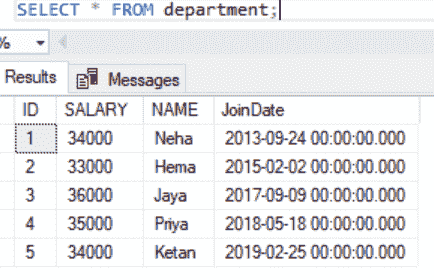
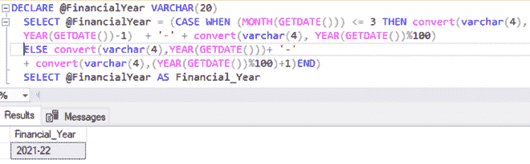
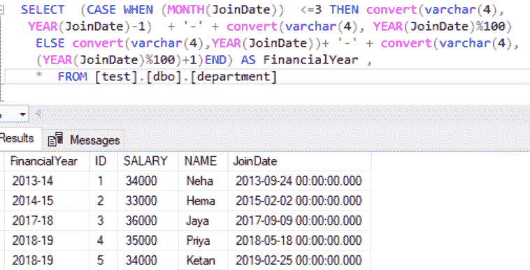

# 使用给定日期获取财政年度的 SQL 查询

> 原文:[https://www . geesforgeks . org/SQL-查询获取财政年度使用给定日期/](https://www.geeksforgeeks.org/sql-query-to-get-a-financial-year-using-a-given-date/)

在这里，我们将使用 SQL 中的给定日期来获取财政年度。在本文中，我们将使用微软的 SQL Server 作为我们的数据库。

例如，在表中查找给定日期的财政年度。在这里，我们将首先创建一个名为“极客”的数据库，然后在该数据库中创建一个表“部门”。之后，我们将对该表执行查询。

### **创建数据库:**

```sql
CREATE DATABASE geeks;
```

### **使用该数据库:**

```sql
USE geeks;
```

### **在** ***极客*** **数据库中创建**一个**表:**

```sql
CREATE TABLE [dbo].[department](
[ID] [int] NULL,
[SALARY] [int] NULL,
[NAME] [varchar](20) NULL,
[JoinDate] [datetime] NULL
) ON [PRIMARY]
GO
```

### **在表格中添加数值:**

```sql
INSERT INTO [dbo].[department] VALUES  ( 1, 34000, 'Neha', '2013-09-24')  
INSERT INTO [dbo].[department] VALUES  ( 2, 33000, 'Hema', '2015-02-0' )
INSERT INTO [dbo].[department] VALUES  ( 3, 36000, 'Jaya', '2017-09-09' )
INSERT INTO [dbo].[department] VALUES  ( 4, 35000, 'Priya', '2018-05-18' )
INSERT INTO [dbo].[department] VALUES  ( 5, 34000, 'Ketan', '2019-02-25' )
GO
```

这是我们表中的数据:

```sql
SELECT * FROM department;
```



**使用 SQL 查询查看当前财政年度:**

```sql
DECLARE @FIYear VARCHAR(20)    
  SELECT @FIYear = (CASE WHEN (MONTH(GETDATE()))
  <= 3 THEN convert(varchar(4), YEAR(GETDATE())-1) + '-' + convert(varchar(4), YEAR(GETDATE())%100)
  ELSE convert(varchar(4),YEAR(GETDATE()))+ '-' + convert(varchar(4),(YEAR(GETDATE())%100)+1)END)    
  SELECT @FIYear AS F_YEAR 
```

**输出:**



**使用表中的给定日期获取财政年度:**

```sql
 SELECT  (CASE WHEN (MONTH(JoinDate))  <=3 THEN convert(varchar(4),
  YEAR(JoinDate)-1)  + '-' + convert(varchar(4), YEAR(JoinDate)%100)    
   ELSE convert(varchar(4),YEAR(JoinDate))+ '-' + convert(varchar(4),
(YEAR(JoinDate)%100)+1)END) AS FinancialYear ,
*  FROM [test].[dbo].[department]   
```

**输出:**

