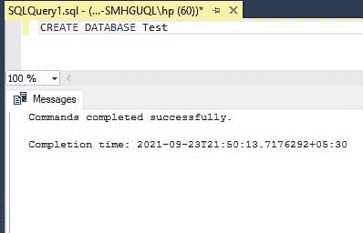
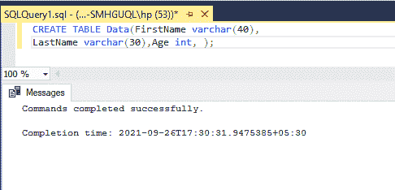
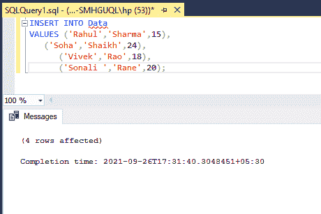
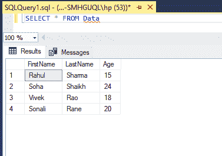
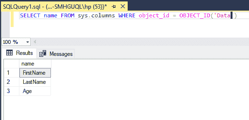

# 从表中获取列名的 SQL 查询

> 原文:[https://www . geesforgeks . org/SQL-query-to-get-column-name-from-a-table/](https://www.geeksforgeeks.org/sql-query-to-get-column-names-from-a-table/)

SQL 代表结构化查询语言。它是一种用于与数据库交互的语言，即创建数据库、在数据库中创建表、检索数据或更新数据库中的表等。SQL 是 ANSI(美国国家标准协会)标准。使用 SQL，我们可以做很多事情。例如，我们可以执行查询，可以将记录插入表中，可以更新记录，可以创建数据库，可以创建表，可以删除表，等等。

在本文中，我们将研究如何从表中获取列名。

**步骤 1:** 创建数据库

我们正在使用 CREATE 查询创建数据库。

**查询:**

```
CREATE DATABASE Test
```

**输出:**



命令已成功完成。这意味着创建了名为“测试”的数据库。下一步是创建一个表。

**步骤 2:** 创建表格

数据表将有三个字段名字、姓氏和年龄。使用下面的查询，我们将创建一个表。

**查询:**

```
CREATE TABLE Data(FirstName varchar(40),
LastName varchar(30),Age int, );
```

**输出:**



数据表是在数据库中创建的。

**步骤 3:** 将数据插入表格

使用下面的查询，我们将数据添加到我们的表中。

**查询:**

```
INSERT INTO Data
VALUES ('Rahul','Sharma',15),
   ('Soha','Shaikh',24),
   ('Vivek','Rao',18),
   ('Sonali ','Rane',20);
```

**输出:**



我们已将数据添加到我们的表中。我们可以使用下面的 SELECT 查询来验证表中的数据。

**步骤 4:** 查看表格数据

**查询:**

```
SELECT * FROM Data
```

**输出:**



**步骤 5:** 从表中获取列名

我们将使用系统。列来获取表中的列名。它是一个系统表，用于维护列信息。它包含以下有关列的信息:

*   名称–列的名称。
*   对象标识–列所属表的对象标识。
*   列标识–列的标识。
*   user _ type _ id–用户定义列类型的 ID。
*   最大长度–列的最大长度(以字节为单位)。
*   is _ nullable–1 =列可为空。

**查询:**

```
SELECT name FROM sys.columns WHERE object_id = OBJECT_ID('Data')  
```

**输出:**

