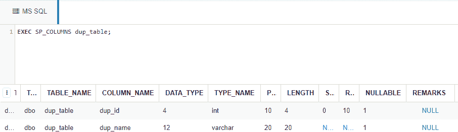
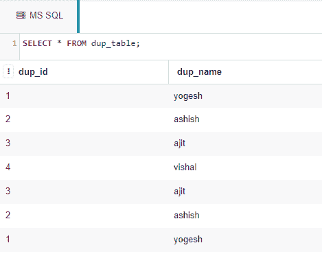
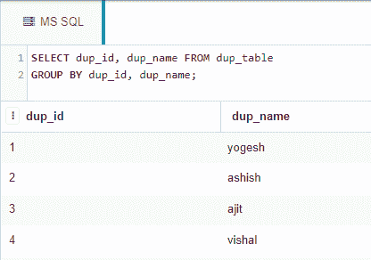
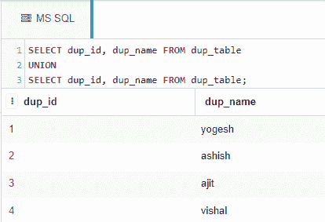
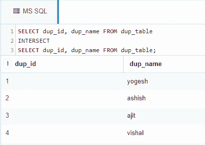
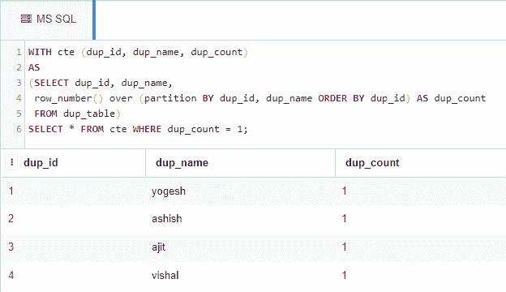

# 不使用不同关键字获取不同记录的 SQL 查询

> 原文:[https://www . geesforgeks . org/SQL-query-get-distinct-records-无需使用-distinct-关键字/](https://www.geeksforgeeks.org/sql-query-to-get-distinct-records-without-using-distinct-keyword/)

在这里，我们将看到如何在不使用 distinct 子句的情况下从微软 SQL Server 的数据库表中检索唯一的(不同的)记录。

我们将在名为“极客”的数据库中创建一个雇员表。

### **创建数据库:**

```
CREATE DATABASE geeks;
```

### **使用数据库:**

```
USE geeks;
```

我们的*极客*数据库中有以下 *dup_table* 表:

```
CREATE TABLE dup_table(
  dup_id int,
  dup_name varchar(20));
```

要查看表模式，请使用以下命令:

```
EXEC SP_COLUMNS dup_table;
```



### **将值添加到*****dup _ Table*****Table:**

使用以下查询向表中添加记录:

```
INSERT INTO dup_table
VALUES
(1, 'yogesh'),
(2, 'ashish'),
(3, 'ajit'),
(4, 'vishal'),
(3, 'ajit'),
(2, 'ashish'),
(1, 'yogesh');
```

现在我们将从 *dup_table* 表中检索所有数据:

```
SELECT * FROM dup_table;
```



现在让我们在不使用 distinct 子句的情况下检索 DISTINCT 行。

### **通过使用 GROUP BY 子句:**

GROUP BY 子句可用于查询表中不同的行:

```
SELECT dup_id, dup_name FROM dup_table
GROUP BY dup_id, dup_name;
```



### **通过使用** a **设置联合运算符:**

set UNION 运算符也可用于查询表中的不同行:

```
SELECT dup_id, dup_name FROM dup_table
UNION
SELECT dup_id, dup_name FROM dup_table;
```



### **通过使用 set INTERSECT 运算符:**

INTERSECT 运算符可用于查询表中不同的行:

```
SELECT dup_id, dup_name FROM dup_table
INTERSECT
SELECT dup_id, dup_name FROM dup_table;
```



### **使用 CTE &行号()功能:**

CTE 代表通用表表达式。它也可以用来查询表中不同的行，函数 row_number()如下所示:

```
WITH cte (dup_id, dup_name, dup_count)
AS
(SELECT dup_id, dup_name,
 row_number() over (partition BY dup_id,
 dup_name ORDER BY dup_id) AS dup_count
 FROM dup_table)
SELECT * FROM cte WHERE dup_count = 1;
```

