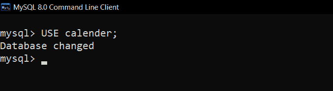
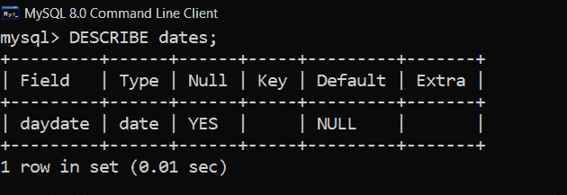
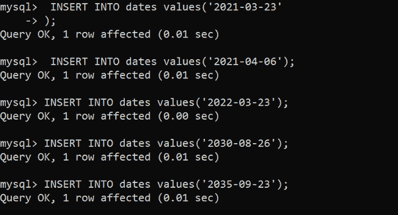
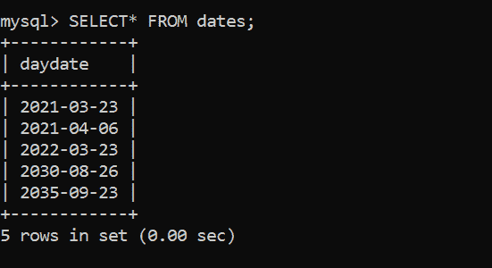
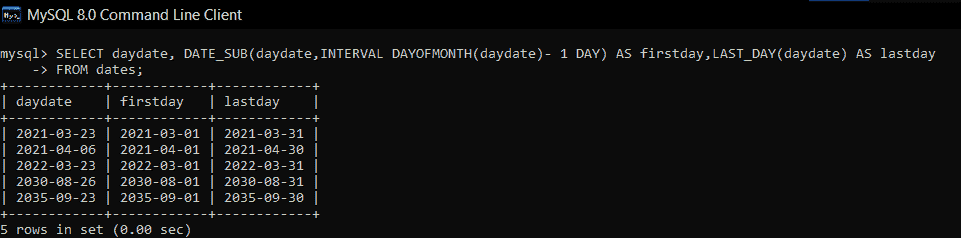
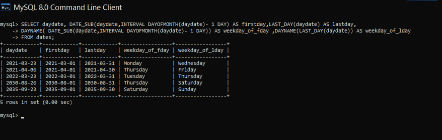

# 获取数据库中一个月的第一天和最后一天的 SQL 查询

> 原文:[https://www . geesforgeks . org/SQL-查询获取数据库中每月的第一天和最后一天/](https://www.geeksforgeeks.org/sql-query-to-get-first-and-last-day-of-a-month-in-a-database/)

在本文中，我们将讨论在数据库上执行操作的 SQL 查询的概述，我们的主要焦点将是如何在 SQL 中获取数据库中一个月的第一天和最后一天。我们一个一个来讨论。

**简介:**
SQL 中的查询帮助我们与数据库交互，完成对[数据库](https://www.geeksforgeeks.org/introduction-of-dbms-database-management-system-set-1/)的创建、更新、检索以及对数据库用户的操作。这里我们讨论在 MySQL 中查找一个月的第一天和最后一天的 SQL 查询。在我的 SQL 中，日期格式是 **YYYY-MM-DD** 。

**示例–**

```
2021-03-23
Monday Wednesday are first and last days of the month.
Example2:
2021-04-06
Thursday Friday are first and last days of the month.
```

**步骤 1:创建数据库–**

```
CREATE DATABASE calendar;
```

**输出:**


**第 2 步:使用数据库–**
使用数据库日历如下。

```
USE calendar;
```

**输出:**



**步骤-3:在日历数据库中创建表格–**
在日历数据库中创建表格，表格名称为日期，列为日期，如下所示。

```
CREATE TABLE dates(daydate DATE);
```

**输出:**


**第 4 步:验证数据到表日期–**
要查看表日期的描述，请使用如下 SQL 查询。

```
DESCRIBE dates;
```

**输出:**



**第 5 步:向表中插入数据–**
向表中插入行，如下所示。

```
 INSERT INTO dates values('2021-03-23');
 INSERT INTO dates values('2021-04-06');
 INSERT INTO dates values('2022-03-23');
 INSERT INTO dates values('2030-08-26');
 INSERT INTO dates values('2035-09-23');
```

**输出:**



**步骤-6:验证数据–**
使用以下 SQL 查询查看插入了数据的表，如下所示。

```
 SELECT* FROM dates;
```

**输出:**



**查询找出日期的第一天和最后一天:**
在 MySQL 中，没有直接的函数可以找出第一天，但是有一个函数可以找出该特定日期所在月份的第一天，因此借助于这个函数，我们可以从给定的日期中减去前一天的日期，从而得到该月的第一天。

**语法:**

```
Firstday:
DATE_SUB(date1,INTERVAL DAYOFMONTH(date1)-1);
Syntax for DATE_SUB:
DATE_SUB(date1,date2) subtracts date2 from date1
```

**最后一天的 SQL 查询–**
最后一天，我们可以使用函数 LAST_DAY 直接得到。

**语法:**

```
LastDay:LAST_DAY(date);
```

在上面的语法中，DAYOFMONTH 函数给出了特定的一天，如下所示。

```
SELECT daydate, DATE_SUB(daydate,INTERVAL DAYOFMONTH(daydate)- 1 DAY) 
AS firstday,
LAST_DAY(daydate) 
AS lastday
FROM dates;
```

**输出:**
这里在表格中通过使用 AS 默认的列标题进行了更改。



**查询找出有工作日的日期的第一天和最后一天:**
通过使用 DAYNAME 函数我们可以得到日期的工作日如下。

**语法:**

```
DAYNAME(date1);
```

在该表中，每月的第一天和最后一天的工作日也添加如下。

```
SELECT daydate, DATE_SUB(daydate,INTERVAL DAYOFMONTH(daydate)- 1 DAY) 
AS firstday,LAST_DAY(daydate) AS lastday,
DAYNAME( DATE_SUB(daydate,INTERVAL DAYOFMONTH(daydate)- 1 DAY)) 
AS weekday_of_fday ,DAYNAME(LAST_DAY(daydate)) 
AS weekday_of_lday
FROM dates;
```

**输出:**

