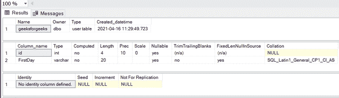
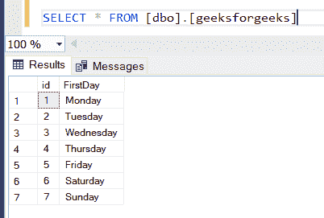
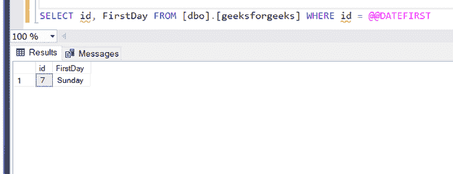
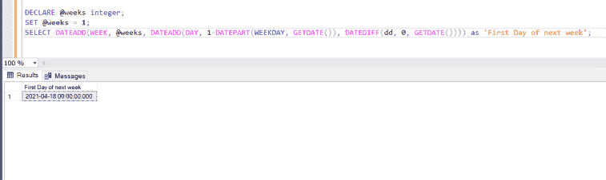
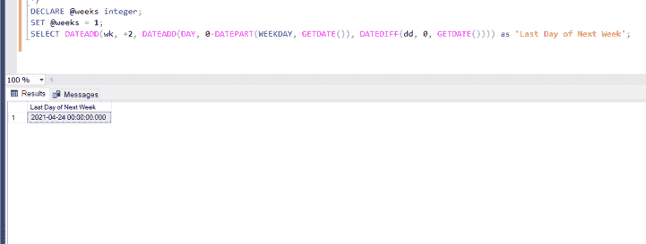

# 获取数据库中一周的第一天和最后一天的 SQL 查询

> 原文:[https://www . geesforgeks . org/SQL-查询获取每周第一天和最后一天的数据库/](https://www.geeksforgeeks.org/sql-query-to-get-first-and-last-day-of-a-week-in-a-database/)

SQL 查询是用特定语言编写的执行特定任务的程序的单行语句。查询由 SQL 中的一些预定义函数组成，如 SELECT、CREATE 等。因此，在本文中，我们将学习 SQL 查询来获取数据库中一周的第一天和最后一天。因此，让我们首先创建一个数据库来完成我们的任务，这里我们将使用微软的 SQL Server:

**步骤 1:** 创建一个名为 GFG 的数据库:

```
CREATE DATABASE GFG
```

**步骤 2:** 使用该数据库:

```
USE GFG
```

**步骤 3:** 在该数据库中创建一个表:

```
CREATE TABLE geeksforgeeks(
id integer,
FirstDay varchar(20)
)
```

描述这张表:

```
sp_help 'dbo.geeksforgeeks'
```



**第 4 步:**在该数据库中插入日期值:

```
INSERT INTO [dbo].[geeksforgeeks]
([id] ,[FirstDay])
VALUES
(1, 'Monday')
GO

INSERT INTO [dbo].[geeksforgeeks]
([id] ,[FirstDay])
VALUES
(2, 'Tuesday')
GO

INSERT INTO [dbo].[geeksforgeeks]
([id] ,[FirstDay])
VALUES
(3, 'Wednesday')
GO

INSERT INTO [dbo].[geeksforgeeks]
([id] ,[FirstDay])
VALUES
(4, 'Thursday')
GO

INSERT INTO [dbo].[geeksforgeeks]
([id] ,[FirstDay])
VALUES
(5, 'Friday')
GO

INSERT INTO [dbo].[geeksforgeeks]
([id] ,[FirstDay])
VALUES
(6, 'Saturday')
GO

INSERT INTO [dbo].[geeksforgeeks]
([id] ,[FirstDay])
VALUES
(7, 'Sunday')
GO
```

现在，我们正在检查数据是否插入成功:

```
SELECT * FROM [dbo].[geeksforgeeks]
```



**第五步:**现在查看一周的第一天:

```
SELECT id, FirstDay FROM [dbo].[geeksforgeeks] WHERE id = @@DATEFIRST 
```



所以我们可以看到一周的第一天是星期天

**第 6 步:**现在我们将使用 DATEADD 函数()找出下周的第一天是什么:

```
/* 
    If you want to find out the first day of 
    upcoming weeks then set @weeks as a positive integer
    with number of weeks, else negative integer. 
*/

DECLARE @weeks integer;
SET @weeks = 1;
SELECT DATEADD(WEEK, @weeks, DATEADD(DAY, 1-DATEPART(WEEKDAY, GETDATE()), 
               DATEDIFF(dd, 0, GETDATE()))) as 'First Day of next week';
```



**第 7 步:**现在我们将使用 DATEADD 函数找出下周的最后一天是什么:

```
/* 
    If you want to find out the first day of 
    previous weeks then set @weeks as a negative integer
    with number of weeks, else negative integer. 
*/

DECLARE @weeks integer;
SET @weeks = 1;
SELECT DATEADD(wk, +2, DATEADD(DAY, 0-DATEPART(WEEKDAY, GETDATE()), 
               DATEDIFF(dd, 0, GETDATE()))) as 'Last Day of Next Week';
```

