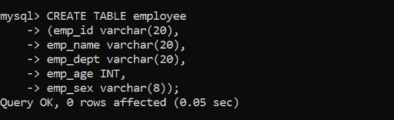
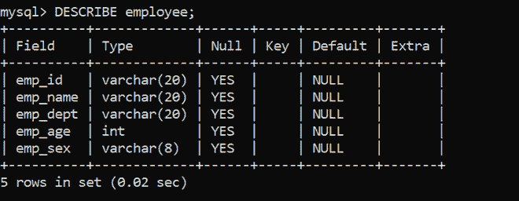
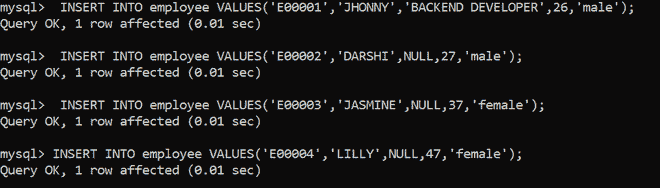
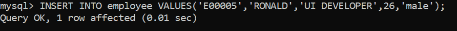
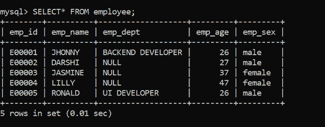
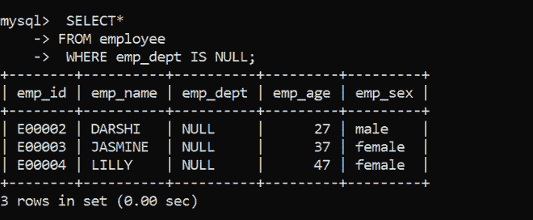
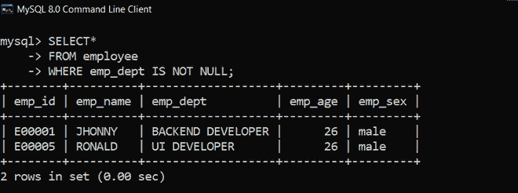

# SQL 查询获取员工未分配到部门的员工信息

> 原文:[https://www . geesforgeks . org/SQL-查询获取员工信息-员工未分配到部门的位置/](https://www.geeksforgeeks.org/sql-query-to-get-information-of-employee-where-employee-is-not-assigned-to-the-department/)

在本文中，我们将讨论 [SQL](https://www.geeksforgeeks.org/sql-tutorial/) 查询的概述，我们的主要焦点将是如何在 SQL 中获取员工未分配到部门的员工信息。我们一步一步来讨论。

**简介:**
查询帮助我们与数据库进行交互，进行数据检索、更新、删除、插入等各种操作。在本文中，让我们看到一个查询，以获取员工的信息，该员工没有被分配到任何部门。当在一个表中，如果任何属性没有被赋予任何值，它将是空的，所以让我们在数据库公司的一个表上执行查询。

**步骤-1:创建数据库–**
使用以下 SQL 查询创建数据库公司，如下所示。

```
CREATE DATABASE company;
```

**输出:**


**步骤-2:使用数据库–**
使用数据库公司使用如下 SQL 查询如下。

```
USE company;
```

**输出:**


**步骤-3:创建表–**
使用如下 SQL 查询创建一个包含 5 列的表员工。

```
CREATE TABLE employee
(
emp_id varchar(20),
emp_name varchar(20),
emp_dept varchar(20),
emp_age INT,
emp_sex varchar(8)
);
```

**输出:**



**步骤-4:验证数据库–**
使用以下 SQL 查询查看数据库的描述，如下所示。

```
DESCRIBE employee;
```

**输出:**




**第 5 步:向表中插入数据–**
使用如下 SQL 查询向员工表中插入行。

```
 INSERT INTO employee VALUES('E00001','JHONNY','BACKEND DEVELOPER',26,'male');
 INSERT INTO employee VALUES('E00002','DARSHI',NULL,27,'male');
 INSERT INTO employee VALUES('E00003','JASMINE',NULL,37,'female');
 INSERT INTO employee VALUES('E00004','LILLY',NULL,47,'female');
 INSERT INTO employee VALUES('E00005','RONALD','UI DEVELOPER',26,'male'); 
```

**输出:**





**第 6 步:验证插入的数据–**
使用如下 SQL 查询查看插入行后的表员工。

```
SELECT* FROM employee;
```

**输出:**



**查询找到部门未分配的员工:**
这里我们就来看看如何使用如下的 SQL 查询找到部门未分配的员工。

**语法:**

```
SELECT*
FROM table_name
WHERE column_name  IS NULL;
```

**选择数据查询–**

```
 SELECT*
 FROM employee
 WHERE emp_dept IS NULL;
```

**输出:**
在该表中，获取部门为空值的所有员工记录。



**查询找到部门被分配的员工:**
在这里，我们将看到如何使用如下 SQL 查询找到部门被分配的员工。

**语法:**

```
SELECT *
FROM table_name
WHERE column_name IS NOT NULL;
```

**选择查询–**

```
SELECT *
FROM employee
WHERE emp_dept IS NOT NULL;
```

**输出:**
获取部门被分配的员工的所有记录。

