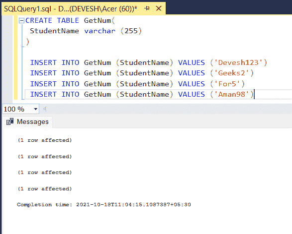
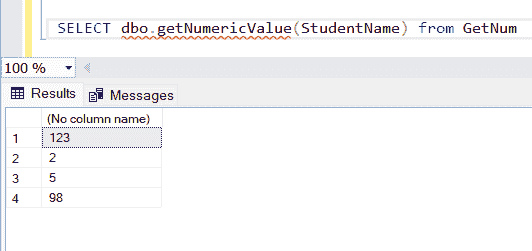

# 只从字符串中获取数字的 SQL 查询

> 原文:[https://www . geesforgeks . org/SQL-query-to-get-only-numbers-from-string/](https://www.geeksforgeeks.org/sql-query-to-get-only-numbers-from-a-string/)

正如我们所知，在一个 [SQL](https://www.geeksforgeeks.org/structured-query-language/) 数据库中，我们可以插入任何类型的数据。有时，在 productions 服务器中，数据会被合并并保存在一列中的两行或更多行损坏。在这种情况下，我们可以从该字符串中提取数字部分并再次保存。因此，在本文中，我们将学习如何在 SQL 中提取字符串的数字部分。我们将使用[微软 SQL](https://www.geeksforgeeks.org/introduction-of-ms-sql-server/#:~:text=Microsoft%20SQL%20Server%20or%20MS,marketed%20by%20the%20Microsoft%20company.) 作为我们的服务器。

所以我们先从[创建数据库](https://www.geeksforgeeks.org/create-database-in-ms-sql-server/)开始。

**步骤 1:** 创建数据库

**查询:**

```sql
CREATE DATABASE GFG
```

**步骤 2:** 使用该数据库

**查询:**

```sql
USE GFG
```

**步骤 3:** 创建表格

创建一个表来存储数据

**查询:**

```sql
CREATE TABLE GetNum(
 StudentName varchar (255)
)

```

**步骤 4:** 向数据库中插入一些数据

**查询:**

```sql
 INSERT INTO GetNum (StudentName) VALUES ('Devesh123')

 INSERT INTO GetNum (StudentName) VALUES ('Geeks2')

 INSERT INTO GetNum (StudentName) VALUES ('For5')

 INSERT INTO GetNum (StudentName) VALUES ('Aman98')
```

**输出:**



**第四步:** SQL 查询提取数字

我们将编写一个 SQL 函数，以便不要一次又一次地运行相同的查询来提取数字，我们可以多次使用该函数，它也将存储在数据库中。

**查询:**

```sql
CREATE FUNCTION dbo.getNumericValue
 (
@inputString VARCHAR(256)
)
RETURNS VARCHAR(256)
AS
BEGIN
  DECLARE @integerPart INT
  SET @integerPart = PATINDEX('%[^0-9]%', @inputString)
  BEGIN
    WHILE @integerPart > 0
    BEGIN
      SET @inputString = STUFF(@inputString, @integerPart, 1, '' )
      SET @integerPart = PATINDEX('%[^0-9]%', @inputString )
    END
  END
  RETURN ISNULL(@inputString,0)
END
GO
```

更多详情可参考 [PATINDEX()。](https://www.geeksforgeeks.org/sql-server-patindex-function/)

**第 5 步:**现在运行创建的函数以获得所需的输出。

**查询:**

```sql
SELECT dbo.getNumericValue(StudentName) from GetNum
```

**输出:**

