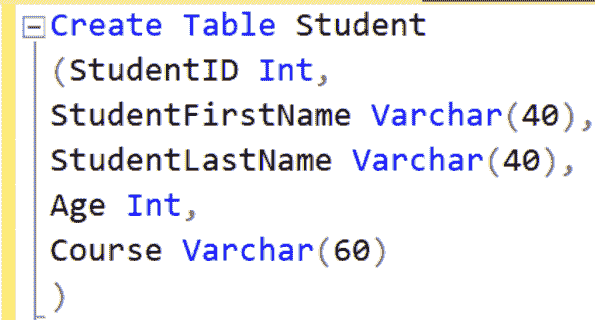
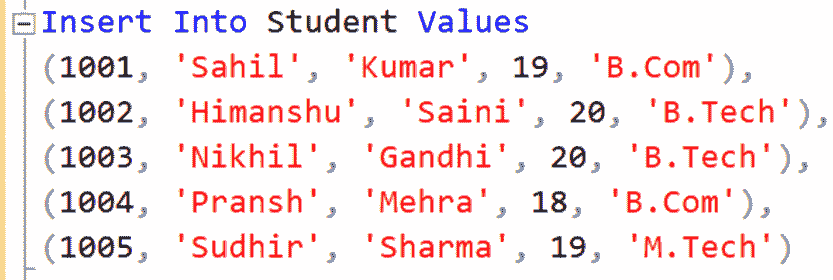
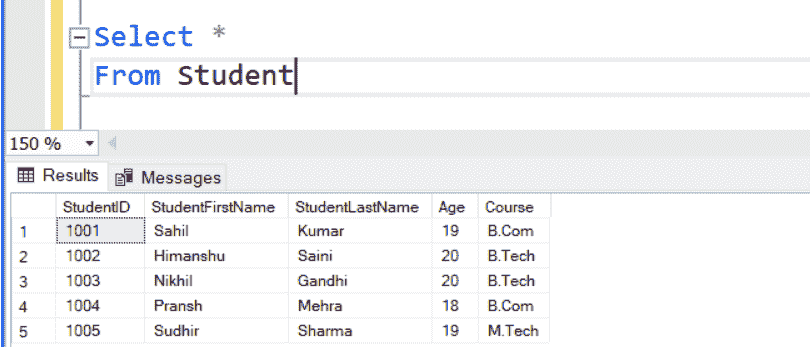
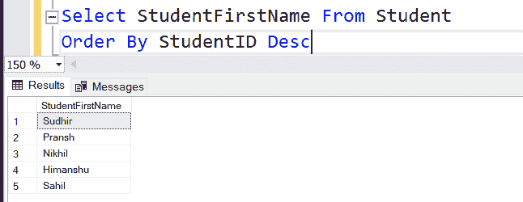
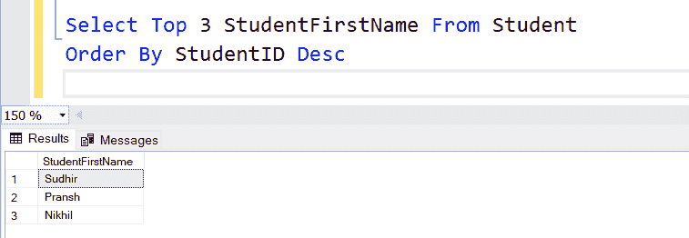

# 从表中获取最新记录的 SQL 查询

> 原文:[https://www . geesforgeks . org/SQL-query-从表中获取最新记录/](https://www.geeksforgeeks.org/sql-query-to-get-the-latest-record-from-the-table/)

从表中获取最新的记录是一项简单的任务，您不需要获得 SQL 的高级知识。在本文中，我们将讨论从表中获取最新记录的最简单的方法。

您可能想要从包含所有列的表中获取最新的记录，或者您可能只想要特定数量的列。您将在本文中找到这两个问题的解决方案。

### 所有列的最新记录:

**步骤 1:** 要解决查询，首先[创建一个表](https://www.geeksforgeeks.org/sql-create/)，从中提取记录。这里，创建了一个名为“学生”的表，其中包含学生数据，如学生标识、名字、姓氏、年龄和学生的课程。

**查询:**

```sql
Create Table Student
(StudentID Int, StudentFirstName Varchar(40),
studentLastName Varchar(40),
Age Int, Course Varchar(60))
```



**步骤 2:** 将数据插入表格

**查询:**

```sql
Insert Into Student Values
(1001,'Sahil','Kumar',19,'B.Com'),
1002,'Himanshu','Saini',20,'B.Tech'),
1003,'Nikhil','Gandhi',20,'B.Tech'),
1004,'Pransh','Mehra',18,'B.Com'),
1005,'Sudhir','Sharma',19,'M.Tech')
```



**步骤 3:** 要查看数据条目，我们使用以下查询:

**查询:**

```sql
Select * From student;
```

**输出:**



现在要从表中获取最新记录，我们将使用以下语法:

**语法:**

```sql
Select Column_Name From Table_Name
Order By Column_Name Desc
```

我们在表格顶部得到的数据是我们的最新数据，我们将使用 [OrderBy](https://www.geeksforgeeks.org/sql-order-by/) 降序得到我们的记录。



您已经看到学生的名字在列表的顶部，而如果我们在创建表格时看到。输入名称 Sudhir 作为最后一个条目。这为我们提供了表中所有列的数据。

现在让我们看看如何获取特定数量的列的记录。

### 从表中获取包含多列的最新记录的 SQL 查询:

要获取特定列数的最新记录，我们将使用以下语法:

**查询:**

```sql
Select Top 3 Column_Name From Table_Name
Order By Column_Name Desc
```

请看下面的例子，它显示了表中学生的记录。



您只观察到表中的 3 个条目，但这里需要注意的是，这是表中最新的 3 个条目，学生。这样，您可以获得多个列的最新记录。