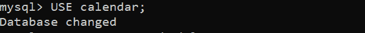

# 获取昨天和明天的 SQL 查询

> 原文:[https://www . geesforgeks . org/SQL-query-get-昨天和明天/](https://www.geeksforgeeks.org/sql-query-to-get-yesterday-and-tomorrow/)

查询帮助用户与数据库交互，以便使用不同的查询在数据库中创建、插入、删除和更新数据。

在本文中，让我们看看如何根据数据库中给定的日期获取昨天和明天。

示例–

给定日期:2021-03-23
昨天:2021-03-22 星期一
明天:2021-03-24 星期三

**创建数据库日历:**

```
CREATE DATABASE calendar;
```


**使用数据库日历**

```
USE calendar;
```



**创建表格时间表:**

```
CREATE TABLE schedule
(dates date);
```


**查看表格描述:**

```
DESCRIBE schedule;
```


**在计划中插入行:**

```
INSERT INTO schedule VALUES('2021-03-23');
INSERT INTO schedule VALUES('2020-08-04');
INSERT INTO schedule VALUES('2021-06-08');
INSERT INTO schedule VALUES('2030-04-04');
INSERT INTO schedule VALUES('2025-09-13');

```


**查看表中数据:**

```
SELECT* FROMschedule;
```


**查询得到当前日期的昨天和明天:**

为了得到当前日期的昨天和明天，我们可以使用 MySQL 中的 CURRDATE()函数，从中减去 1 得到昨天，再加上 1 得到明天。

```
SELECT CURDATE(),
    DATE_SUB(CURDATE(),INTERVAL 1 DAY) AS yesterday,
    DATE_ADD(CURDATE(),INTERVAL 1 DAY) AS tomorrow;
```

在这里，我们可以使用 AS 将默认的列标题更改为其他名称。


**示例 1:**

查询以获取表中日期的昨天和明天:

> **语法:**
> 选择日期 _ 子(日期)、
> 日期 _ 子(日期)、【间隔 1 天】作为某名称
> 日期 _ 添加(日期)、【间隔 1 天】作为某名称；

```
 SELECT dates,
     DATE_SUB(dates,INTERVAL 1 DAY) AS yesterday,
     DATE_ADD(dates,INTERVAL 1 DAY) AS tomorrow
     FROM schedule;
```


**示例 2:**

查询以获取工作日表中的昨天和明天日期:

> **语法:**
> 
> SELECT column_name，
> DATE_SUB(column_name，INTERVAL 1 DAY) AS some_name，
> DATE_ADD(column_name，INTERVAL 1 DAY) AS some_name，
> DAYNAME(当前 _ DATE)
> DAY name(前 _ 日)
> DAYNAME(下 _ 日)；

```
  SELECT dates,
     DATE_SUB(dates,INTERVAL 1 DAY) AS yesterday,
     DATE_ADD(dates,INTERVAL 1 DAY) AS tomorrow,
     DAYNAME(dates) AS weekdayofdate,
     DAYNAME(DATE_SUB(dates,INTERVAL 1 DAY)) AS weekdayofYd,
     DAYNAME( DATE_ADD(dates,INTERVAL 1 DAY)) AS weekdayofTm
     FROM schedule;
```

