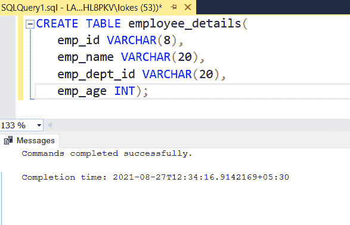
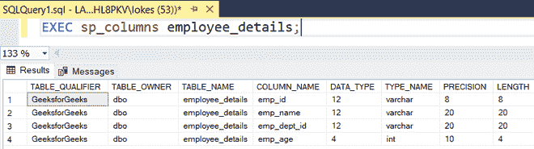
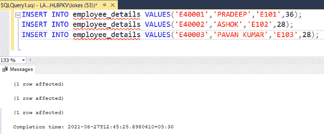
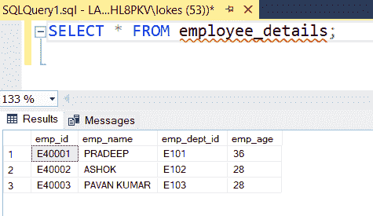
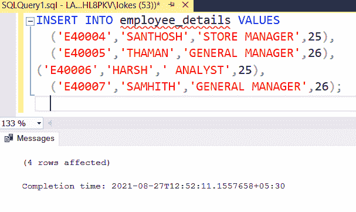
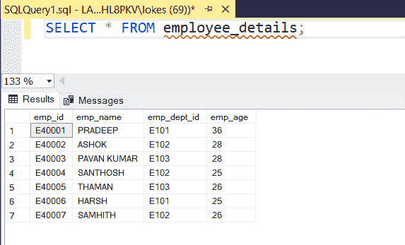

# 插入多行的 SQL 查询

> 原文:[https://www . geesforgeks . org/SQL-查询-插入-多行/](https://www.geeksforgeeks.org/sql-query-to-insert-multiple-rows/)

在表中插入是 SQL 中的一种数据操作语言。当我们想要存储数据时，我们需要将数据插入数据库。我们使用 **INSERT 语句**将数据插入数据库。

在本文中，我们将看到如何在 MSSQL server 中使用 **INSERT** 语句在数据库中插入单个以及多个行。

**创建数据库:**使用以下命令创建名为 GeeksforGeeks 的数据库:

**查询:**

```sql
CREATE DATABASE GeeksforGeeks;
```

**输出:**


**使用数据库:**要使用 GeeksforGeeks 数据库，请使用以下命令:

**查询:**

```sql
USE GeeksforGeeks
```

**输出:**


**创建表:**使用以下 SQL 查询创建包含 4 列的 employee_details 表:

**查询:**

```sql
CREATE TABLE employee_details(
   emp_id VARCHAR(8),
   emp_name VARCHAR(20),
   emp_dept_id VARCHAR(20),
   emp_age INT);
```

**输出:**



**验证表:**使用以下 SQL 查询查看数据库中表的描述:

**查询:**

```sql
EXEC sp_columns employee_details;
```

**输出:**



**向表中插入行的查询:**

使用以下 SQL 查询将行插入 employee_details 表:

**1。将单个行插入表中:**

**查询:**

```sql
INSERT INTO employee_details VALUES('E40001','PRADEEP','E101',36);
INSERT INTO employee_details VALUES('E40002','ASHOK','E102',28);
INSERT INTO employee_details VALUES('E40003','PAVAN KUMAR','E103',28); 
```

**输出:**



**2。查看插入的数据:**

**查询:**

```sql
SELECT * FROM employee_details;
```

**输出:**



**3。在表格中插入多行:**

**查询:**

```sql
INSERT INTO employee_details VALUES
  ('E40004','SANTHOSH','E102',25),
  ('E40005','THAMAN','E103',26),
('E40006','HARSH','E101',25),
  ('E40007','SAMHITH','E102',26);
```

**输出:**



**4。现在查看插入的数据:**

**查询:**

```sql
SELECT * FROM employee_details;
```

**输出:**

