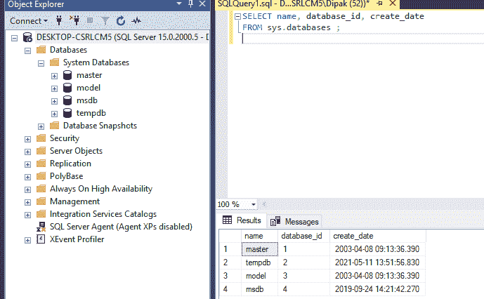
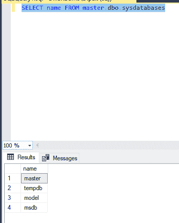
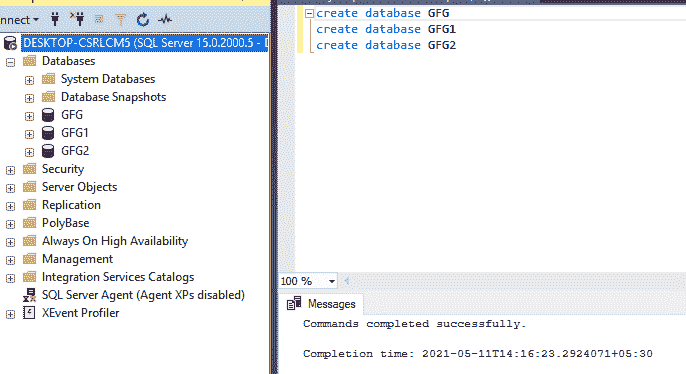
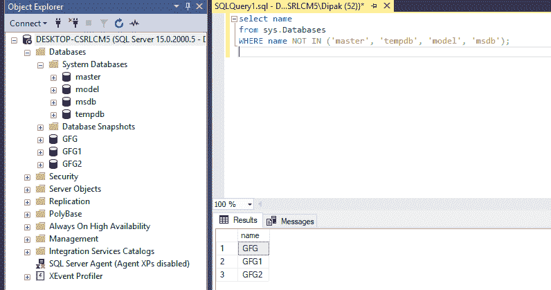

# 列出所有数据库的 SQL 查询

> 原文:[https://www . geesforgeks . org/SQL-查询到列表-所有数据库/](https://www.geeksforgeeks.org/sql-query-to-list-all-databases/)

SQL 语言是数据库管理系统中的一种数据管理语言。这用于操作数据库和其中保存的记录。数据库是存储在任何计算机系统中的结构化信息或数据的集合。因此，为了修改这些数据库或更新其中包含的任何数据，我们使用了类似 SQL 等 DML 语言。我们将主要使用 **MS SQL SERVER** 来进行这个主题。

因此，首先让我们创建一些数据库，我们将在本文中使用它们来使用 SQL 进行查询。

要用 SQL 创建数据库，我们必须使用以下命令:

```sql
CREATE DATABASE database_name;
```

这个命令在 SQL server 中创建一个给定名称的数据库，然后我们也可以通过 SQL 向这个数据库添加表。我们也可以在这些表中添加元组或行，或者我们可以使用 SQL 根据我们的需要删除这些表或更新或修改它们。

要使用任何特定的数据库，我们应该在它们之间进行选择，如下所示:

```sql
USE database_name;
```

因此，让我们使用 SQL 向该数据库添加两个表。

为此，我们将使用下面给出的命令:

```sql
CREATE TABLE [database_name.]table_name (
   pk_column data_type PRIMARY KEY,
   column_1 data_type NOT NULL,
   column_2 data_type,
   ...,
   table_constraints
);
```

如果我们没有提到数据库的名称，那么将选择默认的 USE 数据库来创建表。

下面是一些命令，显示了我们如何创建数据库，以及如何列出它们并对它们运行查询。

SQL server 上最初存在两种类型的默认数据库:

### 1.系统数据库:

```sql
The command to see system databases are :
SELECT name, database_id, create_date  
FROM sys.databases ;  
```

**输出:**



主要有四种类型的系统数据库:

1.  掌握
2.  模型
3.  msdn
4.  tempdb

除了上述数据库之外，服务器中还存在其他一些数据库。这些可以显示如下:

```sql
SELECT name FROM master.dbo.sysdatabases
```

**输出:**



### 2.用户定义的数据库:

现在，为了选择用户定义的数据库，让我们首先在服务器中创建一些数据库。

我们将使用下面提到的命令向 SQL server 添加一些数据库:

```sql
create database GFG;
create database GFG1;
create database GFG2;
```

**输出:**



这些查询列出了服务器中存在的用户定义的数据库(虽然我们已经完成了上面的工作):

```sql
select name  
from sys.Databases
WHERE name NOT IN ('master', 'tempdb', 'model', 'msdb');  /* removing the name of sys db*/
```

**输出:**



因此，通过这种方式，我们能够选择并列出 SQL server 中所有用户定义和非用户定义的数据库。