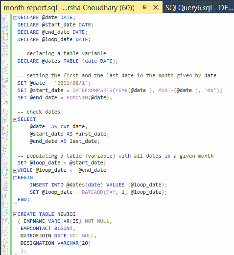
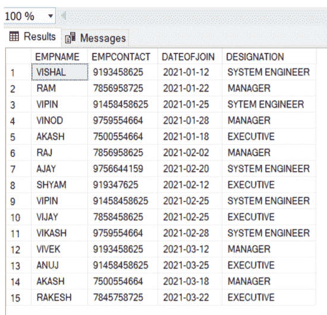

# 进行月度报表的 SQL 查询

> 原文:[https://www . geesforgeks . org/SQL-按月查询制作报告/](https://www.geeksforgeeks.org/sql-query-to-make-month-wise-report/)

在本文中，我们将学习 SQL Query 如何按月从表中提取数据或按月生成报告，为了更好地理解，我们将借助一个示例来实现它。我们将遵循一步一步的过程。

在这里，我们将讨论如何在使用 DATENAME()函数的 SQL 查询的帮助下，按月从表中提取数据或按月生成报告。

### **资料名称():**

这个函数是 SQL 的一个定义函数。它用于提取数据的特定部分。该函数将结果提取为字符串类型值。

**语法:**

```
DATENAME( required part of date,date)
```

此处所需的日期参数为:

*   年，年，年:年
*   月，毫米，米:月
*   一天，一天，一天。和日期时间的另一部分。

为了实现查询以查找按月报告。我们将创建一个数据库“SAMPLE”，并在名为“SAMPLE”的数据库中创建一个表“NEWJOINEE”。我们将按照以下步骤实现该查询

### **第一步:创建数据库**

用于创建名为 SAMPLE 的数据库的 SQL server 语句如下

**查询:**

```
Create database SAMPLE;
```

### **第二步:使用数据库**

SQL 语句切换数据库上下文示例，如下所示:

**查询:**

```
Use SAMPLE;
```

### **第三步:在数据库**中创建表格

用于在数据库中创建表。我们需要在微软的 SQL Server 中执行一个查询。像 Mysql、Oracle 等。我们将使用这个查询:

**语法:**

```
create table table_name(
column1 type(size),
column2 type(size),
.
.
.
columnN type(size)
);
```

**查询:**

```
DECLARE @date DATE;
DECLARE @start_date DATE;
DECLARE @end_date DATE;
DECLARE @loop_date DATE;

-- declaring a table variable
DECLARE @dates TABLE (date DATE);

-- setting the first and the last date in the month given by date
SET @date = '2021/08/1';
SET @start_date = DATEFROMPARTS(YEAR(@date ), MONTH(@date ), '01');
SET @end_date = EOMONTH(@date);

-- check dates
SELECT 
    @date  AS cur_date,
    @start_date AS first_date,
    @end_date AS last_date;

-- populating a table (variable) with all dates in a given month
SET @loop_date = @start_date;
WHILE @loop_date <= @end_date 
BEGIN
    INSERT INTO @dates(date) VALUES (@loop_date);
    SET @loop_date = DATEADD(DAY, 1, @loop_date);
END;

CREATE TABLE NEWJOINEE
( EMPNAME VARCHAR(25) NOT NULL,
 EMPCONTACT BIGINT,
 DATEOFJOIN DATE NOT NULL,
 DESIGNATION VARCHAR(20)
 );
```



**第四步:将数据插入表格**

要将数据插入到表中，这里有一个我们将在 SQL Server 中使用的查询。

**语法:**

```
insert into table_name(
value1,
value2,
value3,...valueN);
```

**查询:**

```
 INSERT INTO NEWJOINEE
 VALUES ('VISHAL',9193458625,'12-JAN-2021','SYSTEM ENGINEER'),
 ('RAM',7856958725,'22-JAN-2021','MANAGER'),
 ('VIPIN',91458458625,'25-JAN-2021','SYSTEM ENGINEER'),
('VINOD',9759554664,'28-JAN-2021','MANAGER'),
('AKASH',7500554664,'18-JAN-2021','EXECUTIVE'),
('RAJ',7856958625,'02-FEB-2021','MANAGER'),
('AJAY',9756644159,'20-FEB-2021','SYSTEM ENGINEER'),
('SHYAM',919347625,'12-FEB-2021','EXECUTIVE'),
 ('VIPIN',91458458625,'25-FEB-2021','SYSTEM ENGINEER'),
('VIJAY',7858458625,'25-FEB-2021','EXECUTIVE'),
('VIKASH',9759554664,'28-FEB-2021','SYSTEM ENGINEER'),
('VIVEK',9193458625,'12-MAR-2021','MANAGER'),
 ('ANUJ',91458458625,'25-MAR-2021','EXECUTIVE'),
('AKASH',7500554664,'18-MAR-2021','MANAGER'),
('RAKESH',7845758725,'22-MAR-2021','EXECUTIVE');
```

**输出:**



**第五步:逐月报表查询**

**查询:**

```
SELECT MAX(DATENAME(MM,DATEOFJOIN)) AS JOININGMONTH, COUNT(1) AS "TOTALEMP. JOIN"
FROM NEWJOINEE GROUP BY MONTH(DATEOFJOIN);
```

**输出:**

