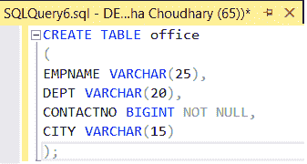
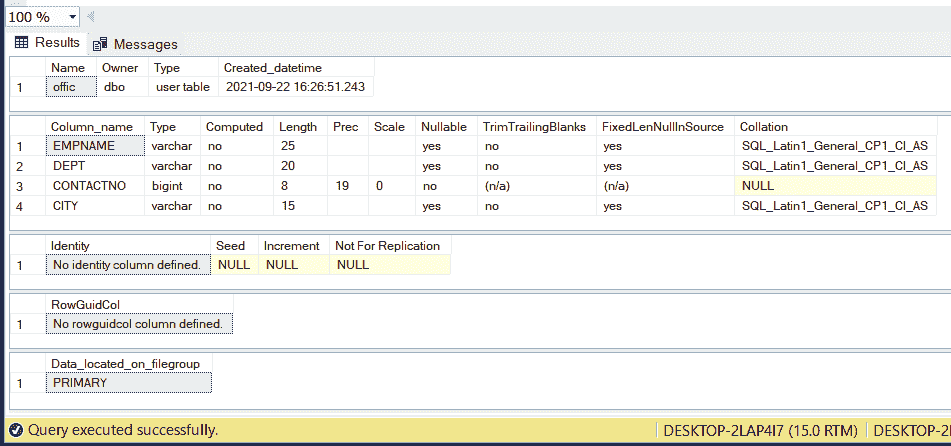
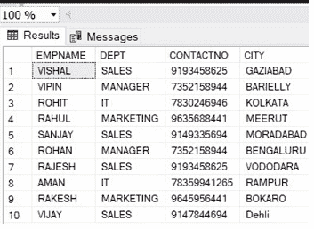
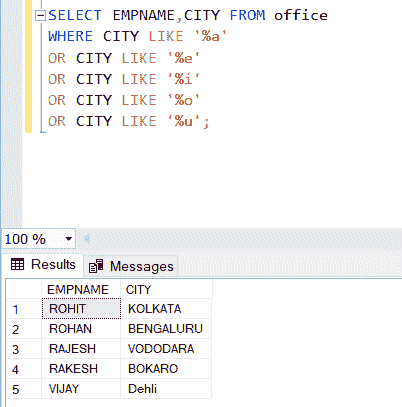

# 匹配以元音结尾的城市名称的 SQL 查询

> 原文:[https://www . geesforgeks . org/SQL-查询匹配城市名称-以元音结尾/](https://www.geeksforgeeks.org/sql-query-to-match-city-names-ending-with-vowels/)

在本文中，我们将学习如何编写一个 SQL 查询来匹配表中以元音结尾的城市名。为了更好地理解，我们将借助一个示例来实现，首先，我们将创建一个名为 Sample 的数据库。在数据库内部，我们将创建一个名为“office”的表。

**步骤 1:** 创建数据库

对于数据库创建，有一个我们将在 SQL 平台中使用的查询。这是查询。

**查询:**

```
Create database sample;
```

**步骤 2:** 使用数据库

为了使用数据库，我们将在 SQL 平台中使用另一个查询，如 Mysql、oracle 等。

**查询:**

```
use Sample;
```

**步骤 3:** 在数据库中创建表

用于在数据库中创建表。我们需要在 SQL 中执行一个查询。这样我们就可以在表中存储记录。

**语法:**

```
create table table_name(
column1 type(size),
column2 type(size),
.

columnN type(size)
);
```

**查询:**

```
CREATE TABLE office
(
EMPNAME VARCHAR(25),
DEPT VARCHAR(20),
CONTACTNO BIGINT NOT NULL,
CITY VARCHAR(15)
); 
```



上面的查询将在我们的示例数据库中创建一个表。这里的桌子名字是办公室。创建表后，我们可以借助下面的查询来调整表的视图和元数据。它将返回模式、列、数据类型、大小和约束。

**语法:**

```
EXEC sp_help table_name
```

**查询:**

```
EXEC sp_help office; 
```

**输出:**



EXEC sp_help 表 _ name 查询类似于 DESC 表名；在另一个平台如 Oracle、MySql 等进行查询。

**步骤 4:** 将数据插入表格

为了将数据插入到表中，我们将在 SQL server 中使用这个查询。

**查询:**

```
INSERT INTO office
VALUES ('VISHAL','SALES',9193458625,'GAZIABAD'),
('VIPIN','MANAGER',7352158944,'BARIELLY'),
('ROHIT','IT',7830246946,'KOLKATA'),
('RAHUL','MARKETING',9635688441,'MEERUT'),
('SANJAY','SALES',9149335694,'MORADABAD'),
('ROHAN','MANAGER',7352158944,'BENGALURU'),
('RAJESH','SALES',9193458625,'VODODARA'),
('AMAN','IT',78359941265,'RAMPUR'),
('RAKESH','MARKETING',9645956441,'BOKARO'),
('VIJAY','SALES',9147844694,'Dehli');
```

**步骤 5:** 查看插入的数据

在表中插入数据后，我们可以调整或确认哪些数据必须正确插入或不正确插入。借助下面的查询。

**查询:**

```
SELECT * FROM office;
```

**输出:**



**第六步:**查询城市端与元音的匹配

**查询:**

```
SELECT EMPNAME,CITY FROM office
WHERE CITY LIKE '%a'
OR CITY LIKE '%e'
OR CITY LIKE '%i'
OR CITY LIKE '%o'
OR CITY LIKE '%u';
```

**输出:**

