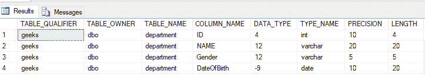

# SQL 查询打印 DOB 在给定范围内的不同员工的姓名

> 原文:[https://www . geesforgeks . org/SQL-query-to-print-distinct-employee-其 dob 介于给定范围之间/](https://www.geeksforgeeks.org/sql-query-to-print-name-of-distinct-employee-whose-dob-is-between-a-given-range/)

SQL 中的查询就像执行任务的语句。这里，我们需要编写一个查询，该查询将打印其 DOB 在给定范围内的不同员工的姓名。

我们将首先创建一个名为“**极客**”的数据库，然后我们将在该数据库中创建一个表“**部门**”。

### **创建数据库:**

使用下面的 SQL 语句创建一个名为 geeks 的数据库:

```sql
CREATE DATABASE geeks;
```

### **使用数据库:**

```sql
USE geeks;
```

### 表格定义:

我们的*极客*数据库中有以下部门表:

```sql
CREATE TABLE department(
    ID int,
    NAME Varchar(20),
    Gender Varchar(5),
    DateOfBirth Date);
```

您可以使用下面的语句来查询创建的表的描述:

```sql
EXEC sp_columns department;
```



### 向表中添加数据:

**日期**数据类型使用格式“ **YYYY-MM-DD** ”。使用以下语句向部门表添加数据:

```sql
INSERT INTO department VALUES (1,'Neha','F','1994-06-03');
INSERT INTO department VALUES (2,'Harsh','M','1996-03-12');
INSERT INTO department VALUES (3,'Harsh','M','1995-05-01');
INSERT INTO department VALUES (4,'Rupali','F',1996-11-11');
INSERT INTO department VALUES (5,'Rohan','M','1992-03-08');
```

要验证表格的内容，请使用以下语句:

```sql
SELECT * FROM department
```


这里，我们将假设 DOB 范围为从 **1995-01-01** 到 **1996-12-31** 。

### 查询:

现在，我们将使用以下语法来查询其 DOB 在给定范围内的独特员工的姓名:

```sql
Syntax:
SELECT DISTINCT column_name1 FROM table_name 
WHERE column_name2 between value1 and value2;
```

因此，我们的表的查询如下所示:

```sql
SELECT DISTINCT NAME FROM department 
WHERE DateOfBirth between '1995-01-01' and '1996-12-31';
```

**输出:**

