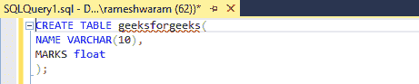
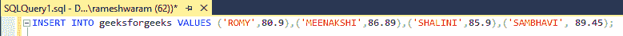
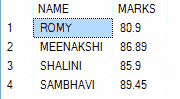
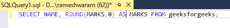
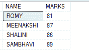
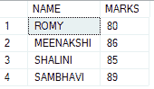
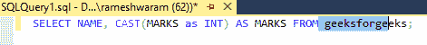

# 删除十进制值的 SQL 查询

> 原文:[https://www . geeksforgeeks . org/SQL-查询删除十进制值/](https://www.geeksforgeeks.org/sql-query-to-remove-decimal-values/)

十进制值是那些以“浮点”作为数据类型的值。

有多种方法可以删除 SQL 中的十进制值:

*   使用 [ROUND()](https://www.geeksforgeeks.org/round-function-in-sql-server/) 函数:此函数在 SQL Server 中用于将指定的数字舍入到指定的小数位数
*   使用 [FLOOR()](https://www.geeksforgeeks.org/floor-and-ceiling-function-in-sql-server/) 函数:返回小于等于一个数的最大整数值。
*   使用 CAST()函数:显式转换必须在 SQL Server 中使用 [Cast](https://www.geeksforgeeks.org/ms-sql-server-type-conversion/) 或 Convert 函数完成。

**步骤 1:** 创建数据库

使用下面的 SQL 语句创建一个名为 geeks 的数据库:

**查询:**

```sql
CREATE DATABASE geeks;
```

**步骤 2:** 使用数据库

使用下面的 SQL 语句将数据库上下文切换到极客:

**查询:**

```sql
USE geeks;
```

**步骤 3:** 表格定义

我们的极客数据库中有以下极客表。

**查询:**

```sql
CREATE TABLE geeksforgeeks(
NAME VARCHAR(10),
MARKS float);
```



**步骤 4:** 将数据插入表格

**查询:**

```sql
INSERT INTO geeksforgeeks VALUES ('ROMY',80.9),('MEENAKSHI',86.89),('SHALINI',85.9),('SAMBHAVI', 89.45);
```



**第五步:**检查表的值

可以使用 SELECT 命令查看表格的内容。

**查询:**

```sql
SELECT * FROM geeksforgeeks;
```



**第 6 步:**使用函数删除小数值

### **使用 Round()功能**

*   **ROUND():** 此函数将一个数字舍入到指定的小数位数。如果我们想去掉所有的小数值，我们将把它四舍五入到小数位 0。

**语法:**

```sql
ROUND(Value, decimal_place)
```

**查询:**

```sql
SELECT NAME, ROUND(MARKS,0) AS MARKS FROM geeksforgeeks;
```



**输出:**



80.0 被舍入到 81，因为 81 是最接近的整数值。

### **通过使用****楼层()功能**

*   **FLOOR():** 此函数返回小于或等于用作参数的值的最大整数值。

**语法:**

```sql
 FLOOR(value)
```

**查询:**

```sql
SELECT NAME, FLOOR(MARKS) AS MARKS FROM geeksforgeeks;
```


**输出:**



这里，80.9 被转换为 80，因为 FLOOR()返回的值小于或等于给定值，但不能返回大于给定值的值。

### **通过使用 CAST()功能**

*   **CAST():** 此函数用于将值转换为特定的数据类型。

**语法:**

```sql
CAST( value as datatype)
```

**查询:**

```sql
SELECT NAME, CAST(MARKS as INT) AS MARKS FROM geeksforgeeks;
```



**输出:**


这给出了类似于 FLOOR()函数的结果。结果根据使用的功能略有不同。应该根据需要选择。