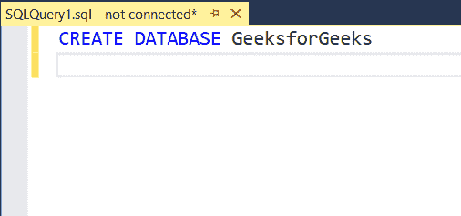
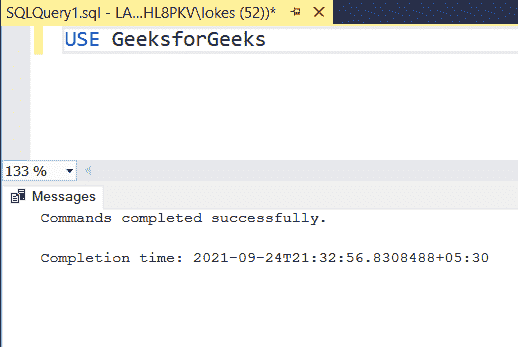
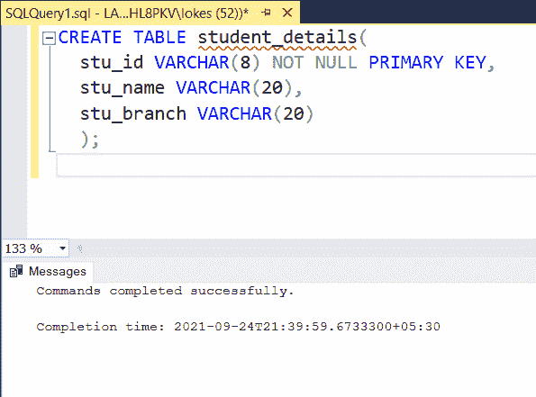
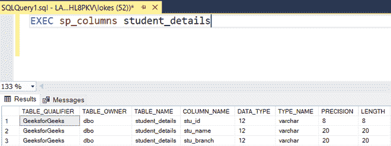
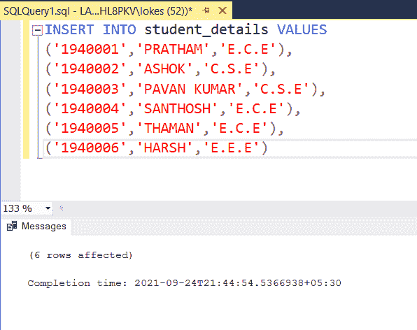
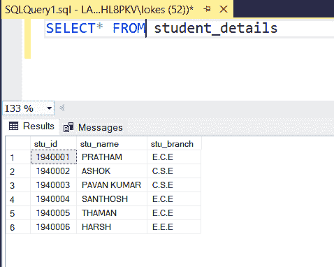
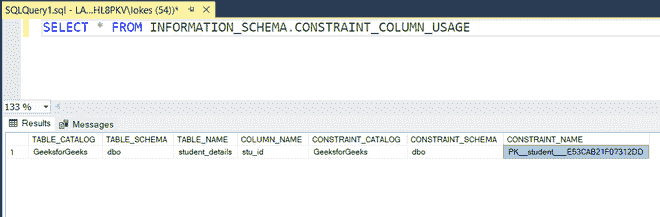
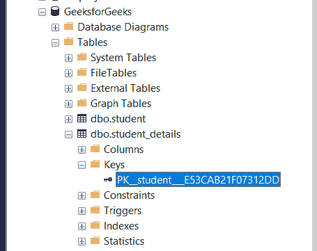
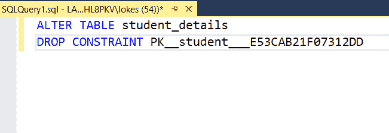
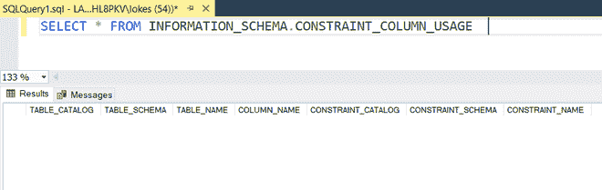

# 删除主键的 SQL 查询

> 原文:[https://www . geesforgeks . org/SQL-query-to-remove-primary-key/](https://www.geeksforgeeks.org/sql-query-to-remove-primary-key/)

主键是可能包含一个或多个唯一标识表中每一行的列的键。我们可以在创建时添加一个主键约束，然后在数据库的表中使用 ALTER 命令添加或删除。

在本文中，让我们看看如何使用 MSSQL 作为服务器来删除表中的主键约束。

**步骤 1:** 创建数据库

我们使用下面的命令创建一个名为 GeeksforGeeks 的数据库:

**查询:**

```
CREATE DATABASE GeeksforGeeks
```



**步骤 2:** 使用数据库

要使用 GeeksforGeeks 数据库，请使用以下命令:

**查询:**

```
USE GeeksforGeeks
```

**输出:**



**步骤 3:** 创建表格

使用以下 SQL 查询创建一个包含 3 列的 student_details 表:

**查询:**

```
CREATE TABLE student_details(
  stu_id VARCHAR(8) NOT NULL PRIMARY KEY,
  stu_name VARCHAR(20),
  stu_branch VARCHAR(20)
  );
```

**输出:**



**步骤 4:** 验证数据库

使用以下 SQL 查询查看表的描述，如下所示。

**查询:**

```
EXEC sp_columns student_details
```

**输出:**



**步骤 5:** 将数据插入表中

使用以下 SQL 查询将行插入学生详细信息:

**查询:**

```
INSERT INTO student_details VALUES
('1940001','PRATHAM','E.C.E'),
('1940002','ASHOK','C.S.E'),
('1940003','PAVAN KUMAR','C.S.E'),
('1940004','SANTHOSH','E.C.E'),
('1940005','THAMAN','E.C.E'),
('1940006','HARSH','E.E.E')
```

**输出:**



**步骤 6:** 验证插入的数据

使用以下 SQL 查询在插入行后查看表学生详细信息、学生分支详细信息和学生地址:

**查询:**

```
SELECT* FROM student_details 
```

**输出:**



**步骤 7:** 使用以下 SQL 查询了解表的约束。

**查询:**

```
SELECT * FROM INFORMATION_SCHEMA.CONSTRAINT_COLUMN_USAGE  
```

**输出:**



在输出中，这里的“主键”是指主键。该约束也可以从对象资源管理器中获知。



**步骤 8:** 这里我们使用 Drop 约束从数据库中移除主键。 DROP 用于删除整个数据库或一个表。DROP 语句像销毁现有的数据库、表、索引或视图一样销毁对象。SQL 中的 [DROP](https://www.geeksforgeeks.org/sql-drop-truncate/) 语句从关系数据库管理系统(RDBMS)中删除一个组件。

**查询:**

使用以下查询删除主键约束:

**查询:**

```
ALTER TABLE student_details
DROP CONSTRAINT PK__student___E53CAB21F07312DD
```



主键约束现已移除:

**输出:**

