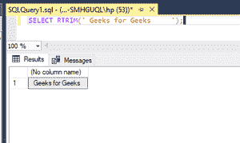
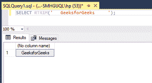

# 删除尾随空格的 SQL 查询

> 原文:[https://www . geesforgeks . org/SQL-query-to-remove-trading-spaces/](https://www.geeksforgeeks.org/sql-query-to-remove-trailing-spaces/)

在本文中，我们将研究如何删除尾随空格。尾随空格表示右侧的空格字符。我们需要使用 [RTRIM()功能](https://www.geeksforgeeks.org/rtrim-function-in-sql-server/)。RTRIM 函数用于删除字符串右侧的所有指定字符。T

**语法:**

```sql
RTRIM(string)
```

**参数:**

*   **字符串–**这是唯一需要的参数，它是一个删除尾随空格的字符串。

**适用于:**

此功能适用于以下数据库。

*   SQL Server(所有支持版本)，
*   并行数据仓库
*   蔚蓝 SQL 数据仓库
*   蓝色数据库，

**例 1:**

**查询:**

```sql
SELECT RTRIM('Geeks for Geeks     ');
```

**输出:**

```sql
+------------------+
| (No column name) |
+------------------+
| Geeks for Geeks  |
+------------------+
```



**例 2:**

**查询:**

```sql
SELECT RTRIM('   GeeksforGeeks     ');
```

**输出:**

```sql
+------------------+
| (No column name) |
+------------------+
|   GeeksforGeeks  |
+------------------+
```

