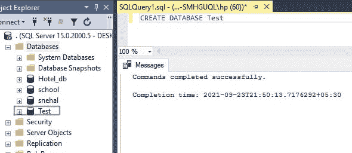
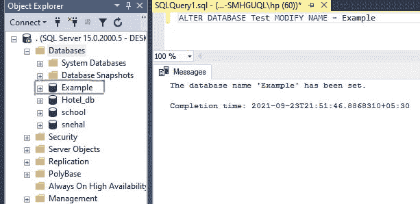

# 重命名数据库的 SQL 查询

> 原文:[https://www.geeksforgeeks.org/sql-query-to-rename-database/](https://www.geeksforgeeks.org/sql-query-to-rename-database/)

ALTER SQL 命令是一个 DDL(数据定义语言)语句。ALTER 用于更新数据库中表的结构(如添加、删除、修改数据库中表的属性)。在本文中，我们将了解如何在 SQL server 中使用 [ALTER-Modify](https://www.geeksforgeeks.org/difference-between-alter-and-update-command-in-sql/) 关键字重命名数据库。要重命名数据库，我们需要先创建数据库。所以，让我们创造它。

**步骤 1:** 创建数据库

我们正在使用 CREATE 查询创建数据库。

**步骤 2:** 创建查询

CREATE 查询用于创建新的数据库。

**查询:**

```
CREATE DATABASE Test
```

**输出:**



**步骤 3:** 重命名数据库

为此，我们需要使用 [ALTER 命令](https://www.geeksforgeeks.org/sql-alter-add-drop-modify/)。 ALTER 关键字用于添加、删除/删除或修改现有表中的列。它还用于在现有表上添加和删除各种约束。

*   重命名意味着我们正在修改数据。
*   因此，我们将使用 ALTER-MODIFY。

**查询:**

```
ALTER DATABASE Test MODIFY NAME = Example
```

**输出:**



数据库名称从测试更改为示例。