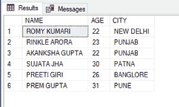
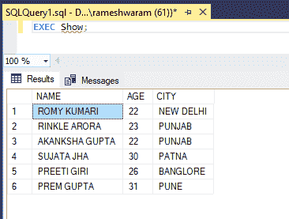
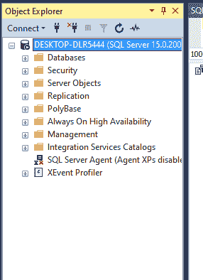
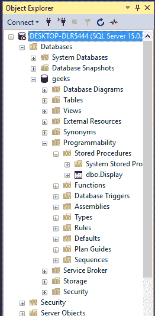
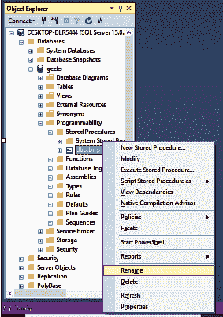
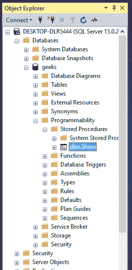

# 重命名存储过程的 SQL 查询

> 原文:[https://www . geesforgeks . org/SQL-查询-重命名-存储过程/](https://www.geeksforgeeks.org/sql-query-to-rename-stored-procedure/)

存储过程是一个保存的 SQL 代码。创建它是为了节省时间，因为我们可以一次又一次地使用它，而无需编写整个查询。在本文中，我们将看到如何重命名存储过程。

### **创建程序:**

**语法:**

```
CREATE PROCEDURE procedure_name AS 
SELECT * FROM table_name;
```

需要创建过程的 SQL 查询总是写在 AS 语句之后。

### **执行程序:**

**语法:**

```
EXEC procedure_name;
```

我们可以通过两种方法执行上述操作。这些方法是:

*   通过在 SQL Server 中使用 sp_rename 语句。
*   来自 SQL Server 管理工作室(SSMS)的对象资源管理器。

进行演示时，请遵循以下步骤:

**步骤 1:** 创建数据库

可以使用 CREATE 命令创建数据库。

**查询:**

```
CREATE DATABASE geeks;
```

**步骤 2:** 使用数据库

使用下面的 SQL 语句将数据库上下文切换到极客:

**查询:**

```
USE geeks;
```

**步骤 3:** 表格定义

我们的极客数据库中有以下演示表。

**查询:**

```
CREATE TABLE demo_table(
NAME VARCHAR(20),
AGE INT,
CITY VARCHAR(20) );
```

**步骤 4:** 将数据插入表格

**查询:**

```
INSERT INTO demo_table VALUES
('ROMY KUMARI', 22, 'NEW DELHI'),
('RINKLE ARORA',23, 'PUNJAB'),
('AKANKSHA GUPTA',22, 'PUNJAB'),
('SUJATA JHA', 30,'PATNA'),
('PREETI GIRI', 26,'BANGLORE'),
('PREM GUPTA',31,'PUNE');
```

**输出:**



**步骤 5:** 创建程序

我们将创建一个名为“**显示**”的过程来查看表格的所有内容。

**查询:**

```
CREATE PROCEDURE Display AS  
SELECT * FROM demo_table;
```

**输出:**


**步骤 6:** 重命名程序

**方法一:使用 sp_rename**

**语法:**

```
EXEC sp_rename 'Current procedure_name', 'New procedure_name';
```

为了演示，让我们将程序名称从**“显示”**重命名为**“显示”**。

**查询:**

```
EXEC sp_rename 'Display', 'Show';
```

**执行:**

```
EXEC Show;
```

**输出:**



**方法 2:从对象浏览器**

**步骤 1:** 从菜单栏中的查看选项打开对象资源管理器。它出现在屏幕的左侧。



我们可以在数据库文件夹中看到“极客”数据库。

**步骤 2:** 展开极客数据库内的可编程文件夹。然后展开存储过程文件夹



**步骤 3:** 右键单击创建的程序，并选择“重命名”选项。



**步骤 4:** 键入您要重命名过程的名称



通过这两种方式，我们可以重命名存储过程。