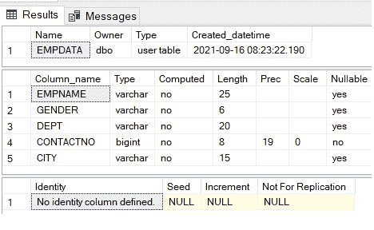
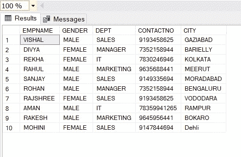
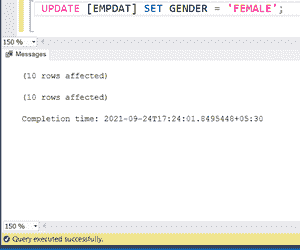
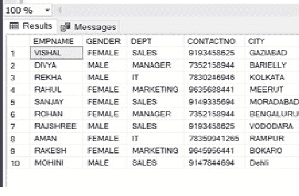

# 将列值从“男性”替换为“女性”并将“女性”替换为“男性”的 SQL 查询

> 原文:[https://www . geesforgeks . org/SQL-query-to-replace-a-column-values-从男性到女性再到女性再到男性/](https://www.geeksforgeeks.org/sql-query-to-replace-a-column-values-from-male-to-female-and-female-to-male/)

在本文中，我们将实现一个查询，将列值从“男性”替换为“女性”，将“女性”替换为“男性”。为了更好地解释，我们将通过一个例子来实现这个查询。为了实现这个查询，首先我们将创建一个数据库。数据库“示例”的名称。

之后，在数据库中，我们将创建一个表。该表的名称是“EMPDATA”。在这里，我们将借助 UPDATE、CASE 语句和条件将列值从“男”替换为“女”，从“女”替换为“男”。

现在，我们必须遵循下面的语句来实现这个查询。

**步骤 1:** 创建数据库

对于数据库的创建，有我们将在 MS SQL Server 中使用的查询。

**查询:**

```sql
CREATE DATABASE Sample;
```

**步骤 2:** 使用数据库

用于使用数据库

**查询:**

```sql
use database_name;
for this database…
use Sample;    
```

**步骤 3:** 创建表格

对于创建数据表，我们将使用下面的查询

**查询:**

```sql
CREATE TABLE EMPDATA
(
EMPNAME VARCHAR(25),
GENDER VARCHAR(6),
DEPT VARCHAR(20),
CONTACTNO BIGINT NOT NULL,
CITY VARCHAR(15)
);
```

**步骤 4:** 表格的结构

在 SQL 中借助 EXEX sp_help 表名，我们可以看到表的结构。像许多列、数据类型、大小、可空性和约束。EXEC Sp_ help 查询类似于 DESC 查询或 description 查询。

**查询:**

```sql
 EXEC sp_help EMPDATA
```

**输出:**



**第 5 步:**将值插入表格

**查询:**

```sql
INSERT INTO EMPDATA
VALUES ('VISHAL','MALE','SALES',9193458625,'GAZIABAD'),
('DIVYA','FEMALE','MANAGER',7352158944,'BARIELLY'),
('REKHA','FEMALE','IT',7830246946,'KOLKATA'),
('RAHUL','MALE','MARKETING',9635688441,'MEERUT'),
('SANJAY','MALE','SALES',9149335694,'MORADABAD'),
('ROHAN','MALE','MANAGER',7352158944,'BENGALURU'),
('RAJSHREE','FEMALE','SALES',9193458625,'VODODARA'),
('AMAN','MALE','IT',78359941265,'RAMPUR'),
('RAKESH','MALE','MARKETING',9645956441,'BOKARO'),
('MOHINI','FEMALE','SALES',9147844694,'Dehli')
 SELECT * FROM EMPDATA;
```

**输出:**



**第 6 步:**执行查询，将列值从“男”替换为“女”，将“女”替换为“男”。

最后，在这一步中，我们将实现查询，将列值从“男性”替换为“女性”，将“女性”替换为“男性”。这里我们使用 [**【更新】**](https://www.geeksforgeeks.org/sql-update-statement/) ，以及 [**CASE**](https://www.geeksforgeeks.org/sql-case-statement/) 语句。

我们可以使用带有 WHERE 子句或不带 WHERE 子句的 Update 语句。

*   **不带 where 子句的 Update 语句:**不带 Where 子句的 Update 语句用于更新表中的所有行。

**查询:**

```sql
UPDATE [EMPDATA] SET GENDER = ‘FEMALE’;
```



此查询将更新所有行的性别= '女性'。

*   **带 where 子句的 Update 语句:**带 WHERE 子句的 Update 语句用于根据 SQL Server 中的 Where 子句更新一行或多行。

**查询:**

```sql
UPDATE [EMPDATA] SET GENDER = ‘FEMALE’ WHERE EMPNAME = ‘AMAN’
```

*   **多列更新:**

**查询:**

```sql
UPDATE [EMPDATA] SET GENDER = ‘FEMALE’ WHERE EMPNAME = ‘AMAN’ or EMPNAME = ‘VIJAY’; 
```

现在，我们将执行查询，将列值从“男性”替换为“女性”，将“女性”替换为“男性”

**查询:**

```sql
UPDATE [EMPDATA] SET GENDER = (CASE WHEN GENDER ='MALE' THEN 'FEMALE'
WHEN GENDER = 'FEMALE' THEN 'MALE'
END ) 
```

执行下面的代码，注意我们想要在这个查询中评估 CASE Gender。

**输出:**

