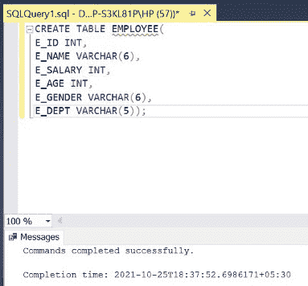
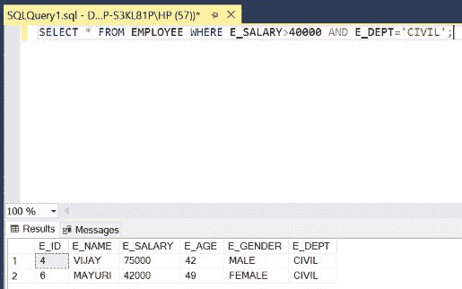

# 返回符合特定条件的行的 SQL 查询

> 原文:[https://www . geesforgeks . org/SQL-查询-返回-行-匹配-某个条件/](https://www.geeksforgeeks.org/sql-query-to-return-rows-matching-a-certain-condition/)

在 SQL 中，有时我们需要 [](https://www.geeksforgeeks.org/sql-update-statement/) 从表中选择匹配某个条件。我们将使用[选择命令](https://www.geeksforgeeks.org/sql-select-query/)和 [WHERE 子句](https://www.geeksforgeeks.org/sql-where-clause/)在 SQL 中应用一个条件来实现这一点。为了这篇文章。我们将使用微软的服务器作为我们的数据库。

**语法:**

```sql
SELECT COLUMN_NAME_1, COLUMN_NAME_2, ....
 FROM TABLE_NAME WHERE CONDITION;
```

**步骤 1:** 创建数据库。为此，使用下面的命令创建一个名为 GeeksForGeeks 的数据库。

**查询:**

```sql
CREATE DATABASE GeeksForGeeks
```

**输出:**


**步骤 2:** 使用 GeeksForGeeks 数据库。为此，请使用以下命令。

**查询:**

```sql
USE GeeksForGeeks
```

**输出:**


**步骤 3:** 在数据库 GeeksForGeeks 中创建一个 EMPLOYEE 表。该表有 6 列，即 E_ID、E_NAME、E_SALARY、E_AGE、E_GENDER 和 E_DEPT，包含各种员工的 ID、姓名、薪资、年龄、性别和部门。

**查询:**

```sql
CREATE TABLE EMPLOYEE(
E_ID INT,
E_NAME VARCHAR(6),
E_SALARY INT,
E_AGE INT,
E_GENDER VARCHAR(6),
E_DEPT VARCHAR(5));
```

**输出:**



**第 4 步:**显示 EMPLOYEE 表的结构。

**查询:**

```sql
EXEC SP_COLUMNS 'EMPLOYEE';
```

**输出:**


**步骤 5:** 在 EMPLOYEE 表中插入六行。

**查询:**

```sql
INSERT INTO EMPLOYEE VALUES(1,'KHUSHI',10000,17,'FEMALE','CSE');
INSERT INTO EMPLOYEE VALUES(2,'KAMLA',20000,37,'FEMALE','EE');
INSERT INTO EMPLOYEE VALUES(3,'GAUTAM',25000,27,'MALE','ME');
INSERT INTO EMPLOYEE VALUES(4,'VIJAY',75000,42,'MALE','CIVIL');
INSERT INTO EMPLOYEE VALUES(5,'ANITA',50000,32,'FEMALE','CSE');
INSERT INTO EMPLOYEE VALUES(6,'MAYURI',42000,49,'FEMALE','CIVIL');
```

**输出:**


**第 6 步:**显示 EMPLOYEE 表的所有行。

**查询:**

```sql
SELECT * FROM EMPLOYEE;
```

**输出:**


**第 7 步:**如果我们想显示 EMPLOYEE 表中 20 岁以上 40 岁以下员工的所有详细信息。使用 [BETWEEN 子句](https://www.geeksforgeeks.org/sql-between-in-operator/)来比较员工的年龄属性。

**介于:**的语法

```sql
ATTRIBUTE LOWER_LIMIT BETWEEN UPPER_LIMIT;
```

**查询:**

```sql
SELECT * FROM EMPLOYEE WHERE E_AGE BETWEEN 20 AND 40;
```

**输出:**


**第 8 步:**显示 EMPLOYEE 表中女性员工的所有详细信息。使用=(等于)，[关系运算符，](https://www.geeksforgeeks.org/sql-operators/)将员工的性别属性与女性进行比较。

**查询:**

```sql
SELECT * FROM EMPLOYEE WHERE E_GENDER='FEMALE';
```

**输出:**


**第 9 步:**从 EMPLOYEE 表中显示薪资大于 40000 且属于土建部门的员工的所有详细信息。我们将使用>(大于)关系运算符来比较工资和=(等于)关系运算符来检查部门。我们还将使用 AND(逻辑运算符)，以便两个条件同时成立。

**查询:**

```sql
SELECT * FROM EMPLOYEE WHERE E_SALARY>40000 AND E_DEPT='CIVIL';
```

**输出:**

