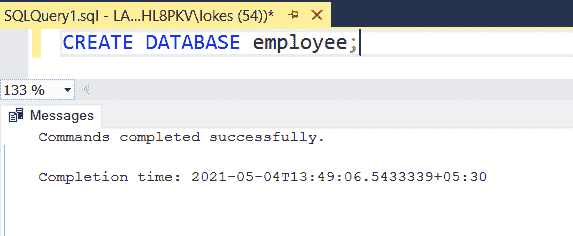
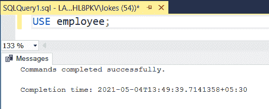
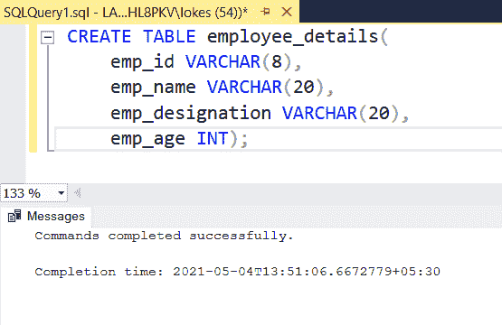
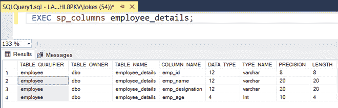
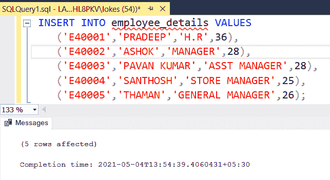
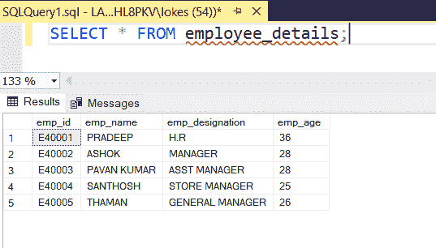
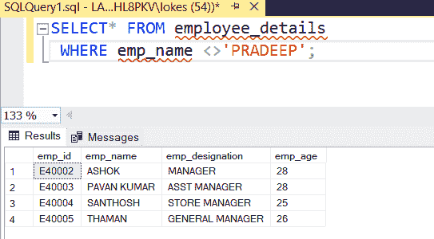
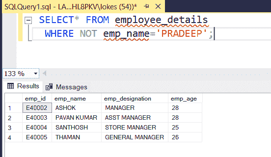
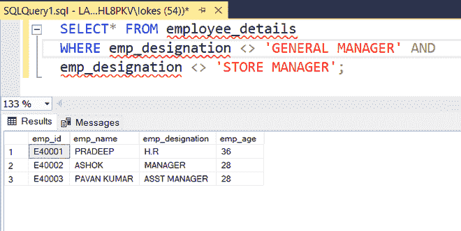

# 从未指定姓名的员工表中选择所有记录的 SQL 查询

> 原文:[https://www . geesforgeks . org/SQL-查询-选择-所有记录-从-员工-表格-其中-姓名-未指定/](https://www.geeksforgeeks.org/sql-query-to-select-all-records-from-employee-table-where-name-is-not-specified/)

在这里，我们将看到如何找到除了具有特定名称 **SQL** 的人之外的人的名字。在本文中，我们将使用 **MSSQL** 服务器作为我们的数据库。

例如，如果员工姓名是帕拉德普，则需要显示员工表，不包括名为帕拉德普的员工。所以让我们一步一步地详细执行这个查询。

### **创建数据库:**

使用以下 **SQL** 查询创建数据库员工，如下所示。

```sql
CREATE DATABASE employee;
```

**输出:**



### **使用数据库:**

使用数据库员工，使用如下 SQL 查询。

```sql
USE employee;
```

**输出:**



### **创建表格:**

使用如下 SQL 查询创建一个包含 4 列的 employee_details 表。

```sql
  CREATE TABLE employee_details(
     emp_id VARCHAR(8),
     emp_name VARCHAR(20),
     emp_designation VARCHAR(20),
     emp_age INT);
```

**输出:**



### **验证表格:**

使用如下 SQL 查询查看数据库中表的描述。

```sql
EXEC sp_columns employee_details;
```

**输出:**



### **将数据插入表中:**

使用如下 SQL 查询将行插入 employee_details 表。

```sql
INSERT INTO employee_details VALUES('E40001','PRADEEP','H.R',36),
    ('E40002','ASHOK','MANAGER',28),
    ('E40003','PAVAN KUMAR','ASST MANAGER',28),
    ('E40004','SANTHOSH','STORE MANAGER',25),
    ('E40005','THAMAN','GENERAL MANAGER',26);
```

**输出:**



### **验证插入的数据:**

使用以下 SQL 查询在插入行后查看 employee_details 表，如下所示。

```sql
SELECT * FROM employee_details;
```

**输出:**



*   查询以查找姓名不是帕拉德普的员工。

由于我们需要显示除帕拉德普之外的名称，因此我们可以在 where 子句中使用 not equal to **( < > )** 运算符来执行所需的查询，在 **WHERE** 子句中，我们可以使用任何其他条件，也可以使用其他运算符，如 **>、<、【AND】、or、NOT** 等..,

```sql
SYNTAX:
SELECT * 
FROM table_name
WHERE condition1 ,condition 2,....;
```

对于以上内容，我们可以通过两种方式来实现:

**1)使用< >操作员**

```sql
 SELECT* FROM employee_details
 WHERE emp_name <>'PRADEEP';
```

**输出:**



**2)使用非操作符**

```sql
  SELECT* FROM employee_details
  WHERE NOT emp_name='PRADEEP';
```

**输出:**



*   查询查找指定不是总经理和门店经理的员工。

使用**和**运算符我们可以在这里合并不同的条件**和**用于执行以下查询。

```sql
  SELECT* FROM employee_details
 WHERE  emp_designation<> 'GENERAL MANAGER' AND
  emp_designation <> 'STORE MANAGER';
```

**输出:**

