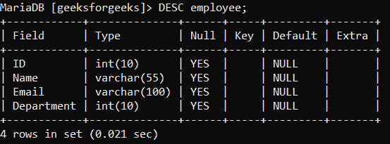
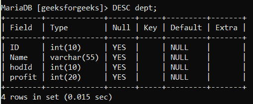
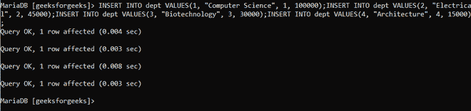
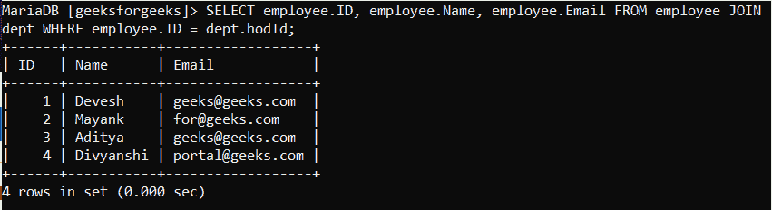
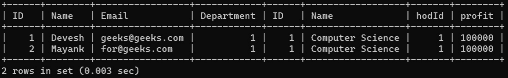
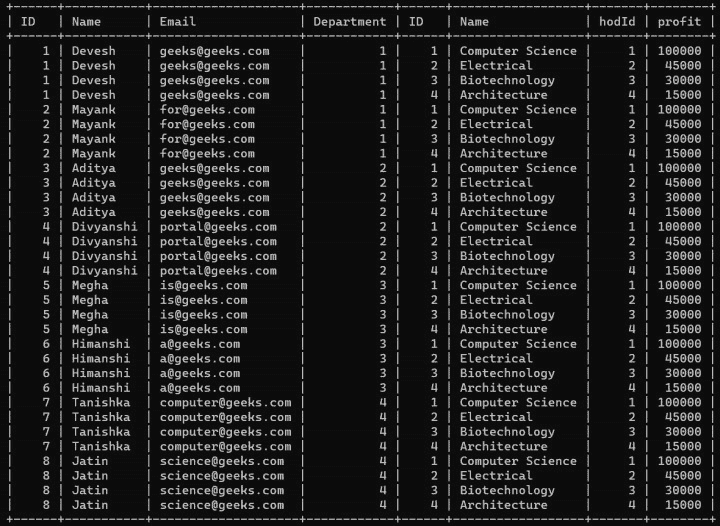
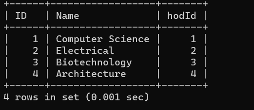

# 使用连接和位置从表中选择数据的 SQL 查询

> 原文:[https://www . geesforgeks . org/SQL-查询-从表中选择数据-使用连接和位置/](https://www.geeksforgeeks.org/sql-query-to-select-data-from-tables-using-join-and-where/)

本文的目的是制作一个简单的程序，使用 MySQL 的 Join 和 Where 子句连接两个表。下面是使用 MySQL 进行同样操作的方法。本文的前提是在你的电脑上安装 [MySQL](https://www.geeksforgeeks.org/mysql-database-current_user-functions/) 和 [Apache](https://www.apachefriends.org/index.html) 服务器。

#### 什么是 SQL 中的查询？

SQL 查询是从数据库的表中传递的对数据/信息的请求。这些数据可以用于各种目的，如训练模型、寻找数据中的模式等。

#### 什么是 SQL 中的联接？

一个 [JOIN](https://www.geeksforgeeks.org/sql-join-set-1-inner-left-right-and-full-joins/#:~:text=1%20INNER%20JOIN%3A%20The%20INNER%20JOIN%20keyword%20selects,similar%20to%20LEFT%20JOIN.%20...%20More%20items...%20) 查询用于组合两个或多个表中的行，基于一个可用于存储两个表中相同数据的列。所以我们在那个点上连接，并连接行。

#### 什么是 SQL 中的 Where 子句？

[SQL 中的 WHERE](https://www.geeksforgeeks.org/sql-where-clause/) 关键字用于检索某个查询下的结果中的数据。它还可以通过匹配模式来检索数据，如选择所有分数大于 90 分的学生，或者从员工工资大于 60 万、小于 120 万的表格中选择所有数据。

所以我们将从创建一个数据库开始

**步骤 1:** 创建**数据库**

```sql
CREATE DATABASE geeksforgeeks;
```

**步骤 2:** 进入该数据库使用它–

```sql
USE geeksforgeeks;
```

**第 3 步:**在数据库中创建一个表 1 作为**员工**，我们将在其中执行我们的操作–

```sql
CREATE TABLE employee ( ID int(10),
            Name varchar(55),
            Email varchar(100),
            Department int(10)
            );
```

**第四步:**创建另一个表 2 作为**部门**，我们将在此存储第二家公司员工的数据-

```sql
CREATE TABLE dept     ( ID int(10),
            Name varchar(55),
            hodId int(10),
            profit int(20)
            );
```

**步骤 5:** 查看表格的模式，确保表格正确–

```sql
> DESC employee;
> DESC dept;
```

 

**第 6 步:**将数据插入员工表–

```sql
INSERT INTO employee VALUES(1, "Devesh", "geeks@geeks.com", 1);
INSERT INTO employee VALUES(2, "Mayank", "for@geeks.com", 1);
INSERT INTO employee VALUES(3, "Aditya", "geeks@geeks.com", 2);
INSERT INTO employee VALUES(4, "Divyanshi", "portal@geeks.com", 2);
INSERT INTO employee VALUES(5, "Megha", "is@geeks.com", 3);
INSERT INTO employee VALUES(6, "Himanshi", "a@geeks.com", 3);
INSERT INTO employee VALUES(7, "Tanishka", "computer@geeks.com", 4);
INSERT INTO employee VALUES(8, "Jatin", "science@geeks.com", 4);
```

**步骤 7:** 将数据插入部门表–

```sql
INSERT INTO dept VALUES(1, "Computer Science", 1, 100000);
INSERT INTO dept VALUES(2, "Electrical", 2, 45000);
INSERT INTO dept VALUES(3, "Biotechnology", 3, 30000);
INSERT INTO dept VALUES(4, "Architecture", 4, 15000);
```



**步骤 8:** 使用 where 和 Join 查询数据–

**示例 1:** 选择部门负责人员工的所有数据–

```sql
SELECT employee.ID, employee.Name, employee.Email
FROM employee 
JOIN dept
WHERE
employee.ID = dept.hodId;
```

**输出:**



**例 2:** 选择部门利润大于 45000 的所有数据–

```sql
SELECT * 
FROM employee
LEFT JOIN dept
ON
employee.Department = dept.ID
WHERE 
employee.Name IN
(SELECT Name FROM employee WHERE dept.profit > 45000);
```

**输出:**



**示例 3:** 使用 JOIN ( **交叉连接**)从两个表中选择所有数据–

```sql
SELECT *
FROM employee 
FULL JOIN dept
WHERE
dept.id > 0;
```



**例 4:** 从利润总额大于 5000 的部门中选择所有员工

```sql
SELECT DISTINCT dept.ID, dept.Name, dept.hodId
FROM dept
JOIN employee
ON
dept.ID = employee.Department
WHERE
hodId IN
(SELECT hodId FROM dept WHERE hodId > 0);
```

**输出:**

