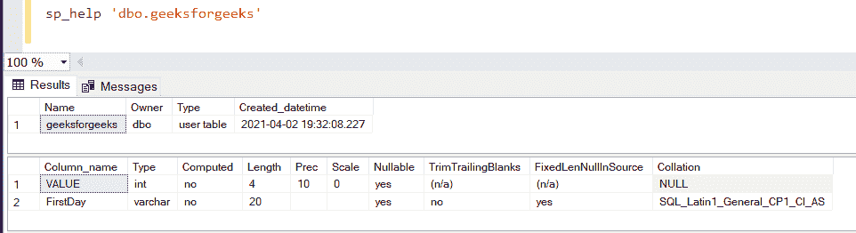
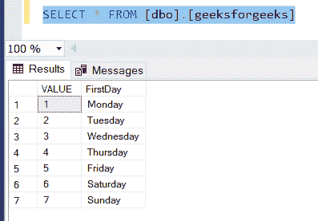
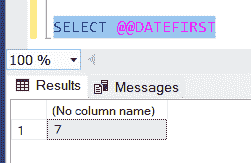

# 在数据库中设置一周第一天的 SQL 查询

> 原文:[https://www . geesforgeks . org/SQL-查询到集合-每周第一天在数据库中/](https://www.geeksforgeeks.org/sql-query-to-set-first-day-of-the-week-in-a-database/)

在本文中，我们将编写一个 SQL 脚本来设置数据库中一周的第一天。下面是相同的实现。你的服务器中应该有 [MSSQL](https://www.microsoft.com/en-in/sql-server/sql-server-downloads) 。

**SQL 查询–**

查询是从数据库表或表的组合中请求数据或信息。这些数据可以用于各种目的，如训练模型、寻找数据中的模式等。

让我们首先创建一个 DatabaSe–

**第一步:**

```
CREATE DATABASE GFG
```

**步骤 2:** 使用该数据库–

```
USE GFG
```

**步骤 3:** 创建一个表作为**日**–

```
CREATE TABLE geeksforgeeks 
                  (VALUE integer,
                  FirstDay varchar(20))
```

描述这张表–

```
sp_help 'dbo.daysData'
```



表的模式

**第 4 步:**在表格中插入数值–

```
USE [GFG]
GO

INSERT INTO [dbo].[geeksforgeeks]
           ([VALUE]
           ,[FirstDay])
     VALUES
           (1, 'Monday')
GO

INSERT INTO [dbo].[geeksforgeeks]
           ([VALUE]
           ,[FirstDay])
     VALUES
           (2, 'Tuesday')
GO

INSERT INTO [dbo].[geeksforgeeks]
           ([VALUE]
           ,[FirstDay])
     VALUES
           (3, 'Wednesday')
GO

INSERT INTO [dbo].[geeksforgeeks]
           ([VALUE]
           ,[FirstDay])
     VALUES
           (4, 'Thursday')
GO

INSERT INTO [dbo].[geeksforgeeks]
           ([VALUE]
           ,[FirstDay])
     VALUES
           (5, 'Friday')
GO

INSERT INTO [dbo].[geeksforgeeks]
           ([VALUE]
           ,[FirstDay])
     VALUES
           (6, 'Saturday')
GO

INSERT INTO [dbo].[geeksforgeeks]
           ([VALUE]
           ,[FirstDay])
     VALUES
           (7, 'Sunday')
GO
```



选择所有值

**步骤 5:** 检查现有的一周第一天–

```
SELECT @@DATEFIRST
```



首先是预定义日期

**第 6 步:**现在使用**日期优先–**设置一周的第一天

```
SET DATEFIRST 1
```

**第 7 步:**检查日期优先值–


首次更改日期

如我们所见，我们已经成功地将我们的第一个日期设置为 1，即**星期一**