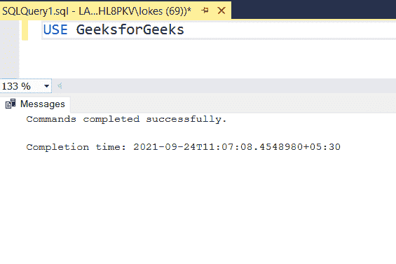
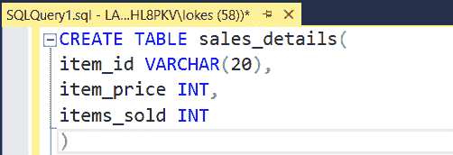
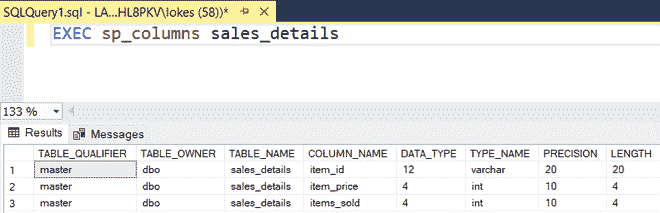
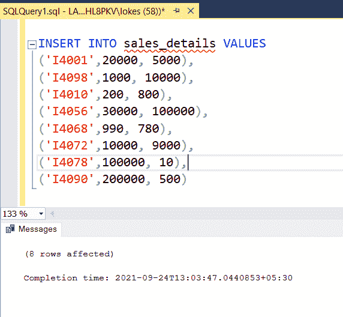
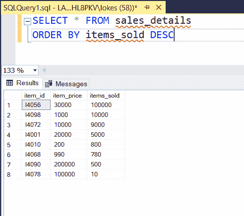
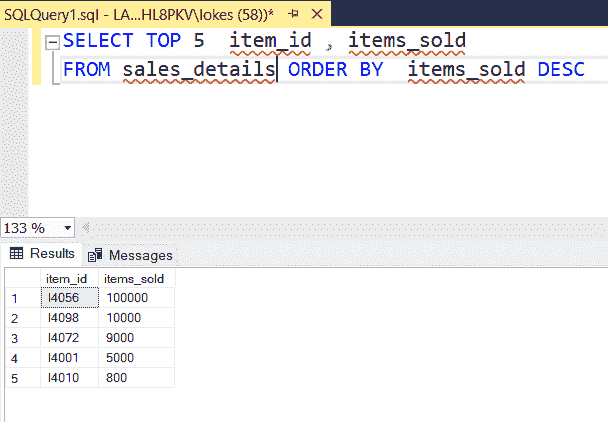

# 显示前 5 大畅销产品的 SQL 查询

> 原文:[https://www . geesforgeks . org/SQL-query-to-show-top-5-畅销产品/](https://www.geeksforgeeks.org/sql-query-to-show-top-5-selling-products/)

要显示销售排名前 5 的产品，可以使用 SELECT TOP 子句按订单排序。因此，让我们看看使用排序依据和选择 Top 子句显示前 5 名销售产品的 SQL 查询，使用 MSSQL 作为服务器。

**步骤 1:** 我们正在创建一个数据库。为此，使用下面的命令创建一个名为 GeeksforGeeks 的数据库。

**查询:**

```sql
CREATE DATABASE GeeksforGeeks;
```


**步骤 2:** 要使用 GeeksforGeeks 数据库，请使用以下命令。

**查询:**

```sql
USE GeeksforGeeks
```



**步骤 3:** 现在我们创建一个表。使用以下 SQL 查询创建一个包含 4 列的 sales_details 表。

**查询:**

```sql
CREATE TABLE sales_details(
item_id VARCHAR(20),
item_price INT,
items_sold INT
)
```



**步骤 4:** 查看表格的描述。

**查询:**

```sql
EXEC sp_columns sales_details
```



**步骤 5:** 向表中插入行的查询。使用以下 SQL 查询将行插入 sales_details 表。

**查询:**

```sql
INSERT INTO sales_details VALUES
('I4001',20000, 5000),
('I4098',1000, 10000),
('I4010',200, 800),
('I4056',30000, 100000),
('I4068',990, 780),
('I4072',10000, 9000),
('I4078',100000, 10),
('I4090',200000, 500)
```



**第 6 步:**查看插入的数据，按销量降序排列。

**查询:**

```sql
SELECT * FROM sales_details  
ORDER BY items_sold DESC
```



**第七步:**查询找到销量前 5 的产品。

**语法:**

```sql
SELECT TOP N column_name 
FROM table_name ORDER BY column_name ordering_type
```

**查询:**

```sql
SELECT TOP 5  item_id , items_sold  
FROM sales_details ORDER BY  items_sold DESC
```

**输出:**

