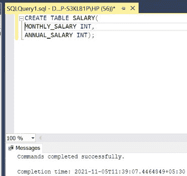
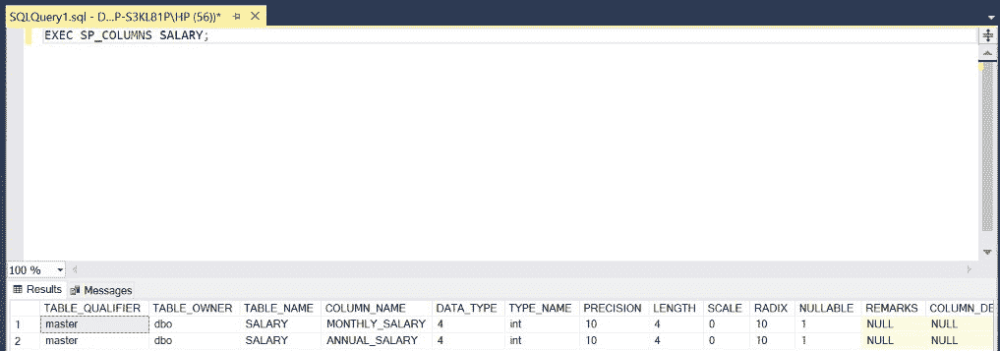
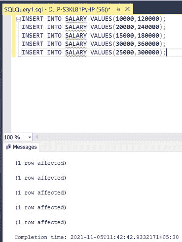
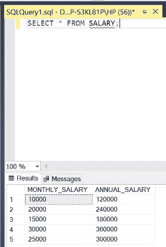
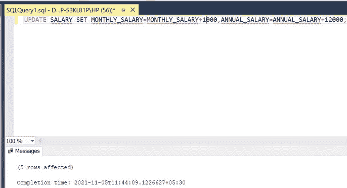
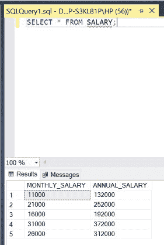

# 更新表中所有列的 SQL 查询

> 原文:[https://www . geesforgeks . org/SQL-查询-更新-表中所有列/](https://www.geeksforgeeks.org/sql-query-to-update-all-columns-in-a-table/)

在 SQL 中，有时我们需要编写一个查询来更新表中所有列的值。我们将使用 **UPDATE** 关键字来实现这一点。为此，我们使用一种特定的查询，如下面的演示所示。在本文中，我们将使用微软的 SQL Server 作为我们的数据库和选择关键字。

**步骤 1:** 创建数据库。为此，使用下面的命令创建一个名为 GeeksForGeeks 的数据库。

**查询:**

```
CREATE DATABASE GeeksForGeeks
```

**输出:**


**步骤 2:** 使用 GeeksForGeeks 数据库。为此，请使用以下命令。

**查询:**

```
USE GeeksForGeeks
```

**输出:**


**步骤 3:** 在数据库 GeeksForGeeks 中创建一个薪资表。该表有两栏，即月工资和年工资，包含工厂工人的月工资和年工资。

**查询:**

```
CREATE TABLE SALARY(
MONTHLY_SALARY INT,
ANNUAL_SALARY INT);
```

**输出:**



**第 4 步:**描述薪资表的结构。

**查询:**

```
EXEC SP_COLUMNS SALARY;
```

**输出:**



**第 5 步:**在薪资表中插入 5 行。

**查询:**

```
INSERT INTO SALARY VALUES(10000,120000);
INSERT INTO SALARY VALUES(20000,240000);
INSERT INTO SALARY VALUES(15000,180000);
INSERT INTO SALARY VALUES(30000,360000);
INSERT INTO SALARY VALUES(25000,300000);
```

**输出:**



**第 6 步:**显示薪资表的所有行。

**查询:**

```
SELECT * FROM SALARY;
```

**输出:**



**第 7 步:**更新表中所有列**薪资**。将**月工资**栏的所有条目值增加 **1000** ，相应地，将**年工资**栏的所有条目值增加 **12*1000=12000** 。

**语法:**

```
UPDATE TABLE_NAME SET COLUMN1=VALUE1,
COLUMN2 = VALUE2;
```

**查询:**

```
UPDATE SALARY SET MONTHLY_SALARY = 
MONTHLY_SALARY+1000,ANNUAL_SALARY=
ANNUAL_SALARY+12000;
```

**输出:**



**第 8 步:**显示更新后的薪资表的所有行。

**查询:**

```
SELECT * FROM SALARY;
```

**输出:**

