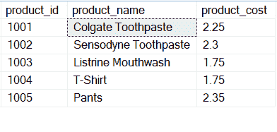
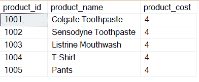
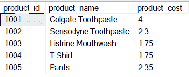

# 更新表中所有行的 SQL 查询

> 原文:[https://www . geesforgeks . org/SQL-查询到更新-表中所有行/](https://www.geeksforgeeks.org/sql-query-to-update-all-rows-in-a-table/)

Update 语句是一个用于更新数据库中数据的 SQL 关键字。我们可以在条件的帮助下更新数据库中的所有行或一些值。更新是一个 SQL 关键字，它属于数据操作语言(DML)，顾名思义，它用于操作数据。有许多 DML 关键字属于这一类:

*   [更新](https://www.geeksforgeeks.org/sql-update-statement/)
*   [插入](https://www.geeksforgeeks.org/sql-insert-statement/)
*   [删除](https://www.geeksforgeeks.org/sql-delete-statement/)
*   [选择](https://www.geeksforgeeks.org/sql-select-query/)

SQL 是一种不区分大小写的语言，即从产品中选择*与从产品中选择*相同。但是我们习惯用大写字母和表格写关键词，用小写字母写列名。

**步骤 1:** 创建数据库

**语法:**

```sql
CREATE DATABASE database_name;
```

**步骤 2:** 创建表格(产品)

**查询:**

```sql
CREATE TABLE products(product_id int 
primary key, product_name varchar(45),
 product_cost float);
```

**步骤 3:** 在表格中插入数值

**查询:**

```sql
INSERT INTO products VALUES
(1001,'Colgate Toothpaste', 2.25),
(1002, 'Sensodyne Toothpaste', 2.30),
(1003, 'Listrine Mouthwash', 1.75), 
(1004, 'T-Shirt', 1.75),
(1005, 'Pants', 2.35);
```

**第 4 步:**现在让我们看看我们创建的表内的数据。

**查询:**

```sql
SELECT * FROM products;
```

**输出:**



**步骤 5:** 更新所有数据

**语法:**

```sql
UPDATE table_name SET column_name1 = new_value1, 
column_name2 = new_value2 ----  ;
```

这里 table_name 是表的名称，column_name 是要更新其值的列，new_value 是更新后的值。我们来看一个例子。


现在我们的任务是将所有产品 id 的 product_cost 更新为 4，让我们看看它是如何完成的。

**查询:**

```sql
UPDATE products SET product_cost = 4;
```

**输出:**



如您所见，所有产品 id 的 product_cost 更改为 4。

**语法:**

```sql
UPDATE table_name SET column_name1 = new_value1, 
column_name2 = new_value2 ----  WHERE condition;
```

这里 table_name 是表的名称，column_name 是要更新其值的列，new_value 是更新后的值，WHERE 用于筛选特定数据。

我们来看一个例子。


现在我们的任务是将 product_cost 更新为 4，对于 product_id 1001，让我们看看它是如何完成的。

**查询:**

```sql
UPDATE products SET product_cost 
= 4 WHERE product_id = 1001;
```

**输出:**



如您所见，product_id 1001 的 product_cost 更改为 4。