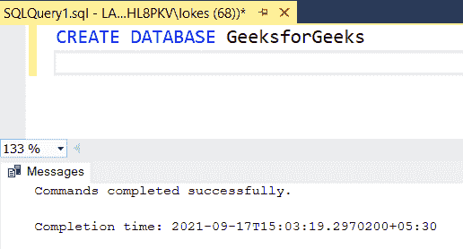
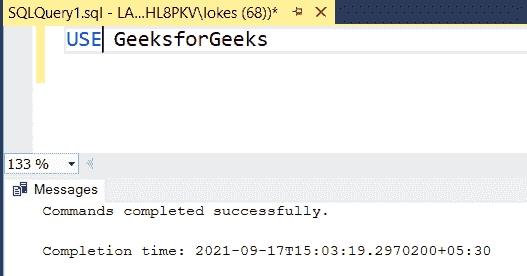
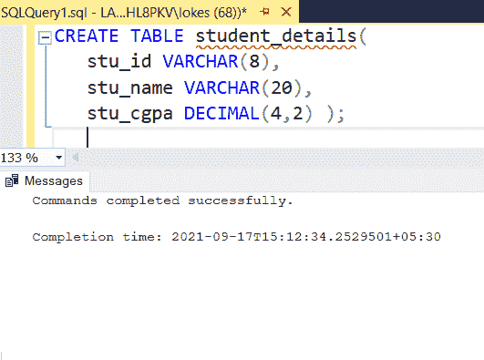
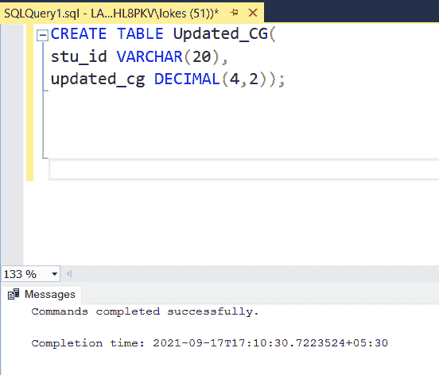
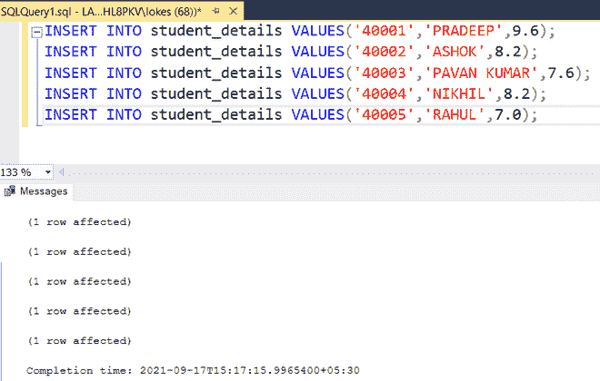
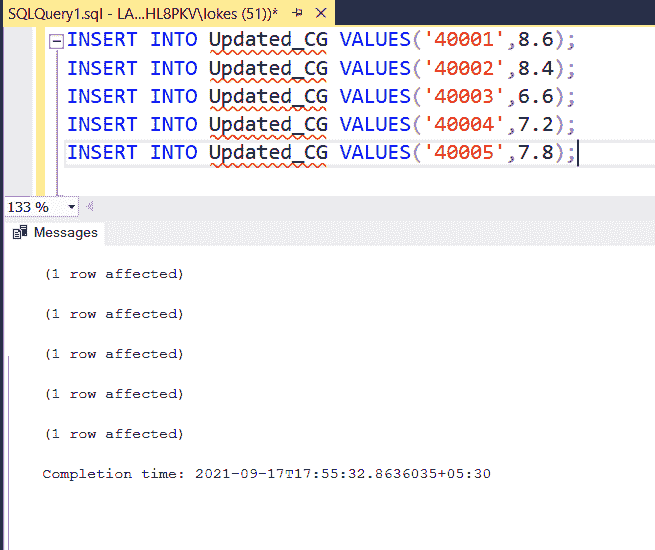
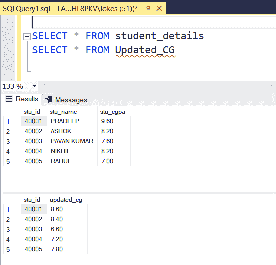
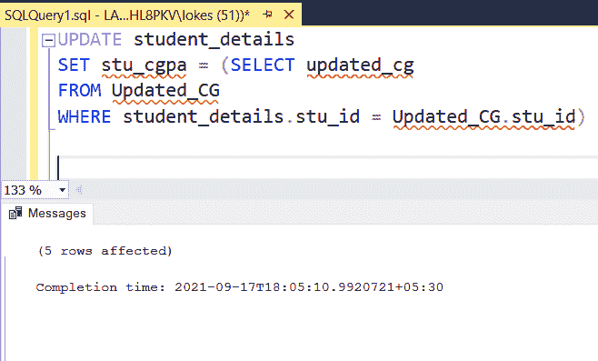
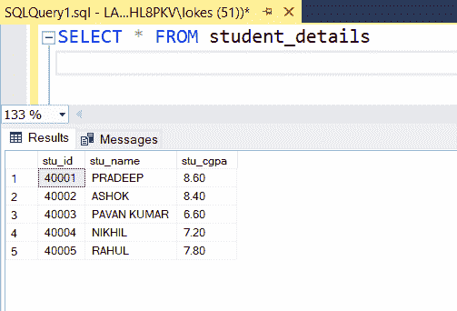

# 用另一个表的列更新列值的 SQL 查询

> 原文:[https://www . geesforgeks . org/SQL-query-to-update-columns-values-with-column-of-other-table/](https://www.geeksforgeeks.org/sql-query-to-update-columns-values-with-column-of-another-table/)

在 SQL 中，更新属于数据定义语言。使用 UPDATE 命令，我们可以使用必要的查询来更新表中的当前数据。在本文中，我们将看到如何使用 MSSQL 作为服务器，用另一个表的列值更新列值。

**语法:**用于更新查询

```
UPDATE table_name 
SET old_value = new_value
WHERE condition 
```

**步骤 1:** 创建数据库

我们使用下面的命令创建一个名为 GeeksforGeeks 的数据库:

**查询:**

```
CREATE DATABASE GeeksforGeeks;
```

**输出:**



**步骤 2:** 使用数据库

要使用 GeeksforGeeks 数据库，请使用以下命令:

**查询:**

```
USE GeeksforGeeks;
```

**输出:**



**步骤 3:** 创建两个表

使用以下 SQL 查询创建一个包含 3 列的学生详细信息表和一个包含 2 列的更新 CG 表:

**查询:**

```
CREATE TABLE student_details(
  stu_id VARCHAR(8),
  stu_name VARCHAR(20),
  stu_cgpa DECIMAL(4,2) );
```



**查询:**

```
CREATE TABLE Updated_CG(
stu_id VARCHAR(20),
updated_cg DECIMAL(4,2));
```

**输出:**



**步骤 4:** 向表中插入行的查询

使用以下 SQL 查询将行插入学生详细信息表

**查询:**

```
INSERT INTO student_details VALUES('40001','PRADEEP',9.6);
INSERT INTO student_details VALUES('40002','ASHOK',8.2);
INSERT INTO student_details VALUES('40003','PAVAN KUMAR',7.6);
INSERT INTO student_details VALUES('40004','NIKHIL',8.2);
INSERT INTO student_details VALUES('40005','RAHUL',7.0);
```

**输出:**



**步骤 5:** 使用以下 SQL 查询将行插入 Updated_CG

**查询:**

```
INSERT INTO Updated_CG VALUES('40001',8.6);
INSERT INTO Updated_CG VALUES('40002',8.4);
INSERT INTO Updated_CG VALUES('40003',6.6);
INSERT INTO Updated_CG VALUES('40004',7.2);
INSERT INTO Updated_CG VALUES('40005',7.8);
```

**输出:**



**步骤 6:** 查看插入的数据

**查询:**

```
SELECT * FROM student_details
SELECT * FROM Updated_CG
```

**输出:**



*   查询以将学生详细信息表中的旧注册会计师从更新后的注册会计师表更新为新注册会计师

**查询:**

```
UPDATE student_details 
SET stu_cgpa = (SELECT updated_cg 
FROM Updated_CG 
WHERE student_details.stu_id = Updated_CG.stu_id)
```

**输出:**



**步骤 7:** 查看更新的表格

**查询:**

```
SELECT * FROM stuent_details
```

**输出:**

